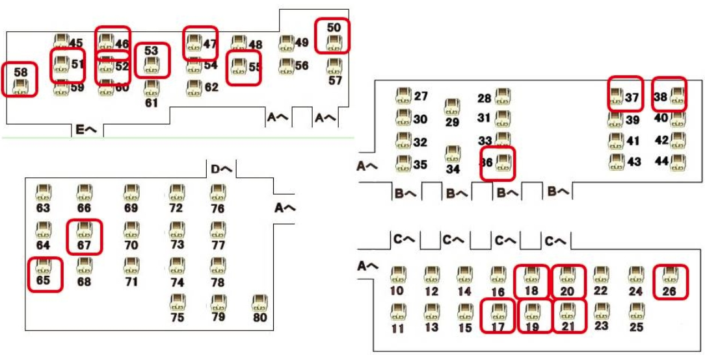

# アークザラッド2 - JP No Major Glitchless(File Conversion) RTAチャート

- 原著：[コアラピュール](https://twitter.com/lieza_sania)
- 筆者：yagamuu
- 更新日：2024/08/02

::: details 目次
[[toc]]
:::

# プレイ環境・ルール

- 計測区間：「はじめから」選択～闇黒の支配者撃破後の画面が暗転した瞬間
- <Danger>コンバート使用許可</Danger>
- <Danger>ゴッズ増殖バグ使用許可</Danger>
- マザークレアの館バグ使用禁止
- バルバラード封印の遺跡バグ使用禁止
- プレイ中に「アークザラッド・モンスターゲームwithカジノゲーム」のプレイ禁止
- 2プレイヤー側のコントローラーを利用した瞬殺コマンドの使用禁止
- 後期ROM使用(Best版、PS one Books版)
- PS2高速読み込み使用
- 連射コントローラー使用

# 各種タイムに関係する小ネタ

- 基本的に会話メッセージはxボタンを長押ししながら□ボタンを連射する
    - xボタンを長押しすると会話メッセージの全文字を最速で表示する効果がある。
    - 会話メッセージの進行は記号ボタン全てで可能だが、誤爆しても影響の少ない□ボタンを連射する
    - 余裕があればシーンに合わせてxボタンや○ボタン連射を使い分ける
- ムービーシーンはSTART+xボタンでスキップ可能
- レベルアップ時のメッセージは○ボタンあるいはxボタン長押しでスキップ可能
- 移動中方向キーを2つ同時に入力すると自動で入力方向の障害物を考慮した移動をする
    - 両方向進める場合は上下移動が優先される
    - ただし両方向に障害物がある場合は止まる
    - 戦闘中はこの仕様が存在しない、同時入力をすると上下どちらかにしか移動をしない
- 後期ROMを使用する事で万能薬のバグを回避できる
    - 初期ROMは万能薬に設定されている装備効果「殆どの異常を回避する」が機能しない
    - 初期ROMでプレイすると主にロマリア戦艦の難易度が激変する。
- 各種効果音、ボイスが鳴っている間にマップの移動を行ったり戦闘を終えると発生するバグが存在する(以下「音声バグ」と呼称)
    - 以降効果音/ボイスが正常に再生されなくなる
    - 発生したタイミングで長いロード(10秒程度)が発生する
    - オプションから事前に効果音、ボイスをオフにすると発生を抑制できるので、極限までタイムを詰めたい人はオフにするのもあり
        - 効果音が無いことで操作感覚などに影響を及ぼすので、やるかはお好み
    - また、特定のBGM(ガルムヘッド戦のBGMなど)が流れてる最中に特定のタイミングでBGMを切り替えることで以降BGMの再生が一部おかしくなるバグも存在する
        - こちらはタイムには一切影響なし

## チャート本編
## ゲーム開始
### ▼装備変更
| ユニット | 武器 | 防具 | 防具2 | 備考 |
| --- | --- | --- | --- | --- |
| <Elc/> | スピア | 布の服 | <Danger>薬草→復活の薬</Danger> | ↑○　○ |

- ビビガと2回会話しギルドへ移動

## プロディアスギルド
- ギルド受付と会話し、ビビガと再度会話

## 東アルディア空港
### 戦闘処理(アルフレッド1)
| ターン | ユニット | 移動先 | 向き | 行動内容 | 備考 |
| --- | --- | --- | :---: | --- | --- |
| 1 | <Elc/> | ↓ | → | 攻撃 |  |

- <Danger>人質になっていた女性と会話し、疾風のバンダナ回収</Danger>

### ▼装備変更
| ユニット | 武器 | 防具 | 防具2 | 備考 |
| --- | --- | --- | --- | --- |
| <Elc/> | スピア | <Danger>布の服→疾風のバンダナ</Danger> | 復活の薬 | ↓○　○ |

### 戦闘処理(アルフレッド2)
- アルフレッドのHPを1以下にすることで戦闘終了

| ターン | ユニット | 移動先 | 向き | 行動内容 | 備考 |
| --- | --- | --- | :---: | --- | --- |
| 1 | <Elc/> | →→→→ | → | 攻撃 |  |
| 1 | <Lieza/> | →→→→ | - | 待機 | 攻めるならその場待機の方が0.5秒ほど早い ただしエルクの被弾が増え次の戦闘がやや不安に |
| 1 | <Pandit/> | - | - | 待機 |  |
| 2 | <Elc/> | →→→→ | → | 攻撃 | 以降倒せるまで繰り返し攻撃 |
| 2 | <Lieza/> | - | - | 待機 | 以降繰り返し |
| 2 | <Pandit/> | - | - | 待機 | 以降繰り返し |

## インディゴス
- ギルド受付→受付隣のハンター→酒場のマスターの順で会話

## 廃墟の町
### 戦闘処理
- 槍熟練度Lv2の場合正面攻撃で撃破できる可能性があるが成功率2.94%とかなり低いので挑戦しない

| ターン | ユニット | 移動先 | 向き | 行動内容 | 備考 |
| --- | --- | --- | :---: | --- | --- |
| 1 | <Elc/> | ↓→ | → | 待機 |  |
| 2 | <Elc/> | →→→↑ | ← | 攻撃 | 倒せなかった場合、1マス離れて攻撃を繰り返し |

## インディゴス
- <Danger>ショップに移動</Danger>
- 以下のアイテムを購入
    1. ソード　↓↓↓
    2. 薬草x2(バグ使用)　↑
    3. 万能薬x3　↑
    4. 復活の薬x8　↑
    5. ライトシューズ　R1　↓
- 以下のアイテムを売却
    1. 布の服(バグ解消)　↑
- シュウのアパートへ戻りイベント進行
- ギルドへ移動しマスターと話しかける

### 戦闘処理(路地裏)
- 4体撃破後誰かが行動すると戦闘終了
- 2体撃破するとセリフが発生するので忘れないよう注意

| ターン | ユニット | 移動先 | 向き | 行動内容 | 備考 |
| --- | --- | --- | :---: | --- | --- |
| 1 | <Elc/>  | ←←↓↓ | ↓ | 待機 |  |
| 1 | <Lieza/> | ↓↓↓ | - | 待機 |  |
| 1 | <Pandit/> | ←↓↓↓ | - | 待機 |  |
| 2 | <Elc/> | - | ↓ | 攻撃 |  |
| 2 | <Lieza/> | ↓ | ↓ | 待機 |  |
| 2 | <Pandit/> | ↓ | ↓ | コールドブレス | L2登録 |
| 3 | <Elc/>  | ↓↓ | → | 攻撃 |  |
| 3 | <Lieza/> | - | → | 攻撃 |  |
| 3 | <Pandit/> | - | - | 待機or攻撃 | 事前のリーザの攻撃で4体目を倒せなかった場合のみ攻撃 |

- シュウのアパートのベッドで休む
- 酒場のマスターに話す→アパートへ移動→酒場へ移動

### 戦闘処理(酒場)
- グルナグのHPを1以下にすることで戦闘終了
- 生き残ったキャラに経験値2400を分配(全員生存で600ずつ)
- 初手エルクが疾風のバンダナを外すことで2ターン目確実にシュウに行動させる
    - これで戦闘終了後にシュウのLvが7になり、再加入時のLvが17になる
    - 1ターン目にグルナグがロブマインド+右強盗がチャージだとシュウのLvが7にならないケースがある
        - 安定取る場合はロブマインドを見てからわざとリーザを背面晒して落とすのもアリ

| ターン | ユニット | 移動先 | 向き | 行動内容 | 備考 |
| --- | --- | --- | :---: | --- | --- |
| 1 | <Elc/> | ↑↑↑↑ | → | 装備変更+攻撃 | <Danger>疾風のバンダナ→なし(↓△)</Danger>
| 1 | <Shu/> | ↑↑↑↑↑ | ↑ | 待機 |  |
| 1 | <Lieza/> | ←↑↑/- | ↑/- | 待機 | グルナグがロブマインドを使用した場合のみ後者 |
| 1 | <Pandit/> | - | - | 待機 | リカバリ用に↑↑→→と移動しても良いが、基本生存できない |
| 2 | <Shu/> | → | ↑ | 攻撃 |  |
| 2 | <Elc/> | - | → | 攻撃 |  |
| 2 | <Lieza/> | ↑↑→→ | → | 攻撃 | 生存している場合のみ |

### 戦闘処理(研究所)
| ターン | ユニット | 移動先 | 向き | 行動内容 | 備考 |
| --- | --- | --- | :---: | --- | --- |
| 1 | <Tosh/> | ←←← | - | 待機 |  |
| 1 | <Arc/> | ←←←←↓ | ↑ | 待機 |  |
| 1 | <Poco/> | - | → | へろへろラッパLv3 | L2登録　L1 |
| 2 | <Tosh/> | ←↑↑↑/↓←← | ↑ | 攻撃 | アークが落ちた場合のみ後者 |
| 2 | <Arc/> | - | - | ゲイルフラッシュLv2 |  |
| 2 | <Poco/> | -/→ | -/← | へろへろラッパLv3 | アークが落ちた場合のみ後者 (左側の敵が生き残った場合のみR1) |
| 3 | <Tosh/> | -/←←↑ | - | 攻撃 | アークが落ちた場合のみ後者 |
| 3～ | <Arc/> | - | - | 待機 |  |
| 3 | <Poco/> | - | - | へろへろラッパLv3 |  |
| 4 | <Tosh/> | - | - | 待機 |  |
| 4 | <Poco/> | - | - | へろへろラッパLv3 |  |

## プロディアス
- イベント進行
- <Danger>鍛冶屋に行き武器の強化を行う</Danger>
    
    ### ▼装備変更    
    | ユニット | 武器 | 防具 | 防具2 | 備考 |
    | --- | --- | --- | --- | --- |
    | <Elc/> | <Danger>スピア→なし</Danger> | なし | 復活の薬 | △ |
    | <Lieza/> | <Danger>ナイフ+1→なし</Danger> | 布の服 | すごい薬草 | R1　△ |
    | <Pandit/> | <Danger>メタルファング→なし</Danger> | なし | なし | R1R1　△ |
    - 以下の装備のLvを最大まで上げる
        - メタルファング
        - ライトシューズ
        - スピア
        - ナイフ+1
        - ソード
    - ナイフ+1(バスターナイフ+1)に暗闇を付与する(一度話しかけ直す必要あり)

## ヒエン置き場
- 話しかける前にシュウに変更(L2)、会話メッセージが短くなる
- ビビガに話しかけて「チケット」回収

## 式典会場
- イベント進行
- <Danger>ムービーシーンが4回入るので忘れずに</Danger>

## ユドの村
- ヴィルマー家を出てすぐに入り直し、再度研究所へ
- <Danger>村中央左の小屋を裏から侵入し、「反撃のバンダナ」を回収</Danger>
    - <Danger>反撃のバンダナの入手マップ内で装備変更</Danger>
    
    ### ▼装備変更    
    | ユニット | 武器 | 防具 | 防具2 | 備考 |
    | --- | --- | --- | --- | --- |
    | <Elc/> | <Danger>なし→バスタースピア</Danger> | なし | 復活の薬 | ◯　↓↓◯ |
    | <Pandit/> | <Danger>なし→メタルファング</Danger> | なし | なし | L1　◯　↓◯ |
    | <Lieza/> | <Danger>なし→バスターナイフ+1</Danger> | <Danger>布の服→復活の薬</Danger> | <Danger>すごい薬草→復活の薬</Danger> | L1　◯　↓◯ ↓◯　R1◯ ↓◯　R1◯ |

## 封印の遺跡(1)
### 戦闘処理(1F-1戦目)
| ターン | ユニット | 移動先 | 向き | 行動内容 | 備考 |
| --- | --- | --- | :---: | --- | --- |
| 1 | <Elc/> | ↓ | ↓ | 待機 |  |
| 1 | <Lieza/> | ← | ← | 待機 |  |
| 1 | <Pandit/> | - | - | 待機 |  |
| 2 | <Elc/> | ↑←↑ | → | 装備変更+攻撃 | <Danger>なし→疾風のバンダナ(↓○　○)</Danger> |
| 2 | <Lieza/> | - | - | 待機 |  |
| 2 | <Pandit/> | →↑ | ↑ | 待機 |  |
| 3 | <Elc/> | - | → | 攻撃 |  |

- 以降、マミィをエルクで2回攻撃しHPを1にし、パンディットで倒す。
- ナイスキャッチを使われたかどうかでパターンを分岐する。

::: details ナイスキャッチを使用していない/ナイスキャッチを使用した(1ターン目)
| ターン                               | ユニット     | 移動先 | 向き  | 行動内容      | 備考                              |
| ------------------------------------ | ------------ | ------ | :---: | ------------- | --------------------------------- |
| 3                                    | <Lieza/>       | ↑↑↑    |   -   | 待機          |                                   |
| 3                                    | <Pandit/> | ↑      |   -   | 待機          |                                   |
| 4                                    | <Elc/>       | ↑      |   →   | 装備変更+攻撃 | <Danger>バスタースピア→マスターソード(◯◯) 疾風のバンダナ→反撃のバンダナ(↓◯　◯)</Danger> |
| 4                                    | <Lieza/>       | →      |   ←   | 攻撃          |                                   |
| 4                                    | <Pandit/> | -      |   ↑   | 攻撃          |                                   |
:::

::: details ナイスキャッチを使用した(2ターン目)
| ターン | ユニット | 移動先 | 向き | 行動内容 | 備考 |
| --- | --- | --- | :---: | --- | --- |
| 3 | <Lieza/> | - | - | 待機 |  |
| 3 | <Pandit/> | - | - | 待機 |  |
| 4 | <Elc/> | →→↑ | ← | 装備変更+攻撃 | <Danger>バスタースピア→マスターソード(◯◯) 疾風のバンダナ→反撃のバンダナ(↓◯　◯)</Danger> |
| 4 | <Lieza/> | →↑↑ | ← | 攻撃 |  |
| 4 | <Pandit/> | ↑ | ↑ | 攻撃 |  |
:::

### 戦闘処理(1F-2戦目)
| ターン | ユニット | 移動先 | 向き | 行動内容 | 備考 |
| --- | --- | --- | :---: | --- | --- |
| 1 | <Elc/> | ←←↑↑ | - | 待機 |  |
| 1 | <Lieza/> | - | - | 待機 |  |
| 1 | <Pandit/>  | - | - | 待機 |  |
| 2 | <Elc/> | ↑↑↑ | - | 待機 |  |
| 2 | <Lieza/> | - | - | 待機 |  |
| 2 | <Pandit/>  | - | - | 待機 |  |
| 3 | <Elc/> | ↑↑↑↑ | - | 階段を降りる |  |

### 戦闘処理(B1F)
- エルクのHPが30未満なら事前に回復(安定を取りたいならHP35未満で回復)
- ヴァンパイアバット2体のみ倒して階段を降りる

| ターン | ユニット | 移動先 | 向き | 行動内容 | 備考 |
| --- | --- | --- | :---: | --- | --- |
| 1 | <Elc/> | ←↑↑→ | ↓ | 攻撃 |  |
| 1 | <Lieza/> | ↑↑↑← | ← | 攻撃 |  |
| 1 | <Pandit/> | ←↑↑↑ | - | 待機 |  |
| 2 | <Elc/> | ←↑↑→ | ↓ | 待機/攻撃 |  |
| 2 | <Lieza/> | ←↓/？ | - | 待機/キュア | ここまでにバット両方倒せてる場合は前者 そうでない場合はアドリブ判断、状況に応じてエルクの代わりに上に逃げて階段を目指す、またはキュアをする |
| 2 | <Pandit/> | →→↓ | ← | 待機 | リーザ同様バット両方倒せてる場合のプラン |
| 3 | <Elc/> | ↑↑↑↑ | - | 待機 |  |
| 3～ | <Lieza/> | - | - | 待機 | 以降ずっと待機 |
| 3～ | <Pandit/> | - | - | 待機 | 以降ずっと待機 |
| 4 | <Elc/> | →→↑↑ | - | 待機 |  |
| 5 | <Elc/> | ↑↑←← | - | 階段を降りる |  |

## ユドの村
- <Danger>イベントで寄るショップで「いい薬草」15個購入</Danger>
    - 多く買いすぎても良い
- <Danger>エルクのHP回復</Danger>(攻めたいならHP30以上であれば回復カット)

## 封印の遺跡(2)
### 戦闘処理(1F-1戦目)
| ターン | ユニット | 移動先 | 向き | 行動内容 | 備考 |
| --- | --- | --- | :---: | --- | --- |
| 1 | <Elc/> | ↑↑↑↑ | ↑ | 待機 |  |
| 1 | <Lieza/> | - | - | 待機 |  |
| 1 | <Pandit/> | ↑↑ | ↑ | コールドブレスLv2 |  |
| 2 | <Elc/> | ↓↓→ | - | 待機 |  |
| 2 | <Lieza/> | - | - | 待機 |  |
| 2 | <Pandit/> | ↓ | - | 待機 |  |
| 3～ | <Elc/> | - | - | 攻撃 | マミィがHP1になるまで |
| 3～ | <Lieza/> | - | - | HP1のマミィに攻撃or待機 | パンディットLv12の場合のみ攻撃 |
| 3～ | <Pandit/> | - | - | HP1のマミィに攻撃or待機 | Lv11以下の場合のみ攻撃 |

### 戦闘処理(1F-2戦目)
- 前回と同じ

### 戦闘処理(B1F)
- エルクのHPが30未満なら事前に回復(安定を取りたいならHP35未満で回復)
- 前回と同じ
    - 1T目でパンディットがバットを倒しても良い
- イベント後、通路を右上に進み階段を降りる
- 精霊の泉で回復

### 戦闘処理(B4F)
| ターン | ユニット | 移動先 | 向き | 行動内容 | 備考 |
| --- | --- | --- | :---: | --- | --- |
| 1 | <Elc/> | ↑ | → | 攻撃 |  |
|  | <Lieza/> | ↑↑↑ | - | 待機 |  |
| 1 | <Pandit/> | ←↑↑↑ | ← | 攻撃 |  |
| 2 | <Elc/> | - | → | 待機/攻撃 |  |
| 2 | <Lieza/> | - | - | 待機 |  |
| 2 | <Pandit/> | - | ← | 攻撃 |  |
| 3 | <Elc/> | ↑↑ | - | 装備変更+待機 | <Danger>マスターソード→バスタースピア(○○)</Danger> |
| 3 | <Lieza/> | - | - | 待機 |  |
| 3～ | <Pandit/> | - | - | 待機 | バット撃破してたら以降ずっと待機 |
| 4 | <Elc/> | ↑↑ | - | 待機 |  |
| 4 | <Lieza/> | ↑↑ | - | 待機 |  |
| 5～ | <Elc/> | - | ↑ | 攻撃 | 以降スケルトンを撃破するまで攻撃 |
| 5～ | <Lieza/> | - | - | 待機 | 以降ずっと待機 |

- エルクのHPが20以上減少していたら薬草で回復

### 戦闘処理(B5F)
| ターン | ユニット | 移動先 | 向き | 行動内容 | 備考 |
| --- | --- | --- | :---: | --- | --- |
| 1 | <Elc/> | ↓↓→ | ↑ | 攻撃 |  |
| 1 | <Lieza/> | ←↓↓ | - | 待機 |  |
| 1 | <Pandit/> | - | → | 待機 |  |
| 2 | <Elc/> | -/↑↑→→ | →/↓ | 攻撃 | 2T目にバットに吸血された場合後者 |
| 2 | <Lieza/> | A：→→→ B：→→↑↑ C：↓→ | A：↓ B：← C：→ | 攻撃 | A：その他 B：下側スケルトンがガードしてた場合 C：2T目にバットに吸血された場合 |
| 2 | <Pandit/> | →→ | ← | 攻撃 |  |
| 3～ | <Elc/> | - | - | HP1になるまでスケルトン攻撃 |  |
| 3～ | <Lieza/> | - | - | HP1のスケルトン撃破 | 2体両方 |
| 3～ | <Pandit/> | - | - | 待機 | 以降ずっと待機 |

- エルク、パンディットのHPを回復(全回復推奨)
- フロア左下の宝箱から「回復果物」回収

### ▼装備変更
| ユニット | 武器 | 防具 | 防具2 | 備考 |
| --- | --- | --- | --- | --- |
| <Elc/> | <Danger>バスタースピア→マスターソード</Danger> | 反撃のバンダナ | 復活の薬 | ◯　◯ |

### 戦闘処理(B6F)
| ターン | ユニット | 移動先 | 向き | 行動内容 | 備考 |
| --- | --- | --- | :---: | --- | --- |
| 1 | <Elc/> | →→↓→/↓→→↑ | ↑/← | 攻撃 | 至近距離のバットに吸血使われた場合後者 |
| 1 | <Lieza/> | ↓/→ | ↑ | 攻撃 | 同上 |
| 1 | <Pandit/> | →↓ | ← | 攻撃 |  |
| 2 | <Elc/> | →→↑/- | ←/→ | 攻撃 |  |
| 2～ | <Lieza/> | - | - | バット＞スケルトンの優先度で攻撃 | 状況次第でキュアも考慮 可能な限りリーザで両方撃破したい |
| 2～ | <Pandit/> | - | - | バット＞スケルトンの優先度で攻撃 | スケルトンに反撃ができる位置に移動し、 リーザで攻撃できるようにすると良い |
| 3～ | <Elc/> | - | - | 近くの敵を撃破 |  |

- エルク、パンディットのHPを回復(全回復推奨)
- <Danger>フロアの宝箱から「魔法のりんご」回収(必ず像のスイッチを押してから開けること！)</Danger>
    - 万能薬は不要(右の宝箱)

### ▼装備変更
| ユニット | 武器 | 防具 | 防具2 | 備考 |
| --- | --- | --- | --- | --- |
| <Elc/> | <Danger>マスターソード→バスタースピア</Danger> | <Danger>反撃のバンダナ→魔法のりんご</Danger>| 復活の薬 | ↓○　○ |

### 戦闘処理(B7F)
| ターン | ユニット | 移動先 | 向き | 行動内容 | 備考 |
| --- | --- | --- | :---: | --- | --- |
| 1 | <Elc/> | ↓→ | ↑ | 装備変更+攻撃 | <Danger>魔法のりんご→反撃のバンダナ(↓○　↓○)</Danger> |
| 1 | <Lieza/> | ←↓↓→ | - | 待機 |  |
| 1 | <Pandit/> | A：↑→↑→ B：↑→↑↑ C：↑→↑ | ↓ ↑ → | A：コールドブレスLv1 B：待機 C：攻撃 | A：近くのガーゴイルがスピードアップを使わない+封印の守護者が攻撃 B：近くのガーゴイルがスピードアップを使用+封印の守護者が攻撃 C：封印の守護者が黄泉の階段を使用 |
| 2 | <Elc/> | - | ←/↑ | 装備変更+攻撃 | <Danger>バスタースピア→マスターソード(○　○)</Danger> 左ガーゴイルがスピードアップを使用し、ガーゴイルに反撃した場合は後者 |
| 2～ | <Lieza/> | - | - | 以降アドリブ | 以下の優先度で基本的立ち回る(上であるほど優先度高) 封印の守護者がHP1：守護者に攻撃 それ以外：HP低い敵に攻撃 |
| 2～ | <Pandit/> | - | - | 以降アドリブ | 基本的にコールドブレスLv1をMP切れるまで打つ その後状況を見て通常攻撃 |
| 3～ | <Elc/> | - | - | 以降HP低い敵に適宜攻撃 |  |

### ▼装備変更
| ユニット | 武器 | 防具 | 防具2 | 備考 |
| --- | --- | --- | --- | --- |
| <Elc/> | マスターソード | 反撃のバンダナ | <Danger>復活の薬→魔法のりんご</Danger> | ↑○　○ |

- <Danger>戦闘終了後左の宝箱から「みなぎる果実」を回収</Danger>
    - 右の宝箱の復活の薬は不要
- 来た道を戻りイベント、ヴィルマー家のベッドを調べてイベント進行

## 作業室
### 戦闘処理
| ターン | ユニット | 移動先 | 向き | 行動内容 | 備考 |
| --- | --- | --- | :---: | --- | --- |
| 1 | <Elc/> | - | → | 攻撃 |  |
| 1 | <Lieza/> | ↑/- | ↑/↑ | 左コボルトに攻撃/右コボルトに攻撃 | 右が落ちてない場合のみ後者 |
| 1 | <Pandit/> | - | ↑ | コールドブレスLv2 | 上ニンジャに敏捷低下入るかチェック |
| 2 | <Elc/> | - | ↑ | 装備変更+攻撃 | <Danger>マスターソード→バスタースピア(◯　◯)</Danger> <Danger>魔法のりんご→復活の薬(↑○　R1○)</Danger> <Danger>反撃のバンダナ→復活の薬(↑◯　R1◯)</Danger> |
| 2 | <Lieza/> | - | - | 上コボルトにラヴィッシュ |  |
| 2 | <Pandit/> | - | ↑ | 残った敵に攻撃 |  |
| 3 | <Elc/> | - | - | 以降アドリブ |  |
| 3 | <Lieza/> | - | - | 以降アドリブ |  |
| 3 | <Pandit/> | - | - | 以降アドリブ |  |

## ユドの村
- 村から出てフィールド上部の仮設空港へ行きイベント

## インディゴス
### ▼装備変更
| ユニット | 武器 | 防具 | 防具2 | 備考 |
| --- | --- | --- | --- | --- |
| <Elc/> | <Danger>バスタースピア→マスターソード</Danger> | <Danger>復活の薬→魔法のりんご</Danger> | 復活の薬 (→疾風のバンダナ) | ◯　◯ ↓○　○ 作業室で上部ニンジャに敏捷低下入っていた場合は疾風のバンダナを装備 |

- シュウのアパートへ移動後イベント
- 酒場へ移動後イベント
- シュウのアパートへ移動後戦闘

### 戦闘処理
- 以降、戦闘メンバー選択が発生。選択するカーソル位置を(縦-横)で記載。
- <Danger>以降必ず書いてある順番で選択すること(行動順、初期配置に影響あり)</Danger>
- パンディット選択(1-3)

| ターン | ユニット | 移動先 | 向き | 行動内容 | 備考 |
| --- | --- | --- | :---: | --- | --- |
| 1 | <Elc/> | ↑→→→ | → | 攻撃 | 疾風のバンダナ装備していた場合のみ装備変更 疾風のバンダナ→復活の薬 |
| 1 | <Lieza/> | ↑/‐ | ←/- | 攻撃/待機 | 42ダメージ以上既に与えた場合待機 |
| 1 | <Pandit/> | → | ↑ | コールドブレスLv2 | R2登録 |

:::details コボルトがいる場合
- コボルト選択(1-4)
- パンディット選択(1-3)
    
| ターン | ユニット | 移動先 | 向き | 行動内容 | 備考 |
| --- | --- | --- | :---: | --- | --- |
| 1 | <Kobold/> | ‐ | - | 振り下ろしLv1 | L2登録 |
| 1 | <Elc/> | ↑→→→ | → | 攻撃 | 疾風のバンダナ装備していた場合のみ装備変更 疾風のバンダナ→復活の薬 |
| 1 | <Lieza/> | ↑/‐ | ←/- | 攻撃/待機 | パンディットLv16以上且つ42ダメージ以上既に与えた場合待機 |
| 1 | <Pandit/> | ↑←← | ↑ | コールドブレスLv2 | R2登録 |
:::

- 酒場へ移動後イベント、シャンテに話しかける(選択肢あり、○連打)
- フィールド左上のガルアーノの屋敷へ移動

## ガルアーノの屋敷
- コボルト捕獲成功している場合はジーン戦まで可能な限りリーザのLvを14に抑える
    - <Danger>逆に上記条件を満たしてない場合はジーン戦開始までに必ずLv15以上にする</Danger>

### 戦闘処理(ホール部屋)
- パンディット選択(1-3)
- リーザ選択(1-2)

| ターン | ユニット | 移動先 | 向き | 行動内容 | 備考 |
| --- | --- | --- | :---: | --- | --- |
| 1 | <Elc/> | ↓→→ | ↓ | 装備変更+チャージ | L2登録 <Danger>魔法のりんご→反撃のバンダナ(↓○　↓○)</Danger> |
| 1 | <Pandit/> | ↓← | ← | コールドブレスLv2 |  |
| 1 | <Lieza/> | ←←↓↓ | ↓ | ラヴィッシュ |  |
| 2 | <Elc/> | ↓→ | ↑ | 装備変更+攻撃 | <Danger>マスターソード→バスタースピア(◯　◯)</Danger> 強盗にチャージされた場合は魔法のりんごを装備しつつで強盗を後方から攻撃 強盗にガードされた場合は復活*2装備で攻撃 どちらでも無い場合は魔法のりんごを装備しつつ攻撃 <Danger>反撃のバンダナ→魔法のりんご(↓○　○)</Danger> or <Danger>反撃のバンダナ→復活の薬(↓○　R1○)</Danger> |
| 2 | <Pandit/> | ←↑↑→ | ↓ | 攻撃 | ネクロマンサーがこちらにこなかった場合はアドリブ 基本的には強盗を後方から攻撃 |
| 2～ | <Lieza/> | - | - | 以降アドリブ | レッサーデーモンへのラヴィッシュを優先 既に成功している場合は強盗を後方から隣接で攻撃 |
| 3～ | <Elc/> | - | - | 以降アドリブ | 強盗にガードされた場合は強盗優先撃破 |
| 3～ | <Pandit/> | - | - | 以降アドリブ | 基本的には強盗を後方から攻撃 |
:::details コボルトがいる場合
- パンディット選択(1-3)
- リーザ選択(1-2)
- コボルト選択(1-4)
    
| ターン | ユニット | 移動先 | 向き | 行動内容 | 備考 |
| --- | --- | --- | :---: | --- | --- |
| 1 | <Kobold/> | ← | - | 待機 |  |
| 1 | <Elc/> | ↓→→ | ↓ | 装備変更+チャージ | L2登録 <Danger>魔法のりんご→反撃のバンダナ(↓○　↓○)</Danger>
| 1 | <Pandit/> | ↓← | ← | コールドブレスLv2 |  |
| 1 | <Lieza/> | ←←↓↓ | ↓ | ラヴィッシュ |  |
| 2 | <Kobold/> | ← | ↓ | 攻撃 |  |
| 2 | <Elc/> | ↓→ | ↑ | 装備変更+攻撃 | <Danger>マスターソード→バスタースピア(◯　◯)</Danger> 強盗にチャージされた場合は魔法のりんごを装備しつつで強盗を後方から攻撃 強盗にガードされた場合は復活*2装備で攻撃 どちらでも無い場合は魔法のりんごを装備しつつ攻撃 <Danger>反撃のバンダナ→魔法のりんご(↓○　○)</Danger> or <Danger>反撃のバンダナ→復活の薬(↓○　R1○)</Danger> |
| 2～ | <Pandit/> | ‐ | - | 以降アドリブ | 基本的には強盗を後方から攻撃 |
| 2～ | <Lieza/> | - | - | 以降アドリブ | レッサーデーモンへのラヴィッシュを優先 既に成功している場合は強盗を後方から攻撃 |
| 3～ | <Kobold/> | ‐ | - | 以降アドリブ |  |
| 3～ | <Elc/> | - | - | 以降アドリブ | 強盗にガードされた場合は強盗優先撃破 |
:::

- 右上の部屋に移動し戦闘

### 戦闘処理(右上部屋)

| ターン | ユニット | 移動先 | 向き | 行動内容 | 備考 |
| --- | --- | --- | :---: | --- | --- |
| 1 | <Elc/> | ↑↑↑ | ↑ | 装備変更+待機 | <Danger>バスタースピア→マスターソード(◯　◯)</Danger> <Danger>魔法のりんご→反撃のバンダナ(↓○　↓○)</Danger>
| 1 | <Pandit/> | ‐ | - | 待機 |  |
| 1 | <Lieza/> | ‐ | - | 待機 |  |
| 2～ | <Elc/> | ‐ | - | 近くの敵に攻撃 | チャージした敵がいたらそちら優先し背後から攻撃 反撃済の敵は正面から攻撃で足りる |
| 2～ | <Pandit/> | ‐ | - | 近くの敵に背面から攻撃 |  |
| 2～ | <Lieza/> | ‐ | - | 近くの敵に背面から攻撃 |  |

:::details コボルトがいる場合
| ターン | ユニット | 移動先 | 向き | 行動内容 | 備考 |
| --- | --- | --- | :---: | --- | --- |
| 1 | <Kobold/> | ‐ | - | 待機 |  |
| 1 | <Elc/> | ↑↑↑ | ↑ | 装備変更+待機 | <Danger>バスタースピア→マスターソード(◯　◯)</Danger> <Danger>魔法のりんご→反撃のバンダナ(↓○　↓○)</Danger> |
| 1 | <Pandit/> | ‐ | - | 待機 |  |
| 1 | <Lieza/> | ‐ | - | 待機 |  |
| 2～ | <Kobold/> | ‐ | - | アドリブ | 近くの敵に背面から攻撃するか、チャージした敵に振り下ろし |
| 2～ | <Elc/> | ‐ | - | 近くの敵に攻撃 | チャージした敵がいたらそちら優先し背後から攻撃     反撃済の敵は正面から攻撃で足りる |
| 2～ | <Pandit/> | ‐ | - | 近くの敵に背面から攻撃 |  |
| 2～ | <Lieza/> | ‐ | - | 近くの敵に背面から攻撃 |  |
:::

### ▼装備変更
| ユニット | 武器 | 防具 | 防具2 | 備考 |
| --- | --- | --- | --- | --- |
| <Elc/> | マスターソード | <Danger>反撃のバンダナ→魔法のりんご</Danger> | 復活の薬 | ↓○　○ |

- <Danger>エルクのHP回復(最大まで)</Danger>
- 中央の部屋に戻り扉を中央から調べイベント

### 戦闘処理(ジーン戦)
- リーザ選択(1-2)

| ターン | ユニット | 移動先 | 向き | 行動内容 | 備考 |
| --- | --- | --- | :---: | --- | --- |
| 1 | <Elc/> | →→→↑ | ↑ | チャージ | L2登録 |
| 1 | <Lieza/> | →→→→ | - | 待機 |  |
| 2 | <Elc/> | ↑↑↑↑ | - | チャージ |  |
| 2 | <Lieza/> | →↑↑↑ | - | 待機 |  |
| 3 | <Elc/> | ‐ | ↑ | 攻撃 | 上手く行けばここで終わる |
| 3 | <Lieza/> | ↑ | - | キュアor攻撃 |  |
:::details コボルトがいる場合
  - リーザ選択(1-2)
  - コボルト選択(1-5)
  
  | ターン | ユニット | 移動先 | 向き | 行動内容 | 備考 |
  | --- | --- | --- | :---: | --- | --- |
  | 1 | <Kobold/> | →→↑↑ | - | 待機 |  |
  | 1 | <Elc/> | →→→↑ | ↑ | チャージ | L2登録 |
  | 1 | <Lieza/> | →→→→ | - | 待機 |  |
  | 2 | <Kobold/> | ↑ | - | 待機 |  |
  | 2 | <Elc/> | ↑↑↑ | - | チャージ |  |
  | 2 | <Lieza/> | →↑↑↑ | - | 装備変更+攻撃/待機 | Lv15以上なら後者 <Danger>復活の薬→疾風のバンダナ(↓○　○)</Danger>
  | 3 | <Kobold/> | ↑ | - | 振り下ろしLv1 |  |
  | 3 | <Elc/> | ‐ | ↑ | 攻撃 |  |
  | 3 | <Lieza/> | ‐ | ↑ | キュアor攻撃 |  |
:::

### 戦闘処理(偽ガルアーノ戦)
- エルク選択(1-1)
- シュウ選択(1-4)
- <Danger>偽ガルアーノのHPを削りきった後、何かしらのレベルアップボイスが発生した場合再生終わってから戦闘を終えること(音声バグが発生する)</Danger>

| ターン | ユニット | 移動先 | 向き | 行動内容 | 備考 |
| --- | --- | --- | :---: | --- | --- |
| 1 | <Shu/> | ↓→→→→ | → | 装備変更+攻撃 | <Danger>ライトシューズ→ライトシューズ(◯　↓◯)</Danger> <Danger>なし→復活の薬(↑○　R1◯)</Danger> |
| 1 | <Elc/> | →→→→ | → | 装備変更+攻撃 | <Danger>マスターソード→バスタースピア(○○)</Danger> シュウが事前に攻撃を外していたら魔法のりんご→復活の薬(↓○　R1○) |

- イベント後、「ヒエン置き場」に移動し「ヤゴス島」へ移動(→)

## ヤゴス島
- ヴィルマーの家に行きヂークベックを加入

### ▼装備変更
- 装備変更前、メニューの「ステータス」からキャラの並びをLv順にする

| ユニット | 武器 | 防具 | 防具2 | 備考 |
| --- | --- | --- | --- | --- |
| <Shante/> | <Danger>ライトシューズ→なし</Danger> | 布の服+2 | 強力果物 | △ |
| <Diecbeck/> | <Danger>ヂークナックル→なし</Danger> | <Danger>なし→Pチャージャー</Danger> | なし | L1　△ ↓○　R1　↓↓↓↓○ |
| <Elc/> | スピア | (復活の薬→)魔法のりんご | 復活の薬 | (↓○　○) |
| <Lieza/> | ナイフ | (疾風のバンダナ→)なし | 復活の薬 | (△　↓△) |

- <Danger>装備変更後ベッドで回復</Danger>
- フィールド上部の「仮設空港」へ行き「西アルディア」へ移動(→)

## 西アルディア
- 中央の「サルバ砂漠」へ移動(暗転前から先行入力を受け付ける仕様なので注意)

## サルバ砂漠
### 戦闘処理(1戦目)
- ヂークベック選択(1-7or8)

| ターン | ユニット | 移動先 | 向き | 行動内容 | 備考 |
| --- | --- | --- | :---: | --- | --- |
| 1 | <Diecbeck/> | →→→→→→ | → | 装備変更+待機 | <Danger>なし→Pファイアイーター(↑○　R1　↓↓↓↓○)</Danger>
| 2 | <Diecbeck/> | →→→→→→ | → | 待機 |  |
| 3 | <Diecbeck/> | →→→→→→ | → | 待機 |  |
| 4 | <Diecbeck/> | →→→→→ | - | 脱出 |  |

- <Danger>戦闘終了後にヂークのHP回復</Danger>
    - HP90～100程度まで回復(大抵はいい薬草2枚)
    - 攻めるならHP70前後で進む(いい薬草1枚)

### 戦闘処理(2戦目)
| ターン | ユニット | 移動先 | 向き | 行動内容 | 備考 |
| --- | --- | --- | :---: | --- | --- |
| 1 | <Diecbeck/> | →→→→↓ | ↓ | 待機 |  |
| 2 | <Diecbeck/> | →→→→→→ | → | 待機 |  |
| 3 | <Diecbeck/> | →→→ | - | 待機 |  |

### 戦闘処理(3戦目)
| ターン | ユニット | 移動先 | 向き | 行動内容 | 備考 |
| --- | --- | --- | :---: | --- | --- |
| 1 | <Diecbeck/> | ↑→→→→→ | → | 待機 |  |
| 2 | <Diecbeck/> | →→→→→→ | → | 待機 |  |
| 3 | <Diecbeck/> | ↑↑→→→→ | → | 待機 |  |
| 4 | <Diecbeck/> | ↑↑↑↑↑↑ | - | 待機 |  |

- 小屋には寄らずにそのまま「帰らずの森」へ

## 帰らずの森
- ヂークベック選択(1-7or8)
- ヂークベックのHPが30を下回っていたら回復
- 右に移動

### 戦闘処理(1戦目)
| ターン | ユニット | 移動先 | 向き | 行動内容 | 備考 |
| --- | --- | --- | :---: | --- | --- |
| 1 | <Diecbeck/> | →→→→→→ | → | 待機 |  |
| 2 | <Diecbeck/> | →→→→→ | → | 待機 |  |
| 3 | <Diecbeck/> | →→→→→ | - | 待機 | 下側スケルトンが特殊能力未使用なら1マス減らしても可 |
| 4 | <Diecbeck/> | →→→→ | - | 脱出 |  |

- ヂークベックのHPが15を下回っていたら回復
- 右上に移動
- 左に移動

### 戦闘処理(2戦目)
| ターン | ユニット | 移動先 | 向き | 行動内容 | 備考 |
| --- | --- | --- | :---: | --- | --- |
| 1 | <Diecbeck/> | ←↑ | ↑ | 待機 |  |
| 2 | <Diecbeck/> | ↑←←←←↑ | - | 脱出 |  |

- ヂークベックのHPが15を下回っていたら回復
- 右に移動
- 上に移動

### 戦闘処理(3戦目)
| ターン | ユニット | 移動先 | 向き | 行動内容 | 備考 |
| --- | --- | --- | :---: | --- | --- |
| 1 | <Diecbeck/> | ↑↑ | ← | 待機 |  |
| 2 | <Diecbeck/> | ↑→→→→↑ | - | 脱出 |  |

- 左に移動
- 上に移動し脱出

## 下水道
- 473
- シュウ選択(1-4)
- ヂークベック選択(1-7or8)
- エルク選択(1-2or3)

### ▼装備変更
| ユニット | 武器 | 防具 | 防具2 | 備考 |
| --- | --- | --- | --- | --- |
| <Diecbeck/> | なし | <Danger>Pチャージャー→なし</Danger> | <Danger>Pファイアイーター→なし</Danger> | ↓△　↓△ |

- 左中央のスイッチを押し左上の部屋へ移動

### 戦闘処理(1戦目)
| ターン | ユニット | 移動先 | 向き | 行動内容 | 備考 |
| --- | --- | --- | :---: | --- | --- |
| 1 | <Shu/> | ‐ | - | 待機 |  |
| 1 | <Elc/> | ‐ | - | 待機 |  |
| 1 | <Diecbeck/> | ←←←←←← | - | 装備変更+待機 | <Danger>なし→Pチャージャー(↓○　R1　↓↓↓○)</Danger> <Danger>なし→Pファイアイーター(↓○　R1　↓↓↓○)</Danger> |
| 2 | <Diecbeck/> | ←←←↓↓↓ | - | 脱出 |  |
- 攻めたい場合は以下のパターンを採用しても良い(<Danger>※採用する場合上記の装備変更は行わず、HP50程度確保する</Danger>)
    - 成功すると3秒程度早くなる、がメズマライズブレスを受けて眠ると大ロス確定
::: details 攻めパターン

| ターン | ユニット | 移動先 | 向き | 行動内容 | 備考 |
| --- | --- | --- | :---: | --- | --- |
| 1 | <Diecbeck/> | ←←←←←← | ↑ | 待機 |  |
| 1 | <Shu/> | ‐ | - | 待機 |  |
| 1 | <Elc/> | ‐ | - | 待機 |  |
| 2 | <Diecbeck/> | ↓↓←←←↓ | - | 脱出 |  |
:::

- <Danger>ヂークベックのHP回復(目安50以上)</Danger>
- 左上のハシゴを降り、スイッチを入れたら戻る
- 中央左のハシゴを降りる
- 右上の部屋に移動し、スイッチを入れたら戻る、右下の通路に移動

### 戦闘処理(2戦目)
| ターン | ユニット | 移動先 | 向き | 行動内容 | 備考 |
| --- | --- | --- | :---: | --- | --- |
| 1 | <Diecbeck/> | →↑↑↑ | - | 脱出 |  |

- 左の部屋に移動し、<Danger>「魔力の葉」回収</Danger>
- 先程の戦闘の部屋に戻る

### 戦闘処理(3戦目)
| ターン | ユニット | 移動先 | 向き | 行動内容 | 備考 |
| --- | --- | --- | :---: | --- | --- |
| 1 | <Diecbeck/> | →→↓↓↓ | → | 待機 |  |
| 1 | <Shu/> | ←←←↓ | ↓ | 待機 |  |
| 1 | <Elc/> | ←↓ | - | 待機/チャージ | ヂークが反撃できなかった場合のみ後者 |
| 2 | <Diecbeck/> | ↓→→→→→/→→→→→→ | →/↓ | 待機 | 右側スケルトンがチャージした場合は後者 |
| 2 | <Shu/> | → | → | 攻撃 |  |
| 2 | <Elc/> | →→→↓ | ← | 装備変更+攻撃 | <Danger>魔法のりんご→復活の薬(↓○　R1○)</Danger> |
| 3 | <Diecbeck/> | ↑→→→→→/→→→→→→ | - | 脱出 |  |

### 戦闘処理(4戦目)
| ターン | ユニット | 移動先 | 向き | 行動内容 | 備考 |
| --- | --- | --- | :---: | --- | --- |
| 1 | <Diecbeck/> | →→→→→→ | ↓ | 待機 |  |
| 1 | <Shu/> | ‐ | - | 待機 |  |
| 1 | <Elc/> | ↓↓↓ | ↓ | 待機 |  |
| 2 | <Diecbeck/> | →→→→→ | - | 脱出 |  |

### 戦闘処理(5戦目)
| ターン | ユニット | 移動先 | 向き | 行動内容 | 備考 |
| --- | --- | --- | :---: | --- | --- |
| 1 | <Diecbeck/> | → | - | 待機 |  |
| 1 | <Shu/> | →→→→ | ↓ | 待機 |  |
| 1 | <Elc/> | ←↑↑↑ | ← | (装備変更+)待機 | 安定を取りたい場合は装備変更 復活の薬→万能薬(↑○R1↓↓○) |
| 2 | <Diecbeck/> | →↑↑↑↑↑ | - | 3マス上に復活の薬→シュウ復活 | →*4 |
| 2 | <Shu/> | ←← →→→→→→↑ | - | スイッチ入れて脱出 | スイッチ入れた後にメニューを開くことで脱出可 |

- <Danger>左上の部屋に入りベッドで回復</Danger>
- 戻って右上の通路に入る

## 白い家
- エルク選択(1-1or2)
- シュウ選択(1-4)
- ヂークベック選択(1-7or8)

### ▼装備変更
| ユニット | 武器 | 防具 | 防具2 | 備考 |
| --- | --- | --- | --- | --- |
| <Elc/> | スピア | <Danger>復活の薬or万能薬→魔法のりんご</Danger> | 復活の薬 | R1　↓○　○ |
| <Shu/> | ライトシューズ | 復活の薬 | <Danger>なし→反撃のバンダナ</Danger> | R1R1　↓○　↓○ |
| <Diecbeck/> | <Danger>なし→ヂークナックル</Danger> | Pチャージャー | Pファイアイーター | R1R1R1(R1)　○　↓↑○ |

- 右上のスイッチを入れて部屋に入り、スイッチを入れて戻る
- 中央の部屋に入る

### 戦闘処理(1戦目)
| ターン | ユニット | 移動先 | 向き | 行動内容 | 備考 |
| --- | --- | --- | :---: | --- | --- |
| 1 | <Diecbeck/> | ↑→↑↑↑↑ | ↓ | 攻撃 |  |
| 1 | <Shu/> | ↓→→→→ | - | 待機 |  |
| 1 | <Elc/> | →↑→↑ | ↑ | 装備変更+攻撃 | 44ダメージ以上与えていたら装備変更なし <Danger>魔法のりんご→復活の薬(↑○　R1○)</Danger> もしヂークが攻撃を外していた場合は以下 復活の薬→なし(↑△) |
| 2 | <Diecbeck/> | →→→→↑↑ | ↑ | 待機 |  |
| 2 | <Shu/> | - | - | 待機 |  |
| 2 | <Elc/> | →→→→/- | -/↑ | 待機/(装備変更+)攻撃 | ポイズンスモッグを倒せてない場合のみ後者 55以上ダメージ与えていたら装備変更なし 44以上ダメージ与えていて背後向いてる場合も同上 状況に応じてソード装備、復活装備で撃破狙い 背後復活1：50(残23) 背後復活2：65(残13) |
| 3 | <Diecbeck/> | ↑→ | - | 脱出 |  |

- <Danger>ヂークベックのHP回復(目安90以上)</Danger>
- 左下のスイッチを入れ、一番右の部屋に入り、<Danger>「みなぎる果実」回収</Danger>
- 左隣のスイッチを入れ部屋に入る

### 戦闘処理(2戦目)
| ターン | ユニット | 移動先 | 向き | 行動内容 | 備考 |
| --- | --- | --- | :---: | --- | --- |
| 1 | <Diecbeck/> | ↑↑→→↑ | → | 待機 |  |
| 1 | <Shu/> | ↓→→ | - | 待機 |  |
| 1 | <Elc/> | → | - | 待機 |  |
| 2 | <Diecbeck/> | →→→↑↑↑/‐ | - | スイッチを入れ待機/待機 | 右上のウィッチクラフトにパワーシュート使われた場合後者 |
| 2 | <Shu/> | ↓/‐ | - | 脱出/待機 |  |
| 2 | <Elc/> | ←← | ↓ | 待機 | 以降パワーシュートを使われた場合 |
| 3 | <Diecbeck/> | →→→↑↑↑ | - | スイッチを入れ待機 |  |
| 3 | <Shu/> | ↓ | - | 脱出 |  |

- 左隣の部屋に入る
- 一番左の部屋に入る
- <Danger>次の部屋は落とし穴があるので絶対に避けること(模様が無い床が落とし穴)</Danger>
- <Danger>エルク、ヂークを回復する(HP全回復推奨)</Danger>

### ▼装備変更
| ユニット | 武器 | 防具 | 防具2 | 備考 |
| --- | --- | --- | --- | --- |
| <Elc/> | スピア | <Danger>復活の薬→魔法のりんご</Danger> | <Danger>復活の薬→疾風のバンダナ</Danger> | ↓○　○ ↓○　○ |

- 一番右の部屋に入る

### 戦闘処理(ガルムヘッド)
- 47612
- シュウ選択(1-4)
- ヂークベック選択(1-7or8)
- リーザ選択(1-6or7)
- エルク選択(1-1)
- シャンテ選択(1-2)
- アイテムが当たったかどうかで立ち回りに変化が生じる

| ターン | ユニット | 移動先 | 向き | 行動内容 | 備考 |
| --- | --- | --- | :---: | --- | --- |
| 1 | <Diecbeck/> | ↑ | - | アイテムを本体に投げる | シャンテの靴を投げる ライトシューズ(R1　↑↑↑↑○) |

:::details アイテムが当たった       
| ターン | ユニット | 移動先 | 向き | 行動内容 | 備考 |
| --- | --- | --- | :---: | --- | --- |
| 1 | <Elc/> | ↑←↑ | - | アイテムを本体に投げる | シュウの靴を投げる 以降、ガルムヘッドを倒しそこねた場合分岐 |

| ターン | ユニット | 移動先 | 向き | 行動内容 | 備考 |
| --- | --- | --- | :---: | --- | --- |
| 1 | <Shu/> | →↓ | - | 待機 |  |
| 1～ | <Lieza/> | ↑/↓← | - | (装備変更+)キュア/待機 | 安定を取る場合は装備変更 なし→万能薬(R1　↓○) エルクが被弾した場合はキュア 自身も被弾した場合は隣接してキュアする 被弾してない場合は待機 以降エルクのHPが減っていればキュアを繰り返し |
| 1 | <Shante/> | ←←↓ | - | 待機/リザレクションLv1 | エルクが落ちている場合のみ後者(←に蘇生) |
| 2 | <Diecbeck/> | ←↓ | - | 待機 |  |
| 2～ | <Shu/> | ‐ | - | 待機 | 以降繰り返し |
| 2～ | <Elc/> | ‐ | ↑ | アドリブ | ガルムヘッドのHPが17以下なら、 魔力の葉を装備しファイヤーストームLv2(↓○　↓↓↓↓○) L1 ガルムヘッドのHPが14以下ならファイヤーストームLv2 ガルムヘッドのHPが4以下なら石を投げる それ以外なら攻撃 |
:::

:::details アイテムが外れた    
| ターン | ユニット | 移動先 | 向き | 行動内容 | 備考 |
| --- | --- | --- | :---: | --- | --- |
| 1 | <Elc/> | ↓↓← | - | チャージLv1 |  |
| 1 | <Shu/> | →↓/→→ | - | 待機/いい薬草をヂークに使用 | ヂークが投げ返された場合のみ後者 |
| 1 | <Shante/> | ←←↓↓ | - | 待機/リザレクションLv1 | エルクが落ちている場合のみ後者(←に蘇生) |
| 1 | <Lieza/> | ↓←↓ | - | 待機 |  |
| 2 | <Diecbeck/> | - | - | アイテムを本体に投げる | シュウの靴を投げる |
| 2 | <Elc/> | ‐ | - | アドリブ | 靴が当たった場合は3チャージまでして装備変更+攻撃 外れたら再び3チャージしてやり直し 靴外した場合は7チャージして装備変更+攻撃 外した場合は6チャージしてやり直し <Danger>バスタースピア→マスターソード(○○)</Danger> <Danger>魔法のりんご→復活の薬(↓○　R1○)</Danger> <Danger>疾風のバンダナ→復活の薬(↓○　R1○)</Danger> |
| 2～ | <Shu/> | ‐ | - | 待機 |  |
| 2～ | <Lieza/> | ‐ | - | 待機 |  |
| 2～ | <Shante/> | ‐ | - | 待機 |  |
| 3～ | <Diecbeck/> | ‐ | - | アドリブ | ファイヤーブレスLv1→下2マス移動して待機 |
:::

### ▼装備変更
| ユニット | 武器 | 防具 | 防具2 | 備考 |
| --- | --- | --- | --- | --- |
| <Elc/> | スピア | 魔法のりんご | 疾風のバンダナ | 適宜修正 |

### 戦闘処理(実験室)
- <Danger>この戦闘でエルクが必ず2体(基本はグール)倒すようにする</Danger>
    - 余りは可能な限りシュウで倒したいが、別に他キャラで倒しても良い(後でケア可能)
    - ここからシュウが撃破したモンスターの数をカウントする(クイナの丘まで)

| ターン | ユニット | 移動先 | 向き | 行動内容 | 備考 |
| --- | --- | --- | :---: | --- | --- |
| 1 | <Diecbeck/> | ↑↑↑↑↑ | ↓ | ファイヤーブレスLv1 | Lv1：L2登録　Lv2：R2登録 |
| 1 | <Elc/> | ↑↑↑↑ | ← | 装備変更+攻撃 | <Danger>疾風のバンダナ→復活の薬(↑○R1○)</Danger> |
| 1 | <Shu/> | →↑↑ | ↑ | 攻撃 |  |
| 1 | <Shante/> | ↑↑↑↑/- | →/- | 待機 | 上4マス移動できない場合はその場で待機 |
| 1 | <Lieza/> | ↑↑↑↑ | ↑ | 装備変更+待機orラヴィッシュ | <Danger>なし→疾風のバンダナ(↓○　○)</Danger> |
| 2～ | <Diecbeck/> | ←← | → | ファイヤーブレスLv2 | 以降、グールの隣に隣接させ待機 |
| 2～ | <Shu/> | ‐ | - | 以降アドリブ | ヒョウエンキを優先して撃破　1匹まではグール倒しても良い |
| 2～ | <Lieza/> | ‐ | - | 成功するまでラヴィッシュ | 成功したらすべての装備を外す(↓△) |
| 2～ | <Shante/> | ‐ | - | 以降アドリブ | 基本その場待機 |
| 2 | <Elc/> | ‐ | ↑ | (装備変更+)攻撃 | ヂークが右隣のグールに反撃できなかった場合は装備変更 <Danger>魔法のりんご→復活の薬(↓○　R1○)</Danger> |
| 3～ | <Elc/> | ‐ | - | 以降アドリブ | シュウに撃破させたい場合は適宜疾風装備などで対応 |

### ▼装備変更
| ユニット | 武器 | 防具 | 防具2 | 備考 |
| --- | --- | --- | --- | --- |
| <Elc/> | バスタースピア | 魔法のりんご | 復活の薬 | 適宜修正 |
| <Lieza/> | (ナイフ+1→)なし | (疾風のバンダナ→)なし | (復活の薬→)なし | 適宜修正 |

- <Danger>エルク、ヂークを回復する(HP全回復推奨)</Danger>
- 道なりに移動しイベント

### 戦闘処理(公園)
- 28146
- エルク選択(1-2)
- ヂークベック選択(1-8or2-1)
- グール選択(1-1)
- シュウ選択(1-4)
- パンディット選択(1-6)

| ターン | ユニット | 移動先 | 向き | 行動内容 | 備考 |
| --- | --- | --- | :---: | --- | --- |
| 1 | <Diecbeck/> | ↓↓ | ↓ | ファイヤーブレスLv2 |  |
| 1 | <Shu/> | ‐ | - | 待機 |  |
| 1 | <Elc/> | → | → | 装備変更+待機orチャージ | <Danger>バスタースピア→マスターソード(○　↓○)</Danger> <Danger>魔法のりんご→復活の薬(↓○　R1○)</Danger> チャージするかは好み(3秒差) |
| 1～ | グール | ‐ | - | 近くのソードマンにパラライズウィンド/待機 | L2登録　以降繰り返し |
| 1 | <Pandit/> | → | → | コールドブレスLv2 |  |
| 2 | <Diecbeck/> | →↑/- | ↑ | ファイヤーブレスLv1orLv2 | MPに余裕あればLv2 |
| 2 | <Shu/> | → | ↓ | 攻撃 |  |
| 2 | <Elc/> | ‐ | - | 装備変更+近くのソードマンに攻撃 | <Danger>復活の薬→魔法のりんご(↓○　○)</Danger> |
| 2 | <Pandit/> | → | → | コールドブレスLv1 |  |
| 3～ | <Diecbeck/> | ‐ | - | HP1になっていないレイス＞ソードマンにブレスor攻撃 | 以降繰り返し |
| 3～ | <Shu/> | ‐ | - | HP1のレイスを撃破/待機 | 以降繰り返し |
| 3～ | <Elc/> | ‐ | - | 近くのソードマンに攻撃 | 以降繰り返し |
| 3～ | <Pandit/> | ‐ | - | 待機 | 以降繰り返し |

### 戦闘処理(ミリル1戦目)
- HP62削ると終了
- 初ターン反撃ができていたかどうかで分岐

### 反撃成功
| ターン | ユニット | 移動先 | 向き | 行動内容 | 備考 |
| --- | --- | --- | :---: | --- | --- |
| 1 | <Elc/> | ↑ | ↓ | 装備変更+攻撃 | <Danger>マスターソード→バスタースピア</Danger> |

### 反撃失敗
| ターン | ユニット | 移動先 | 向き | 行動内容 | 備考 |
| --- | --- | --- | :---: | --- | --- |
| 1 | <Elc/> | - | - | 装備変更+1マス離れて攻撃 | <Danger>マスターソード→バスタースピア</Danger> <Danger>復活の薬→疾風のバンダナ(↑○　○)</Danger> |
| 2 | <Elc/> | - | - | 装備変更+攻撃 | <Danger>疾風のバンダナ→復活の薬(↑○　R1○)</Danger> |

### 戦闘処理(ミリル2戦目)
- アドリブ性が強いので理想的なパターンを記載
- <Danger>魔法のりんご、疾風のバンダナを装備したまま戦闘を終了しないこと</Danger>
    - ただし魔法のりんごドロップがあった場合は装備したままでもOK

| ターン | ユニット | 移動先 | 向き | 行動内容 | 備考 |
| --- | --- | --- | :---: | --- | --- |
| 1 | <Elc/> | → | → | 装備変更+回復 | <Danger>マスターソード→バスタースピア</Danger> <Danger>魔法のりんご→復活の薬(↓○　R1○)</Danger> |
| 2 | <Elc/> | ↓↓← | ↑ | 装備変更+攻撃 | <Danger>復活の薬→魔法のりんご(↓○　○)</Danger> <Danger>復活の薬→疾風のバンダナ(↓○　○)</Danger> |
| 3 | <Elc/> | - | ↑ | 装備変更+攻撃 | <Danger>魔法のりんご→復活の薬(↓○　R1○)</Danger> <Danger>疾風のバンダナ→復活の薬(↓○　R1○)</Danger> |

### ▼主要なダメージリスト
| 行動 | ダメージ |
| --- | --- |
| 槍反撃復活1 | 19～25 |
| 槍反撃復活2 | 26～32 |
| 剣反撃復活1 | 26～32 |
| 剣反撃復活2 | 31～38 |
| 槍装備チャージ復活0 | 23～64 |
| 槍装備チャージ復活1 | 31～76 |
| 槍装備チャージ復活2 | 44～86 |
| 剣装備チャージ復活0 | 32～71 |
| 剣装備チャージ復活1 | 44～81 |
| 剣装備チャージ復活2 | 53～95 |
| ファイヤーストームLv2 | 16～20 |
| ミリル通常攻撃 | 17～43 |

- 戦闘終了後イベント、<Danger>ムービーシーンがあるので注意</Danger>
- エルクに2回話しかけた後チョピンに話しかけるとイベント進行

## 白い家(アーク単騎)
### ▼装備変更
| ユニット | 武器 | 防具 | 防具2 | 備考 |
| --- | --- | --- | --- | --- |
| <Arc/> | <Danger>ロングソード→バスターナイフ+1</Danger> | <Danger>勇者の証→魔法のりんご</Danger> | <Danger>古代の指輪→復活の薬</Danger> | ◯　↓◯ ↓◯　◯ ↓◯　R1◯ |

### 戦闘処理
| ターン | ユニット | 移動先 | 向き | 行動内容 | 備考 |
| --- | --- | --- | :---: | --- | --- |
| 1 | <Arc/> | ←←↓ | ↑ | 装備変更+攻撃 | <Danger>魔法のりんご→復活の薬(↓◯　R1◯)</Danger> |

### ▼装備変更
| ユニット | 武器 | 防具 | 防具2 | 備考 |
| --- | --- | --- | --- | --- |
| <Arc/> | <Danger>バスターナイフ+1→なし</Danger> | <Danger>復活の薬→なし</Danger> | <Danger>復活の薬→なし</Danger> | △ ↓△ ↓△ |

- <Danger>ムービーシーンがあるので注意</Danger>
- イベント後、マップ左に移動しチョピンに話しかける
- 神殿に戻りマップ上部のククルに話しかけパレンシアへ移動、選択肢あり(○連打)

## パレンシア
- ショップに移動し以下のアイテムを売却
    1. 布の服*2
    2. ロングソード
    3. マスターソード(エルクが外している場合のみ)
- 以下のアイテムを購入
    1. 回復果物x10
    2. カタナx2　↓↓
    3. パワークラブ　R1　↑
    4. フレイムトライデント　↑
    5. マシンガン　R1

### ▼装備変更
| ユニット | 武器 | 防具 | 防具2 | 備考 |
| --- | --- | --- | --- | --- |
| <Shante/> | (なし→パワークラブ) | 布の服+2 | 強力果物 | 武器はお好み |
| <Shu/> | <Danger>ライトシューズ→マシンガン</Danger> | <Danger>反撃のバンダナ→魔法のりんご</Danger> | 復活の薬 | ◯　↑◯ ↓◯　◯ |

## ダウンタウン
- 酒場の前の男に話す
- 酒場に入り、ペペと会話

## クイナの丘
- 右側のワイバーンが落とす「微かに光る石」を4つ集める＝4回戦闘する
- シュウが疾風のバンダナ装備で敏捷逆転できるLv24か否かでパターンが分岐する
- 実験室、公園で撃破したモンスターの数に合わせてワイバーンの撃破数を変更する
    - 順調に行っていればここまでに4or5匹撃破
    - <Danger>合計で最低8匹以上倒すのを目標にする</Danger>
        - 合計13匹撃破すると果実の要求数を1つ減らせる(予定+2~3)
- もし完璧な乱数を引き続けていた場合は経験値が足りない場合が出てくるので撃破数+1しても良い
- また、戦闘が終わる度に以下の装備に戻す(最後の4戦目除く)

| ユニット | 武器 | 防具 | 防具2 | 備考 |
| --- | --- | --- | --- | --- |
| <Shu/> | マシンガン | <Danger>魔法のりんご</Danger> | 復活の薬 |  |

- 戦闘が終わる度にシュウのHPが70超えるまで回復(基本回復果物使用)

### 戦闘処理
::::details シュウのLvが24未満
:::details シュウが先行する場合
| ターン | ユニット | 移動先 | 向き | 行動内容 | 備考 |
| --- | --- | --- | :---: | --- | --- |
| 1 | <Shu/> | →→↑↑← | ↑ | 装備変更+スケープゴートLv2 | L2登録 <Danger>魔法のりんご→復活の薬(↓○　↓↓↓↓○)</Danger> |
| 1 | <Shante/> | →↑↑ | ↓ | 待機 |  |
:::

:::details シャンテが先行する場合(公園の戦闘で手前のレイスに敏捷低下が入った場合こっち)
| ターン | ユニット | 移動先 | 向き | 行動内容 | 備考 |
| --- | --- | --- | :---: | --- | --- |
| 1 | <Shante/> | ↑ | ↓ | 待機 |  |
| 1 | <Shu/> | →→↑↑↑ | ↑ | 装備変更+スケープゴートLv2 | L2登録 <Danger>魔法のりんご→復活の薬(↓○↓↓↓↓○)</Danger> |
:::

- 以降、以下のパターンに合流

| ターン | ユニット | 移動先 | 向き | 行動内容 | 備考 |
| --- | --- | --- | :---: | --- | --- |
| 2 | <Shu/> | ‐ | ↑ | 攻撃 |  |
| 2 | <Shante/> | ‐ | ↓ | キュア | L2登録 |
| 3 | <Shu/> | ↓/↓↓↓↓↓ | ↑ | 攻撃/脱出 | 右ワイバーンを撃破できた場合後者 |
| 3 | <Shante/> | ↓↓↓↓/- | ↓ | 脱出/キュア | 右ワイバーンを撃破できなかった場合後者 |
::::

:::details シュウのLvが24以上
| ターン | ユニット | 移動先 | 向き | 行動内容 | 備考 |
| --- | --- | --- | :---: | --- | --- |
| 1 | <Shu/> | →→ | - | 待機 |  |
| 1 | <Shante/> | ↓↓→ | - | 待機 |  |
| 2 | <Shu/> | ←↓ | - | 待機 |  |
| 2 | <Shante/> | → | - | 待機 |  |
| 3 | <Shu/> | →↑↑↑↑ | ↓ | 装備変更+攻撃 | <Danger>復活の薬→疾風のバンダナ(↑○　↓○)</Danger> |
| 3 | <Shante/> | ←↑↑↑ | ↓ | (装備変更+)攻撃or待機 | パワークラブ装備 シュウのダメージ38以上なら待機 |
| 4 | <Shu/> | ‐ | ↓ | 装備変更+攻撃 | <Danger>魔法のりんご→復活の薬(↓○　R1○)</Danger> <Danger>疾風のバンダナ→復活の薬(↓○　R1○)</Danger> |
:::

## ダウンタウン
- 酒場に入り、ペペと会話(2回会話、選択肢あり)

## ロマリア戦艦
- イベント終了後右のベッドで回復(イベント中に回復していない)
    - または時短のためにアイテム回復しても良い

### ▼装備変更
| ユニット | 武器 | 防具 | 防具2 | 備考 |
| --- | --- | --- | --- | --- |
| <Shu/> | マシンガン | <Danger>復活の薬→魔法のりんご</Danger> | 復活の薬 | ↓○　○ |
| <Shante/> | なしorパワークラブ | <Danger>布の服+2→疾風のバンダナ</Danger> | 強力果物 | R1　○　↓○ |

### 戦闘処理(1戦目)
| ターン | ユニット | 移動先 | 向き | 行動内容 | 備考 |
| --- | --- | --- | :---: | --- | --- |
| 1 | <Shu/> | ↓↓↓←← | ← | 待機 |  |
| 1 | <Shante/> | ←←↓↓ | → | 待機 |  |
| 2 | <Shu/> | ←←←← | → | 装備変更+攻撃 | <Danger>魔法のりんご→復活の薬(↓○　R1○)</Danger> |

### ▼装備変更
| ユニット | 武器 | 防具 | 防具2 | 備考 |
| --- | --- | --- | --- | --- |
| <Shu/> | マシンガン | <Danger>復活の薬→万能薬</Danger> | <Danger>復活の薬→魔法のりんご</Danger> | ↑◯　◯ ↑○　R1R1○ |
| <Shante/> | なしorパワークラブ | <Danger>疾風のバンダナ→万能薬</Danger> | 強力果物 | R1　○　↓○ |

- 部屋を出て左上の部屋に入り戦闘

### 戦闘処理(2戦目)
| ターン | ユニット | 移動先 | 向き | 行動内容 | 備考 |
| --- | --- | --- | :---: | --- | --- |
| 1 | <Shu/> | ↓←←← | - | 待機 |  |
| 1 | <Shante/> | - | - | 待機 |  |
| 2 | <Shu/> | →↑↑↑/→↑↑↑↑ | → | 待機 | Lv25の場合は後者 |
| 2 | <Shante/> | ‐ | - | 待機 |  |
| 3 | <Shu/> | ←←←↑/←←← | → | 装備変更+攻撃 | <Danger>万能薬→疾風のバンダナ(↓○　↓○)</Danger> |
| 3 | <Shante/> | ‐ | ｰ | 待機 |  |
| 3 | <Shu/> | ‐ | → | 装備変更+攻撃 | <Danger>魔法のりんご→復活の薬(↓○　R1○)</Danger> <Danger>疾風のバンダナ→復活の薬(↓○　R1○)</Danger> |

- 右上のスイッチを押して脱出

### ▼装備変更
| ユニット | 武器 | 防具 | 防具2 | 備考 |
| --- | --- | --- | --- | --- |
| <Shu/> | マシンガン | <Danger>復活の薬→万能薬</Danger> | <Danger>復活の薬→疾風のバンダナ</Danger> | ↓○　R1R1○ ↓○　↓↓○ |

- 右隣の部屋に入り、右上の宝箱から <Danger>「魔法のりんご」回収</Danger>(ここまでにドロップがあった場合無視しても良い)
- 右下の部屋に入り次のフロアへ、その後まっすぐ左に移動し部屋に入る

### 戦闘処理(3戦目)
| ターン | ユニット | 移動先 | 向き | 行動内容 | 備考 |
| --- | --- | --- | :---: | --- | --- |
| 1 | <Shu/> | ↑↑↑↑→ | - | 脱出 |  |

- 右の通路に入りスイッチを押し、左上の出口から次のフロアへ
- 左下の部屋に入りスイッチを押して戻る
- 右下の部屋に入り<Danger>左のスイッチを押して出る</Danger>
- 左隣の通路に入り次のフロアへ
- 左上の出口に入り、右下の部屋に入って <Danger>「レンジャースーツ」回収</Danger>
    - <Danger>音声バグ発生ポイント、シュウのHPを回復+装備変更してから脱出</Danger>
- 右通路隣のスイッチを押し、右上の出口に入る

### ▼装備変更
| ユニット | 武器 | 防具 | 防具2 | 備考 |
| --- | --- | --- | --- | --- |
| <Shu/> | マシンガン | 万能薬 | <Danger>疾風のバンダナ→なし</Danger> | ↑△ |
| <Shante/> | なしorスタッドクラブ | 万能薬 | <Danger>強力果物→布の服+2</Danger> | R1　○　↑○ |

- 下の出口に入る

### 戦闘処理(4戦目)
| ターン | ユニット | 移動先 | 向き | 行動内容 | 備考 |
| --- | --- | --- | :---: | --- | --- |
| 1 | <Shu/> | ↓→→→ | - | 待機 |  |
| 1 | <Shante/> | ↑↑←← | - | 待機 |  |
| 2 | <Shu/> | →→→→→ | - | 装備変更+待機 | <Danger>なし→レンジャースーツ(↑○　↑○)</Danger> |
| 2 | <Shante/> | ‐ | - | 待機 |  |
| 3 | <Shu/> | →↓↓↓↓ | - | 脱出 |  |

### ▼装備変更
| ユニット | 武器 | 防具 | 防具2 | 備考 |
| --- | --- | --- | --- | --- |
| <Shu/> | マシンガン | 万能薬 | <Danger>レンジャースーツ→魔法のりんご</Danger> | ↑○　○ |

### 戦闘処理(5戦目)
| ターン | ユニット | 移動先 | 向き | 行動内容 | 備考 |
| --- | --- | --- | :---: | --- | --- |
| 1 | <Shu/> | ↑→→↑ | ← | 装備変更+攻撃 | <Danger>万能薬→レンジャースーツ(↓○　↑○)</Danger> すばやさ瓶がある場合は装備変更しなくても良い 元気針がある場合は魔法のりんご→レンジャースーツ(↑○　↑○)でも良い |
| 1 | <Shante/> | -/→ | - | 待機orキュア/シュウにアイテム使用 | すばやさ瓶、元気針がある場合は使用しても良い すばやさ瓶の場合はシュウの装備が万能+りんご 元気針の場合は万能+レンジャー |
| 3 | <Shu/> | ↑←↑← | - | 装備変更+攻撃 | <Danger>魔法のりんご→復活の薬(↑○　R1○)</Danger> <Danger>疾風のバンダナ→復活の薬(↑○　R1○)</Danger> もし3体全部に42以上与えれた場合はりんご復活でも可 |
| 3～ | <Shante/> | - | - | アドリブ | 状況次第でキュア等 背面2枚抜きしたい場合は下向きなど誘導を意識 |
| 4～ | <Shu/> | - | - | アドリブ | イービルアイが生存している場合は攻撃 基本的には魔法のりんごを装備して闇法師2体に2回攻撃 背面2枚抜きしたい場合は万能薬を装備して待機でも良い (背面2枚抜きの方が2秒ほど早いが、経験値損するので経験値に余裕がある場合だけやる) |

### ▼装備変更
| ユニット | 武器 | 防具 | 防具2 | 備考 |
| --- | --- | --- | --- | --- |
| <Shu/> | マシンガン | 魔法のりんご | 復活の薬→反撃のバンダナ | 適宜修正 |

- <Danger>シュウのHPを回復</Danger>
- 通路を直進してイベント

### 戦闘処理(6戦目)
| ターン | ユニット | 移動先 | 向き | 行動内容 | 備考 |
| --- | --- | --- | :---: | --- | --- |
| 1 | <Shu/> | ↓↓↓→→ | ↑ | 攻撃 |  |
| 1 | <Shante/> | →→ | - | 待機 |  |
| 2 | <Shu/> | →→ | ← | 攻撃 |  |
| 2 | <Shante/> | →↓ | - | キュア | L1 |
| 3 | <Shu/> | ‐ | - | 以降アドリブ | 各個撃破 |
| 3 | <Shante/> | ‐ | - | 以降アドリブ | 状況次第でキュア |

### ▼装備変更
| ユニット | 武器 | 防具 | 防具2 | 備考 |
| --- | --- | --- | --- | --- |
| <Shu/> | マシンガン | <Danger>魔法のりんご→なし</Danger> | <Danger>反撃のバンダナ→なし</Danger> | ↑△　↑△ |
| <Shante/> | <Danger>なし</Danger> | 万能薬 | 布の服+2 | R1 ↑△ |

- レバーを引いてイベント、<Danger>選択肢はそのまま○連打</Danger>

## クレニアの町
- <Danger>宿屋の主に話しかけてから</Danger>町を出る

## 時の森
- 以下の順序で移動する
    - (←、→)*3、↓、↑
- 村に着いたら左上のちょこの家に入る
- 入ったら泊まり、ちょこに話しかけ以下の順序で村を移動する
    - 右の教会
    - 左の家
    - 下の橋
    - 下の出口
- 森の中を以下の順序で移動する(<Danger>追い抜いて話しそびれると仲間にならないので慎重に</Danger>)
    - →、↓、↓、←、←、↑、↑(墓地)
    - →、↑、→、↓

## 鍛錬の岩場
### 戦闘処理
| ターン | ユニット | 移動先 | 向き | 行動内容 | 備考 |
| --- | --- | --- | :---: | --- | --- |
| 1 | <Choko/> | ↑↑↑ | - | 装備変更+待機 | <Danger>ライトシューズ→ライトシューズ(◯　↑◯)</Danger> <Danger>なし→魔法のりんご(↓◯　◯)</Danger> <Danger>なし→反撃のバンダナ(↓◯　↓↓↓◯)</Danger> |
| 1 | <Gruga/> | ↓↓↓↓→ | ↑ | 待機 |  |
| 1～ | <Shante/> | - | - | 待機 | 以降繰り返し |
| 2 | <Choko/> | ↑↑↑↑ | ↑ | 攻撃 |  |
| 2 | <Gruga/> | ←↓↓↓ | - | 勇者の証を使用 | 対象ちょこ(R1) |
| 3 | <Choko/> | ← | ↓ | ヒュルルーLv2 | L2登録 |
| 3 | <Gruga/> | - | - | 待機 | 以降繰り返し |

## クレニアの町
- 宿屋の主に2回話しかけて泊まる
- 闘技場でグルガに話しかけイベント
- 宿屋の主に2回話しかけて泊まる
- 闘技場でグルガに話しかけイベント
- 宿屋に戻ってイベント

## 無人の館
### 戦闘処理(1戦目)
| ターン | ユニット | 移動先 | 向き | 行動内容 | 備考 |
| --- | --- | --- | :---: | --- | --- |
| 1 | <Choko/> | ↑↑↑↑ | ↑ | 攻撃 |  |
| 1 | <Gruga/> | - | - | 待機 | 以降繰り返し |
| 1 | <Shante/> | - | - | 待機 | 以降繰り返し |
| 2 | <Choko/> | ←↓ | → | 攻撃 |  |
| 3 | <Choko/> | → | → | 攻撃 |  |

### ▼装備変更
| ユニット | 武器 | 防具 | 防具2 | 備考 |
| --- | --- | --- | --- | --- |
| <Choko/> | ライトシューズ | <Danger>魔法のりんご→魔力の葉</Danger> | 反撃のバンダナ | L1　↓○　R1↓↓○ |

- 右上の部屋に入りイベント

### 戦闘処理(2戦目)
| ターン | ユニット | 移動先 | 向き | 行動内容 | 備考 |
| --- | --- | --- | :---: | --- | --- |
| 1 | <Choko/> | ↑↑↑→ | ↓ | 待機 | 安定取るならヒュルルーLv2 |
| 1 | <Gruga/> | →↑↑↑↑ | ← | 待機 |  |
| 1～ | <Shante/> | - | - | 待機 | 以降繰り返し |
| 2 | <Choko/> | →↑ | - | ヒュルルーLv2 | 以降繰り返し |
| 2 | <Gruga/> | - | - | 待機 | 敵の範囲外に逃げる |

### ▼装備変更
| ユニット | 武器 | 防具 | 防具2 | 備考 |
| --- | --- | --- | --- | --- |
| <Choko/> | ライトシューズ | <Danger>魔力の葉→なし</Danger> | 反撃のバンダナ | ↓　△ |

- 宿から出てイベント

## ククルの神殿
### ▼装備変更
| ユニット | 武器 | 防具 | 防具2 | 備考 |
| --- | --- | --- | --- | --- |
| <Kelack/> | <Danger>パワーアーム→フレイムトライデント</Danger> | <Danger>王様の像→復活の薬</Danger> | なし | ◯　↓↓↓◯ ↓◯　R1◯ |
| <Mofly/> | <Danger>アイアンナックル→パワーアーム</Danger> | <Danger>なし→復活の薬</Danger> | <Danger>なし→魔法のりんご</Danger> | R1　◯　◯ ↑◯　↑↑◯ ↑◯　◯ |
| <Hemoji/> | アイアンナックル | <Danger>なし→疾風のバンダナ</Danger> | <Danger>なし→魔力の葉</Danger> | R1　◯　R1◯ ↑◯　↓◯ |

- トウヴィル左のチョピンに話しかけフォーレスへ

## ホルン
- 戦闘開始前の会話イベントのセリフである「あなたたちやめなさい！」を読み進めたタイミングで敵配置が変わる
- 「パンディット！」というセリフまで連射
    - その後のセリフ文字が全て表示されるまで飛ばさず待機し調整(下側に敵が2体並んでるパターンが成功)

### 戦闘処理
- 213
- モフリー選択(1-2)
- ケラック選択(1-1)
- ヘモジー選択(1-3)

| ターン | ユニット | 移動先 | 向き | 行動内容 | 備考 |
| --- | --- | --- | :---: | --- | --- |
| 1 | <Hemoji/> | - | - | チョンガラの爆撃Lv1 | L2登録 |
| 1 | <Mofly/> | ↑↑↑ | ↑ | 床作りLv2 | L2登録 |
| 1 | <Kelack/> | ↑↑↑↑ | ← | 攻撃 |  |

- <Danger>戦闘後、大岩を調べてホルンを出る</Danger>

## ラムール
- NPC5人に話しかけ、街から出ようとするとイベント発生、話しかけるNPCは以下の中からお好みで(どれを選んでも最大1秒差が付く程度)
    - 入ってすぐの花屋(セリフがやや長いが移動しない)
    - 新聞屋
    - 橋左下の少年(セリフが短いが、移動するため話しかけにくい)
    - 橋右上の女性
    - ショップ前の中年
    - 中年隣の女性
- リッツに話しかけイベント進行

## ホルン
### 戦闘処理(1戦目)
- 34
- モフリー選択(1-3)
- ヘモジー選択(1-4)

| ターン | ユニット | 移動先 | 向き | 行動内容 | 備考 |
| --- | --- | --- | :---: | --- | --- |
| 1 | <Hemoji/> | - | - | チョンガラの爆撃Lv1 |  |
| 1 | <Gogen/> | ↓↓ | - | エクスプロージョンLv3 | L2登録 |
| 1 | <Mofly/> | ↓↓↓← | ← | 床作りLv2 |  |
| 1 | <Lieza/> | - | - | 古代の指輪使用 | 対象ヘモジー(L1) |
| 1 | <Pandit/> | - | - | 待機 |  |
| 2 | <Hemoji/> | - | - | チョンガラの爆撃Lv1 |  |
- マップ右上の家に入る

### 戦闘処理(2戦目)
| ターン | ユニット | 移動先 | 向き | 行動内容 | 備考 |
| --- | --- | --- | :---: | --- | --- |
| 1 | <Gogen/> | - | - | エクスプロージョンLv3 | L1 |
- マップ下に移動し脱出
- ワールドマップ左上に移動し「？？？」に移動

## キメラ研究所
- 31
- モフリー選択(1-3)
- ゴーゲン選択(1-1)
- すぐ左の通路の先のスイッチを押す
- 右上の部屋に侵入

### 戦闘処理(1戦目)
| ターン | ユニット | 移動先 | 向き | 行動内容 | 備考 |
| --- | --- | --- | :---: | --- | --- |
| 1 | <Mofly/> | →→→→→→ | - | 待機 |  |
| 1 | <Gogen/> | ↓ | - | 待機 |  |
| 2 | <Mofly/> | ↑↑↑↑→→ | - | 脱出 |  |
- 左上の部屋に入り、そのまま上に直進し戦闘

### 戦闘処理(2戦目)
| ターン | ユニット | 移動先 | 向き | 行動内容 | 備考 |
| --- | --- | --- | :---: | --- | --- |
| 1 | <Mofly/> | →→↑ ↓←←↓↓←↓↓↓ | - | スイッチを押して待機 | 一番下で待機 |
| 1 | <Gogen/> | ↓ | - | ドリームノックLv3 | R2登録 |
| 2 | <Mofly/> | →→↓↓↓↓ | - | 脱出 |  |
- 左下の階段に入らないように注意しながら右上の部屋に入り部屋に入り、そのまま上に直進し戦闘

### 戦闘処理(3戦目)
| ターン | ユニット | 移動先 | 向き | 行動内容 | 備考 |
| --- | --- | --- | :---: | --- | --- |
| 1 | <Mofly/> | ↑↑←←←← | ↓ | 待機 |  |
| 1 | <Gogen/> | ↑ | - | 待機 |  |
| 2 | <Mofly/> | ←←←↑↑↑ | - | 脱出 |  |
- スイッチを無視してそのまま道なりに進む

### 戦闘処理(4戦目)
| ターン | ユニット | 移動先 | 向き | 行動内容 | 備考 |
| --- | --- | --- | :---: | --- | --- |
| 1 | <Mofly/> | ↑→→→→ | ↑ | 攻撃 |  |
| 1 | <Gogen/> | →→→ | - | ドリームノックLv3 |  |
| 2 | <Mofly/> | ↑↑↑ | - | 脱出 |  |
- 右から3、6、8番目のスイッチをONにし直進

### ▼装備変更
| ユニット | 武器 | 防具 | 防具2 | 備考 |
| --- | --- | --- | --- | --- |
| <Kelack/> | <Danger>フレイムトライデント→なし</Danger> | <Danger>復活の薬→なし</Danger> | なし | R1　△ ↓△ |
| <Mofly/> | パワーアーム | <Danger>復活の薬→なし</Danger> | <Danger>魔法のりんご→なし</Danger> | R1　△ ↓△ |
| <Hemoji/> | アイアンナックル | <Danger>疾風のバンダナ→なし</Danger> | <Danger>魔力の葉→なし</Danger> | R1　△ ↑△ |

### 戦闘処理(5戦目)
- 4
- ヘモジー選択(1-4)
| ターン | ユニット | 移動先 | 向き | 行動内容 | 備考 |
| --- | --- | --- | :---: | --- | --- |
| 1 | <Gogen/> | - | - | 待機 |  |
| 1 | <Hemoji/> | - | - | チョンガラの爆撃Lv1 |  |
| 1 | <Lieza/> | - | - | 待機 |  |
| 2 | <Gogen/> | - | - | 待機 |  |
| 2 | <Hemoji/> | - | - | チョンガラの爆撃Lv1 |  |

## エルクの夢
### 戦闘処理
- エルクの母・父を優先して撃破、あとはアドリブ
- もし炎の剣がドロップした場合は装備

## ククルの神殿
### ▼装備変更
| ユニット | 武器 | 防具 | 防具2 | 備考 |
| --- | --- | --- | --- | --- |
| <Elc/> | <Danger>バスタースピア→フレイムトライデント</Danger> | <Danger>復活の薬→王様の像</Danger> | <Danger>復活の薬→魔力の葉</Danger> | ◯　↓↓↓◯ ↓○　R1R1○ ↓○　R1　↓↓↓↓◯ |

- 神殿の奥に進みククルに話しかけパレンシアへ
- すぐ左の出口から出る

## パレンシア城跡
### 戦闘処理(1戦目)
| ターン | ユニット | 移動先 | 向き | 行動内容 | 備考 |
| --- | --- | --- | :---: | --- | --- |
| 1 | <Poco/> | - | - | エルクにカタナ投げ |  |
| 1 | <Diecbeck/> | ←←↑↑↑ | - | 脱出 |  |

### 戦闘処理(2戦目)
| ターン | ユニット | 移動先 | 向き | 行動内容 | 備考 |
| --- | --- | --- | :---: | --- | --- |
| 1 | <Poco/> | - | - | 装備変更+へろへろラッパLv2 | <Danger>音楽集→なし(↑△)</Danger> |
| 1 | <Diecbeck/> | - | - | 待機 |  |
| 1 | <Elc/> | ‐ | - | ファイヤーストームLv2 |  |

### ▼装備変更
| ユニット | 武器 | 防具 | 防具2 | 備考 |
| --- | --- | --- | --- | --- |
| <Poco/> | パニックウェーブ | おもちゃの指輪 | <Danger>なし→音楽集</Danger> | ↑◯　R1R1　↓◯ |
| <Diecbeck/> | ヂークナックル | Pファイアイーター | <Danger>Pチャージャー→Pブラスト</Danger> | L1　◯　↑◯ |
| <Elc/> | フレイムトライデント | 王様の像 | (魔力の葉→疾風のバンダナ) | 1戦目でカタナを被弾しなかった場合のみ L1　◯　L1L1　↓↓◯ |

### 戦闘処理(3戦目)
| ターン | ユニット | 移動先 | 向き | 行動内容 | 備考 |
| --- | --- | --- | :---: | --- | --- |
| 1 | <Poco/> | ↑↑ | - | へろへろラッパLv3 | L1 |
| 1 | <Diecbeck/> | →↑↑↑ | - | サンダーストームLv2 |  |

:::details カタナ被弾なし
| ターン | ユニット | 移動先 | 向き | 行動内容 | 備考 |
| --- | --- | --- | :---: | --- | --- |
| 1 | <Elc/> | ↑↑ | ↑ | 装備変更+待機 | <Danger>疾風のバンダナ→なし(↑△)</Danger> |
| 1 | <Poco/> | →↑ | - | エルクにカタナ投げ |  |
| 1 | <Diecbeck/> | ‐ | - | 待機 |  |
| 2 | <Poco/> | - | - | へろへろラッパLv3 | L1？ |
| 2 | <Diecbeck/> | - | - | サンダーストームLv2 | L1　L2登録 |
:::

- 部屋上部に移動しイベント
- <Danger>アイテムのソート順を「価格」最優先に変更する</Danger>
- 「リーフの珠」を使用しククルの神殿へ　R1　↑↑
- <Danger>パレンシア中央上の露店でローブ3つ購入</Danger>
    - 間違えてパレンシアを出てしまった場合は、入り直し酒場を出入りして復活させる(エルクポコ編が終了すると取り返しが付かない)
- 左の出口から出る

## パレンシアタワー
- すぐ右の通路を通って地下へ
- 部屋を出て左上の通路を通り、突き当りのスイッチを押す
- 戻って今度は右上の通路を通り、そのまま下に進み<Danger>「フランベルジュ」回収</Danger>
- 左下の通路を通った先の部屋のスイッチを押す
- 右の宝箱から<Danger>「強力果物」を回収</Danger>
- 戻って分岐点を左に進み、先程スイッチで開けた部屋に入る
- 通路左を通り、突き当りのスイッチを押す(スイッチは横から押せる)
- 戻って右側のスイッチを押し、右上の部屋に入る
- 右上の部屋に入りスイッチを押す
- 左上の部屋に入り直進し、イベント
- イベント後、そのまま直進(<Danger>スイッチは押さないこと</Danger>)
- 広い部屋に入ったら左下の宝箱から<Danger>「生命の木の実」回収</Danger>

### 戦闘処理(1戦目)
| ターン | ユニット | 移動先 | 向き | 行動内容 | 備考 |
| --- | --- | --- | :---: | --- | --- |
| 1 | <Poco/> | ‐ | - | エルクにアイテムを投げる | カタナ＞ライトシューズ＞パニックウェーブ |

:::details エルクが戦闘不能になった場合   
| ターン | ユニット | 移動先 | 向き | 行動内容 | 備考 |
| --- | --- | --- | :---: | --- | --- |
| 1 | <Diecbeck/> | →↓↓↓↓ | - | 復活の薬でエルク蘇生(R1←) | ↓↓↓ |
| 1 | <Elc/> | ↓↓ | - | 脱出 |  |
:::

:::details エルクが戦闘不能にならなかった場合
| ターン | ユニット | 移動先 | 向き | 行動内容 | 備考 |
| --- | --- | --- | :---: | --- | --- |
| 1 | <Diecbeck/> | →↓↓↓↓ | - | 待機 |  |
| 1 | <Elc/> | ↓→→/↑↑↑ | -/← | 待機/敵に攻撃 | 投げるアイテムがない場合後者 |
| 2 | <Poco/> | ‐ | - | エルクにアイテムを投げる/待機 |  |
| 2 | <Diecbeck/> | ‐ | - | 復活の薬でエルク蘇生(R1←) |  |
| 2 | <Elc/> | ↓↓ | - | 脱出 |  |
:::

- 右のスイッチを押す
- 隣の部屋で両方のスイッチを押す
- 左下の部屋で左のスイッチを押す
- 右下の部屋で左のスイッチを押す
- 右下の部屋に入り直進
- 次の部屋の右上のスイッチを押し、<Danger>落とし穴を回避しながら</Danger>左上のスイッチを押して通路を進む
- <Danger>エルクのHPを回復</Danger>

### ▼装備変更
| ユニット | 武器 | 防具 | 防具2 | 備考 |
| --- | --- | --- | --- | --- |
| <Elc/> | <Danger>フレイムトライデント→フランベルジュ</Danger> | <Danger>王様の像→万能薬</Danger> | ？→レンジャースーツ | R1　◯　↓◯ ↓◯　R1R1R1　◯ ↓◯　◯ |

### 戦闘処理(2戦目)
| ターン | ユニット | 移動先 | 向き | 行動内容 | 備考 |
| --- | --- | --- | :---: | --- | --- |
| 1 | <Poco/> | ‐ | - | 待機 |  |
| 1 | <Diecbeck/> | ‐ | - | 待機 |  |
| 1 | <Elc/> | ↑↑↑↑ | - | 脱出 |  |

### 戦闘処理(3戦目)
| ターン | ユニット | 移動先 | 向き | 行動内容 | 備考 |
| --- | --- | --- | :---: | --- | --- |
| 1 | <Poco/> | ↑↑ | ↑ | オーケストラヒットLv2 |  |
| 1 | <Diecbeck/> | A：↑↑↑↑ B：↑↑↑↑↑ C：↑↑↑↑ | - | A：サンダーストームLv1 B：ファイヤーブレスLv2 C：待機 | リザードの被ダメで分岐 A：90～102 B：103～107 C：108～ |
| 1 | <Elc/> | ↑↑↑ | - | 装備変更+ファイヤーストームLv2 | <Danger>万能薬→王様の像(↓◯　R1R1R1　↑◯)</Danger> <Danger>レンジャースーツ→魔力の葉(↓◯　R1R1　↓↓◯)</Danger> |
| 2 | <Poco/> | ↓↓ | ↓ | 荒獅子太鼓Lv3 |  |
| 2 | <Diecbeck/> | A：↓← B：↓↓← C：↓← | ↓ | ファイヤーブレスLv2 |  |
| 2 | <Elc/> | →↓↓ | → | ファイヤーストームLv2 |  |
| 3 | <Poco/> | - | - | 待機 |  |
| 3 | <Diecbeck/> | - | ↓ | ファイヤーブレスLv2 |  |
| 3 | <Elc/> | - | - | ファイヤーストームLv2 |  |

### ▼装備変更
| ユニット | 武器 | 防具 | 防具2 | 備考 |
| --- | --- | --- | --- | --- |
| <Elc/> | フランベルジュ | <Danger>王様の像→生命の木の実</Danger> | <Danger>万能薬→レンジャースーツ</Danger> | ↑◯　◯ ↑◯　◯ |
- 左の通路を進みイベント進行
- 選択肢はそのまま上を選び回復

### 戦闘処理(4戦目)
| ターン | ユニット | 移動先 | 向き | 行動内容 | 備考 |
| --- | --- | --- | :---: | --- | --- |
| 1～ | <Elc/> | - | - | アドリブ | 以下の説明に応じて処理 |

- <Danger>HP60を下回ったら回復果物で回復</Danger>
- 初ターン、ほぼ被弾しなかった場合は装備そのままでスーパーシノビに背面から攻撃
    - もし炎の剣を持っていた場合は関係なしに復活の薬を装備し背面から攻撃
- スーパーシノビのHPが80未満かつ背面から攻撃できる場合は生命の木の実+復活の薬装備で攻撃
- それ以外の状況なら生命の木の実→魔力の葉でエクスプロージョンLv1でシノビに攻撃
- シノビを撃破したら生命の木の実を装備しながらサンダーバードに背面から攻撃

### 戦闘処理(5戦目)
| ターン | ユニット | 移動先 | 向き | 行動内容 | 備考 |
| --- | --- | --- | :---: | --- | --- |
| 1 | <Poco/> | →↑↑↑ | - | 待機 |  |
| 1 | <Diecbeck/> | ← | - | 待機 |  |
| 2 | <Poco/> | ‐ | - | 近くの敵にへろへろラッパLv3 | ヂークがパレ地下で2匹撃破できなかった場合はLv1にして削る |
| 2 | <Diecbeck/> | ‐ | - | 待機 | ヂークがパレ地下で2匹撃破できなかった場合はファイヤーブレスLv2で撃破 |
| 3 | <Poco/> | ‐ | - | 近くの敵にへろへろラッパLv3 | ヂークがパレ地下で2匹撃破できなかった場合はLv1にして削る |
| 3 | <Diecbeck/> | ‐ | - | 待機 | ヂークがパレ地下で2匹撃破できなかった場合はファイヤーブレスLv2で撃破 |
| 4～ | <Poco/> | ‐ | - | 待機 | 以降繰り返し |
| 4～ | <Diecbeck/> | ‐ | - | 待機 | 以降繰り返し |
| 4 | <Elc/> | ↓↓↓↓ | → | (装備変更+)待機or回復 | 生命の木の実を装備してない場合は装備 |
| 5 | <Elc/> | ↓↓→→ | ↑ | 装備変更+攻撃 | <Danger>フランベルジュ→フレイムトライデント(◯　↓◯)</Danger> <Danger>生命の木の実→復活の薬(↓◯　R1R1)</Danger> |

### ▼装備変更
| ユニット | 武器 | 防具 | 防具2 | 備考 |
| --- | --- | --- | --- | --- |
| <Elc/> | フレイムトライデント | <Danger>復活の薬→魔法のりんご</Danger> | 復活の薬 | R1　↓◯　↓↓◯ |
- 神殿を出て左側のチョピンに話しかけイベント進行

## クズ鉄の町
- 酒場に入りマスターに話しかける

### ▼装備変更
| ユニット | 武器 | 防具 | 防具2 | 備考 |
| --- | --- | --- | --- | --- |
| <Shu/> | マシンガン | <Danger>なし→生命の木の実</Danger> | <Danger>なし→レンジャースーツ</Danger> | ↑◯　◯ ↑◯　◯ |

### 戦闘処理
- お祈り戦闘、狙うタイムと相談しながら対応を考える
- ニンジャマスターを優先して撃破する、安定を取りたい場合は装備を崩さずにニンジャマスターに背面攻撃を徹底する

| ターン | ユニット | 移動先 | 向き | 行動内容 | 備考 |
| --- | --- | --- | :---: | --- | --- |
| 1 | <Shu/> | ↑↑↑ | - | 自身に元気針使用or待機 |  |
| 2 | <Shu/> | ↓←←←← | → | 装備変更+攻撃 | <Danger>レンジャースーツ→復活の薬(↑○　R1○)</Danger> |
| 3 | <Shu/> | - | - | (装備変更+)ニンジャマスターに攻撃or回復 | ニンジャマスターへのダメージ77以上なら装備変更無しで攻撃 そうでなくニンジャマスターに攻撃を当てていた場合は生命の木の実→復活の薬で攻撃 ニンジャマスターにまともにダメージを当たえられなかった場合は復活の薬をレンジャースーツに変更して攻撃or回復 <Danger>生命の木の実→復活の薬(↓◯　R1　↓◯)</Danger> |
| 4 | <Shu/> | - | - | アドリブ | 互いの残HPを見ながら臨機応変に対応 |

### ▼主要なダメージリスト
- Lv33前提

| 行動 | ダメージ |
| --- | --- |
| 背面チャージ復活0 | 37～102(54) |
| 背面チャージ復活1 | 50～121(69) |
| 背面チャージ復活2 | 69～139(87) |
| 側面チャージ復活0 | 25～69(36) |
| 側面チャージ復活1 | 34～81(47) |
| 側面チャージ復活2 | 46～93(59) |
| ニンマス攻撃DEF13 | 27～59(36) |
| ニンマス攻撃DEF2 | 44～76(53) |
| ウルフ攻撃DEF13 | 10～27(13) |
| ウルフ攻撃DEF2 | 17～41(21) |
- 宿屋に入り店主に話しかける
- 酒場に入り左にいるトッシュに話しかける
- トッシュ戦はわざと負ける
- トッシュに話しかけ加入、アジトを出るときは出入り口のスイッチを調べてから出る

### ▼装備変更
| ユニット | 武器 | 防具 | 防具2 | 備考 |
| --- | --- | --- | --- | --- |
| <Shu/> | マシンガン | 生命の木の実 | <Danger>復活の薬→レンジャースーツ</Danger> | R1　↑◯　◯ |
| <Tosh/> | 紅蓮 | <Danger>布の服→復活の薬</Danger> | <Danger>薬草→魔法のりんご</Danger> | R1　◯◯ ↑◯　R1◯ |

## ロマリアトンネル

- ムービーが入るので飛ばす

### 戦闘処理
| ターン | ユニット | 移動先 | 向き | 行動内容 | 備考 |
| --- | --- | --- | :---: | --- | --- |
| 1 | <Tosh/> | →→→→ | → | 攻撃 |  |
| 1 | <Shu/> | ↓→→ | → | 攻撃 |  |
| 2 | <Tosh/> | - | - | 待機 |  |
| 2 | <Shu/> | ↓→→→ | - | 待機 |  |
| 3 | <Tosh/> | ‐ | - | 背面から攻撃 | 以降繰り返し |
| 3 | <Shu/> | ‐ | - | 待機 | 以降繰り返し |

## クズ鉄の町

- <Danger>ギルドに行き「クズ鉄の大穴の恐怖のガス」を受注(◯連打)</Danger>

### 戦闘処理
| ターン | ユニット | 移動先 | 向き | 行動内容 | 備考 |
| --- | --- | --- | :---: | --- | --- |
| 1 | <Tosh/> | - | - | 待機 |  |
| 1 | <Shu/> | ←←↑↑ | ↑ | 装備変更+攻撃 | <Danger>レンジャースーツ→復活の薬(↑◯　R1◯)</Danger> |
| 2～ | <Tosh/> | ‐ | - | 近くの敵を攻撃 | 以降繰り返し |
| 2～ | <Shu/> | - | ↑ | 攻撃 | 以降繰り返し |

## ロマリアトンネル
### 戦闘処理(1戦目)
| ターン | ユニット | 移動先 | 向き | 行動内容 | 備考 |
| --- | --- | --- | :---: | --- | --- |
| 1 | <Tosh/> | ↑→→→ | - | 待機 |  |
| 2 | <Tosh/> | →→→→ | - | 待機 |  |
| 3 | <Tosh/> | →→→→ | - | 待機 |  |
| 4 | <Tosh/> | →→→ | - | 待機 |  |
| 5 | <Tosh/> | ↓↓↓↓ | - | 待機 |  |
| 6 | <Tosh/> | ‐ | - | うつせみの玉使用 | R1　↑↑↑ |

### 戦闘処理(2戦目)
| ターン | ユニット | 移動先 | 向き | 行動内容 | 備考 |
| --- | --- | --- | :---: | --- | --- |
| 1 | <Shu/> | ↓↓→→ | - | 爆弾を調べてゆかりの紋章使用 | ↓↓ |
| 2 | <Shu/> | ↑→→/↑→→→ | →/← | 爆弾を調べる+攻撃/待機 | シールドされたら後者 |
| 3 | <Shu/> | - | - | 爆弾を調べて攻撃or待機 |  |
| 4 | <Shu/> | - | - | 爆弾を調べて攻撃or待機 |  |
| 5 | <Shu/> | - | - | 爆弾を調べて攻撃or待機 |  |
| 6 | <Shu/> | - | - | 爆弾を調べて攻撃or待機 |  |

## キメラ研究所

- HPが減っていたらシュウのHP回復
- 研究所に入ったら上の通路に入り、道なりに進む

### 戦闘処理(1戦目)
| ターン | ユニット | 移動先 | 向き | 行動内容 | 備考 |
| --- | --- | --- | :---: | --- | --- |
| 1 | <Tosh/> | ←↓↓ | ↓ | 攻撃 |  |
| 1 | <Shu/> | ↓↓→→→ | ↑ | 装備変更+攻撃 | <Danger>生命の木の実→復活の薬(↓◯　R1◯)</Danger> |
| 2 | <Tosh/> | ↑↑→/- | →/- | 攻撃 | もしゴーゲン、リーザを対処できてない場合は優先して撃破する |
| 2 | <Shu/> | - | - | 待機 |  |
| 3 | <Tosh/> | - | - | 近くの敵を攻撃 |  |
| 3 | <Shu/> | - | - | 近くの敵を攻撃 |  |
- 3
- モフリー選択(1-3)
- 右上の部屋に入る

### 戦闘処理(2戦目)
| ターン | ユニット | 移動先 | 向き | 行動内容 | 備考 |
| --- | --- | --- | :---: | --- | --- |
| 1 | <Gogen/> | ‐ | - | エクスプロージョンLv3 |  |
| 1 | <Mofly/> | →→→↑↑ | ↑ | 床作りLv2 |  |
- 右から2番目のスイッチを押し中央の部屋へ

### 戦闘処理(3戦目)
| ターン | ユニット | 移動先 | 向き | 行動内容 | 備考 |
| --- | --- | --- | :---: | --- | --- |
| 1 | <Poco/> | A：- B：↓ C：↑ D：↑ | - | へろへろラッパLv3 | A：反撃成功or天の裁きorディバイド B：反撃ミス C：プロテクション D：マジックシールド |
| 1 | <Diecbeck/> | A：- B：← C：→↑ D：→↑ | ↑ | ファイヤーブレスLv2 | 同上 |
| 1 | <Elc/> | →/- | ↑ | 攻撃/待機 | Dの場合のみ後者 |
| 2 | <Poco/> | - | - | へろへろラッパLv3 | Dの場合のみ |

### ▼装備変更
| ユニット | 武器 | 防具 | 防具2 | 備考 |
| --- | --- | --- | --- | --- |
| <Gruga/> | ウォーピック | <Danger>なし→復活の薬</Danger> | <Danger>なし→生命の木の実</Danger> | ↑◯　↓◯ ↑◯　R1◯ |
| <Choko/> | ライトシューズ | <Danger>なし→王様の像</Danger> | 反撃のバンダナ | R1　◯　R1◯ |
| <Shante/> | なし | 万能薬 | <Danger>布の服+2→疾風のバンダナ</Danger> | R1　↓◯　↓◯ |

### 戦闘処理(4戦目)
| ターン | ユニット | 移動先 | 向き | 行動内容 | 備考 |
| --- | --- | --- | :---: | --- | --- |
| 1 | <Choko/> | - | - | 待機 |  |
| 1 | <Gruga/> | ←←←←← | → | 攻撃 |  |
| 1 | <Shante/> | ↑→ | ↓ | サイレントLv1 |  |
| 2 | <Choko/> | - | - | ヒュルルーLv2 |  |
| 2 | <Gruga/> | - | - | 待機 |  |
| 2 | <Shante/> | - | - | 待機 |  |
| 3 | <Choko/> | ‐ | - | ヒュルルーLv1 | 終わってない場合のみ |

### ▼装備変更
| ユニット | 武器 | 防具 | 防具2 | 備考 |
| --- | --- | --- | --- | --- |
| <Choko/> | ライトシューズ | 王様の像 | <Danger>反撃のバンダナ→魔力の葉</Danger> | R1　↑◯　R1　↓◯ |
| <Shante/> | なし | <Danger>万能薬→なし</Danger> | <Danger>疾風のバンダナ→なし</Danger> | R1 △ ↑△ |
- 中央上のスイッチを押し、左上の部屋へ

### 戦闘処理(5戦目)
| ターン | ユニット | 移動先 | 向き | 行動内容 | 備考 |
| --- | --- | --- | :---: | --- | --- |
| 1 | <Choko/> | ↑↑ | - | 待機or心の種使用 |  |
| 1 | <Gruga/> | ↑↑↑↑→ | ↓ | 装備変更+攻撃 | <Danger>生命の木の実→なし(↑△)</Danger> |
| 1 | <Shante/> | - | - | 待機 |  |
| 2 | <Choko/> | - | - | ヒュルルーLv2 |  |
| 2 | <Gruga/> | - | - | グルガタックルLv1 | 敵が残っていた場合 |

### ▼装備変更
| ユニット | 武器 | 防具 | 防具2 | 備考 |
| --- | --- | --- | --- | --- |
| <Iga/> | <Danger>アタックナックル→パワークラブ</Danger> | <Danger>ディールの牙→生命の木の実</Danger> | <Danger>地獄のスコープ→疾風のバンダナ</Danger> | ◯　◯ ↓◯　↓◯ ↓◯　↓◯ |
- 3つ右の扉のスイッチを押し入る

### 戦闘処理(6戦目)
| ターン | ユニット | 移動先 | 向き | 行動内容 | 備考 |
| --- | --- | --- | :---: | --- | --- |
| 1 | <Iga/> | ↑↑↑↑↑ | ↓ | (装備変更+)攻撃 | <Danger>生命の木の実→復活の薬(↓○　R1 ○)</Danger> |
| 2 | <Iga/> | - | - | 旋風激蹴Lv3 |  |
- 左上の部屋に入る

### 戦闘処理(7戦目)
- 2-4
- ちょこ選択(2-4)

| ターン | ユニット | 移動先 | 向き | 行動内容 | 備考 |
| --- | --- | --- | :---: | --- | --- |
| 1 | <Gogen/> | ↑ | - | エクスプロージョンLv3 |  |
| 1 | <Choko/> | ←←↑↑ | - | 適当なアイテムを左上の敵に投げる |  |
| 1 | <Poco/> | ←←←← | - | 待機 |  |
| 2 | <Gogen/> | - | - | 待機 |  |
| 2 | <Choko/> | - | - | 待機 |  |
| 1 | <Poco/> | ↑↑↑↑ | - | 脱出 |  |

- 左上の部屋に入り、ベッドで回復
- 戻って右上の部屋に入る

### 戦闘処理(8戦目)

- 1-3
- ゴーゲン選択(1-3)

| ターン | ユニット | 移動先 | 向き | 行動内容 | 備考 |
| --- | --- | --- | :---: | --- | --- |
| 1 | <Gogen/> | →↑↑ | - | エクスプロージョンLv3 |  |
| 1 | <Shu/> | ↑↑→ | → | 攻撃 |  |
| 1 | <Gruga/> | - | - | 待機 |  |
| 1 | <Shante/> | - | - | 待機 |  |
| 2 | <Gogen/> | - | - | 待機 |  |
| 2 | <Shu/> | →→↑↑ | - | 脱出 |  |
- 直進し右上の部屋に入る

### 戦闘処理(9戦目)

- 63
- ヘモジー選択(1-6)
- ちょこ選択(2-3)

| ターン | ユニット | 移動先 | 向き | 行動内容 | 備考 |
| --- | --- | --- | :---: | --- | --- |
| 1 | <Hemoji/> | - | - | チョンガラの爆撃Lv1 |  |
| 1 | <Choko/> | →→↑↑ | - | ヒュルルーLv3 | L2登録 |
- 左上の部屋に入る

### 戦闘処理(10戦目)

- 2-1
- ちょこ選択(2-1)

| ターン | ユニット | 移動先 | 向き | 行動内容 | 備考 |
| --- | --- | --- | :---: | --- | --- |
| 1 | <Choko/> | ←←↑ | - | ヒュルルーLv3 |  |
| 1 | <Choko/> | - | - | メキメキLv2orヒュルルーLv2 | 撃破できなかった場合のみ |

### ▼装備変更

| ユニット | 武器 | 防具 | 防具2 | 備考 |
| --- | --- | --- | --- | --- |
| <Iga/> | <Danger>パワークラブ→アタックナックル</Danger> | <Danger>復活の薬→なし</Danger> | <Danger>疾風のバンダナ→なし</Danger> | R1　◯　↓◯ ↓△ ↓△ |
| <Elc/> | フレイムトライデント | <Danger>魔法のりんご→疾風のバンダナ</Danger> | <Danger>復活の薬→レンジャースーツ</Danger> | 2-3 ↑◯　◯ ↑◯　↓◯ |
- 中央の部屋に入る

### 戦闘処理(11戦目)

- 44831
- エルク選択(2-4)
- ゴーゲン選択(1-4)
- ポコ選択(1-8)
- イーガ選択(1-3)
- ちょこ選択(2-1)

| ターン | ユニット | 移動先 | 向き | 行動内容 | 備考 |
| --- | --- | --- | :---: | --- | --- |
| 1 | <Gogen/> | ‐ | - | 待機 |  |
| 1 | <Choko/> | ↑←← | - | 待機 |  |
| 1 | <Elc/> | - | - | マイトマインドLv1 | ←　L2登録 |
| 1 | <Iga/> | ↑ | - | 待機 |  |
| 1 | <Poco/> | ‐ | - | へろへろラッパLv3 |  |
| 2 | <Gogen/> | ‐ | - | エクスプロージョンLv3 |  |
| 2 | <Choko/> | ↑↑ | - | ヒュルルーLv3 |  |
| 2 | <Elc/> | ‐ | - | 待機 |  |
| 2 | <Iga/> | →↑↑↑↑ | - | アイテム投げ(L1) | ライトシューズorフランベルジュ |
| 2 | <Poco/> | ↑↑ | - | へろへろラッパLv3 | L1 |
- チョンガラに話しかけイベント進行

## ラマダ寺

- イベント進行

## ペイサス

- 図書館(左下)に入り左上から2Fへ移動しイベント進行、出ようとするとイベント
- NPC11人に話しかけるイベント、居場所は以下の通り
    - 図書館前(マップ左下)
    - ギルド近く(マップ右下)
    - ギルド内右側
    - 中央橋付近の右側
    - ショップ内右下
        - ショップで不要なアイテムを売却する
        - 復活の薬、万能薬、強力果物、魔法のりんご以外の消費アイテム（薬草、回復果物など）
        - ローブ、ナイフ以外の装備品
        - 3列目のアイテムから片っ端に売却→Pユニット→各装備→回復果物と売ると良いかも
    - 宿屋1F
        - <Danger>2Fで回復</Danger>
    - 宿屋2F右上部屋
    - 宿屋2F左下
    - 宿屋下(木で隠れてることが多く見つけにくいので注意)
    - 図書館1F右下
    - 図書館2F最初の人

### ▼装備変更

| ユニット | 武器 | 防具 | 防具2 | 備考 |
| --- | --- | --- | --- | --- |
| <Choko/> | ライトシューズ | <Danger>王様の像→なし</Danger> | <Danger>魔力の葉→なし</Danger> | →↓◯　↓△ ↓△ |
| <Hemoji/> | アイアンナックル | なし | <Danger>なし→魔力の葉</Danger> | L1L1L1 ◯　R1　↓↓◯ |

## ノヤム原野

### 戦闘処理

- 571
- エルク選択(2-5)
- ヘモジー選択(1-7)
- サニア選択(2-1)

| ターン | ユニット | 移動先 | 向き | 行動内容 | 備考 |
| --- | --- | --- | :---: | --- | --- |
| 1 | <Hemoji/> | - | - | チョンガラの爆撃Lv1 |  |
| 1 | <Elc/> | - | - | マイトマインドLv1 |  |
| 1 | <Sania/> | ↑↑ | - | トランスファーLv1 | R2登録　ヘモジー |
| 1 | <Hemoji/> | ‐ | ‐ | チョンガラの爆撃Lv1 |  |

## ラマダ山

- イベント進行

## 国境

### 戦闘処理

- 3157
- ヂークベック選択(3-3or4)
- サニア選択(2-1)
- ケラック選択(1-5)
- ヘモジー選択(1-7)

| ターン | ユニット | 移動先 | 向き | 行動内容 | 備考 |
| --- | --- | --- | :---: | --- | --- |
| 1 | <Kelack/> | - | - | 待機 |  |
| 1 | <Hemoji/> | - | - | チョンガラの爆撃Lv1 |  |
| 1 | <Sania/> | - | - | トランスファーLv1 | ヘモジー |
| 1 | <Hemoji/> | - | - | チョンガラの爆撃Lv1 |  |
| 1 | <Diecbeck/> | ↓↓↓ | ↓ | ファイヤーブレスLv2 |  |
| 2 | <Kelack/> | - | - | 待機 |  |
| 2 | <Hemoji/> | - | - | チョンガラの爆撃Lv1 |  |
- イベント後、「グレイシーヌ空港」に移動
    - チョンガラの国説明は☓押して「はい」を選択しスキップ
    - 次の選択肢も「はい」を選択する
- 「アララトス」へ移動(左2回)

## アララトス

- 中央上の「チョンガラの店」に移動する
- 左上の通路を進み、下1マスの列から一番左の下の宝箱から<Danger>「きぬのおび」を回収</Danger>
- すぐ右上の宝箱から<Danger>「魔法のカード」を回収</Danger>
- 上の部屋に入り一番左の宝箱から<Danger>「女神のいのり」を回収</Danger>
- 隣の縦列に入り右上の宝箱から<Danger>「バイオレットレーサー」を回収</Danger>
- 中央左の宝箱から<Danger>「疾風のバンダナ」を回収</Danger>
- 中央右の宝箱から<Danger>「ハイパーブーツ」を回収</Danger>
- 2列右の列に入り右上の宝箱から<Danger>「バイオレットレーサー」を回収</Danger>
- 左下の宝箱から<Danger>「ハイパーブーツ」を回収</Danger>
- 2個右の宝箱から<Danger>「ブレスレット(反撃Lv1)」を回収</Danger>
- 一番右上の宝箱から<Danger>「疾風のバンダナ」を回収</Danger>
- すぐ下の通路に入りつつ右の通路に入る
- 最下段左から2番目の宝箱から<Danger>「幻のゆびわ」を回収</Danger>
- 部屋内右上に進み右上の宝箱から<Danger>「魔導のゆびわ」を回収</Danger>
- 左の宝箱から<Danger>「魔導のゆびわ」を回収</Danger>
- 入った通路の列の隣列から4つの宝箱、左下の宝箱から<Danger>「太陽のぼうし」、「ロマンシングストーン」4種を回収</Danger>
    - <Danger>音声バグ発生ポイント、装備変更してから部屋を脱出</Danger>

### ▼装備変更

- <Danger>アイテムの並び順を「レベル」＞「名前」の順にする</Danger>(名前→レベルと選択する、一番下を2回選べば良い)

| ユニット | 武器 | 防具 | 防具2 | 備考 |
| --- | --- | --- | --- | --- |
| <Tosh/> | <Danger>紅蓮→なし</Danger> | <Danger>復活の薬→ブレスレット</Danger> | <Danger>魔法のりんご→万能薬</Danger> | R1　△ ↓◯　↓↓↓◯ ↓◯　↑◯ |
| <Iga/> | アタックナックル | <Danger>なし→バイオレットレーサー</Danger> | <Danger>なし→万能薬</Danger> | R1　◯◯ ↑◯　↓◯ |
| <Sania/> | <Danger>ブラックカード→魔法のカード</Danger> |  <Danger>すごい布の服+3→疾風のバンダナ</Danger> | 強力果物 | 2-2 ◯　↓↓◯ ↓◯　R1R1　↑◯ |
| <Hemoji/> | アイアンナックル | <Danger>なし→幻のゆびわ</Danger> | <Danger>魔力の葉→女神のいのり</Danger> | L1L1L1　◯ L1　↑↑◯ ↓◯　↓↓◯ |
- <Danger>ヘモジーに「魔力の葉」を使用</Danger>
- <Danger>王様の像の名前を「和様の像」に変更(名前入力欄からL1押して左上の漢字、アイテム欄一番下にするため)</Danger>

## アゼンダ高地

### 戦闘処理

- 32
- イーガ選択(1-3)
- サニア選択(2-2)

| ターン | ユニット | 移動先 | 向き | 行動内容 | 備考 |
| --- | --- | --- | :---: | --- | --- |
| 1 | <Sania/> | ‐ | ‐ | トランスファーLv1 |  |
| 1 | <Iga/> | ↑↑↑↑↑↑↑ | ‐ | 装備変更+待機 | <Danger>アタックナックル→ハイパーブーツ(◯　↑◯)</Danger> |
| 1 | <Iga/> | ↑→→→ | - | 待機 |  |
| 2 | <Iga/> | ↓→→→→ | - | 脱出 |  |
- 「アララトス空港」に移動し「ロマリア」へ移動(左3回)

## ロマリア

- くず鉄の大穴へ移動

## くず鉄の大穴

- 353
- サニア選択(2-3)
- グルガ選択(2-5)
- イーガ選択(1-3)

### ▼装備変更

| ユニット | 武器 | 防具 | 防具2 | 備考 |
| --- | --- | --- | --- | --- |
| <Iga/> | <Danger>ハイパーブーツ→なし</Danger> | バイオレットレーサー | 万能薬 | R1R1　△ |
| <Gruga/> | ウォーピック | <Danger>復活の薬→バイオレットレーサー</Danger> | <Danger>なし→疾風のバンダナ</Danger> | 2-5 ↓◯　↓◯ ↓◯　R1　↓↓◯ |
| <Elc/> | フレイムトライデント | <Danger>疾風のバンダナ→なし</Danger> | <Danger>レンジャースーツ→なし</Danger> | R1R1　△ ↑△ |
- 右上の通路に入り戦闘

### 戦闘処理(1戦目)

| ターン | ユニット | 移動先 | 向き | 行動内容 | 備考 |
| --- | --- | --- | :---: | --- | --- |
| 1 | <Sania/> | ‐ | ‐ | トランスファーLv1 | L1　グルガ |
| 1 | <Gruga/> | →→→→→↑↑ | - | 待機 |  |
| 1 | <Gruga/> | ↑↑↑↑↑↑ | ‐ | 脱出 |  |
- <Danger>壁から「Pキャッチャー」を回収</Danger>
- <Danger>中央の宝箱から「パロの実」を回収</Danger>

### ▼装備変更

| ユニット | 武器 | 防具 | 防具2 | 備考 |
| --- | --- | --- | --- | --- |
| <Sania/> | 魔法のカード | <Danger>疾風のバンダナ→なし</Danger> | 強力果物 | 2-3 ↓△ |

### 戦闘処理(2戦目)

| ターン | ユニット | 移動先 | 向き | 行動内容 | 備考 |
| --- | --- | --- | :---: | --- | --- |
| 1 | <Gruga/> | ↓↓↓↓↓← | - | グルガタックルLv1 | L2登録 |
| 1 | <Sania/> | ‐ | ‐ | トランスファーLv1 | イーガ |
| 1 | <Iga/> | ↓↓↓↓↓←← | ‐ | 待機 |  |
| 1 | <Iga/> | ←←←←←← | ‐ | 脱出 |  |
- 「ロマリア空港」に移動し「フォーレス」へ移動(右4回)

## ホルン

### ▼装備変更

| ユニット | 武器 | 防具 | 防具2 | 備考 |
| --- | --- | --- | --- | --- |
| <Diecbeck/> | <Danger>ヂークナックル→なし</Danger> | Pファイアイーター | <Danger>Pブラスト→Pキャッチャー</Danger> | L1　△ ↑◯　↑L1　↓↓◯ |
| <Gruga/> | ウォーピック | <Danger>バイオレットレーサー→なし</Danger> | <Danger>疾風のバンダナ→なし</Danger> | 2-5 ↓△ ↓△ |
- <Danger>サニアにパロの実を使用</Danger>

### 戦闘処理

- 573
- ヂークベック選択(3-5or6)
- ヘモジー選択(1-7)
- サニア選択(2-3)

| ターン | ユニット | 移動先 | 向き | 行動内容 | 備考 |
| --- | --- | --- | :---: | --- | --- |
| 1 | <Hemoji/> | ‐ | ‐ | チョンガラの爆撃Lv1 |  |
| 1 | <Sania/> | ‐ | - | トランスファーLv1 | ヘモジー |
| 1 | <Hemoji/> | ‐ | ‐ | チョンガラの爆撃Lv1 |  |
| 1 | <Diecbeck/> | ↓→→→→ | → | ファイヤーブレスLv2 |  |
| 1 | <Hemoji/> | ‐ | ‐ | 待機 |  |
| 2 | <Sania/> | → | ‐ | トランスファーLv1 | ヂークベック |
| 2 | <Diecbeck/> | ←↑↑↑ | ← | 攻撃 |  |
| 2 | <Diecbeck/> | ↑→→ | ↑ | 攻撃 |  |
- イベント終了後、「ホルン」を脱出し、「ラムール」へ移動

## ラムール

- 宿屋へ移動しイベント、選択肢は「いいえ」を選びその後に宿泊
    - イベントなどで安定を取りたい場合は「はい」を選んでセーブを行っても良い
- イベント後、宿屋を出て街の左側出入り口から出る
- すぐ右の「ギーア寺院」へ移動

## ギーア寺院

### 戦闘処理(1戦目)

- 357
- サニア選択(2-3)
- ヂークベック選択(3-5or6)
- ヘモジー選択(1-7)

| ターン | ユニット | 移動先 | 向き | 行動内容 | 備考 |
| --- | --- | --- | :---: | --- | --- |
| 1 | <Hemoji/> | ‐ | ‐ | チョンガラの爆撃Lv1 |  |
| 1 | <Sania/> | ‐ | - | トランスファーLv1 | ヘモジー |
| 1 | <Hemoji/> | ‐ | ‐ | チョンガラの爆撃Lv1 |  |
| 1 | <Diecbeck/> | → | → | ファイヤーブレスLv2 |  |
| 1 | <Hemoji/> | ‐ | ‐ | 待機 |  |
| 2 | <Sania/> | ‐ | ‐ | 待機 |  |
| 2 | <Diecbeck/> | →→→↑↑ | ↑ | ファイヤーブレスLv2 |  |

- 533
- ヂークベック選択(3-5or6)
- イーガ選択(1-3)
- サニア選択(2-3)

### ▼装備変更

| ユニット | 武器 | 防具 | 防具2 | 備考 |
| --- | --- | --- | --- | --- |
| <Diecbeck/> | なし | Pファイアイーター | <Danger>Pキャッチャー→Pブラスト</Danger> | L1　↑◯　↑L1　↓◯ |
- 通路を直進しホールに出たら右上のドアから移動
- 次の部屋は直進し、さらに次の部屋は中央上の通路を通り、右下の通路へ移動し戦闘

### 戦闘処理(2戦目)

| ターン | ユニット | 移動先 | 向き | 行動内容 | 備考 |
| --- | --- | --- | :---: | --- | --- |
| 1 | <Sania/> | ‐ | - | トランスファーLv1 | イーガ |
| 1 | <Iga/> | →↓↓↓↓↓↓ | -　 | 待機 |  |
| 1 | <Iga/> | ↓↓↓↓↓↓ | -　 | 脱出 |  |
- 戦闘終了後イベント。左上の通路を通りそのまま右下の通路に入り戦闘

### 戦闘処理(3戦目)

| ターン | ユニット | 移動先 | 向き | 行動内容 | 備考 |
| --- | --- | --- | :---: | --- | --- |
| 1 | <Sania/> | ‐ | - | トランスファーLv1 | イーガ |
| 1 | <Iga/> | ↓↓→→→→→ | -　 | 待機 |  |
| 1 | <Iga/> | ↓↓↓ | -　 | 脱出 |  |

### 戦闘処理(4戦目)

| ターン | ユニット | 移動先 | 向き | 行動内容 | 備考 |
| --- | --- | --- | :---: | --- | --- |
| 1 | <Sania/> | ‐ | - | トランスファーLv1 | イーガ |
| 1 | <Iga/> | ↓←←←←←← | -　 | 待機 |  |
| 1 | <Iga/> | ←↓↓↓↓ | -　 | 脱出 |  |
- ホールに戻ったら右中央の棚を調べスイッチを押し直進

### 戦闘処理(5戦目)

| ターン | ユニット | 移動先 | 向き | 行動内容 | 備考 |
| --- | --- | --- | :---: | --- | --- |
| 1 | <Sania/> | ‐ | - | 待機 |  |
| 1 | <Iga/> | ←↑↑↑↑↑↑ | - | 待機 |  |
| 1 | <Diecbeck/> | ↑↑↑↑↑↑ | - | 待機 |  |
| 2 | <Sania/> | ‐ | - | 待機 |  |
| 2 | <Iga/> | ‐ | - | 待機 |  |
| 2 | <Diecbeck/> | ↑↑↑↑↑↑ | - | 装備変更+待機 | <Danger>Pファイアイーター→なし(↓△)</Danger> <Danger>Pブラスト→なし(↓△)</Danger>  <Danger>なし→Pファイアイーター(◯　↑L1)</Danger> <Danger>なし→Pキャッチャー(↑◯　↑L1)</Danger> |
| 3 | <Sania/> | ‐ | - | 待機 |  |
| 3 | <Diecbeck/> | ↑↑↑↑↑↑ | - | 脱出 |  |
- 左の通路を通り箱を左上の光る床へ押す
- 戻って右上の通路を通る
    - <Danger>精霊の心には絶対に触れない</Danger>
- 次の部屋は以下の手順でパズルを解き、先に進む
    - 右下に移動し箱を右から押す
    - 正面の箱を左最奥まで押し、下から突き当り1歩手前まで押す
    - 戻って左の通路を通り先程押した箱を左から押し続け下のフロアへ落とす
    - 再び戻ってすぐ左から2番目の箱を先程と同じ位置まで押して下のフロアへ落とす
    - 残った箱を先程とと同じ位置に押して下のフロアへ落とす
    - すぐ上の箱を真っ直ぐ押すと扉が開くので入る
- 赤いフロアに出たら<Danger>左上の通路</Danger>を目指し入る
- 部屋に入って直進後正面の箱を下に折り曲がる通路の<Danger>左下</Danger>まで押し戻る
- 赤いフロアの<Danger>中央の通路</Danger>を目指し入る
    - <Danger>箱を右のスイッチまで押す</Danger>
- 赤いフロアの<Danger>右上の通路</Danger>を目指し入る

### ▼装備変更

| ユニット | 武器 | 防具 | 防具2 | 備考 |
| --- | --- | --- | --- | --- |
| <Iga/> | <Danger>なし→ハイパーブーツ</Danger> | <Danger>バイオレットレーサー→なし</Danger> | <Danger>万能薬→なし</Danger> | R1R1 ◯　↑↑◯ ↓△ ↓△ |
| <Sania/> | 魔法のカード | <Danger>なし→バイオレットレーサー</Danger> | <Danger>強力果物→バイオレットレーサー</Danger> | 2-3 ↓◯　↓◯ ↓◯　↓◯ |
- 通路を直進して正面の箱を押して戦闘

### 戦闘処理(6戦目)

| ターン | ユニット | 移動先 | 向き | 行動内容 | 備考 |
| --- | --- | --- | :---: | --- | --- |
| 1 | <Iga/> | ‐ | - | ヂークにアイテム投げ |  |
| 1 | <Sania/> | ↓↓↓↓↓↓↓/↓ | - | 復活の薬でヂークベック蘇生(↓↓？)/待機 | ↓↓ ヂークベックが落ちてない場合後者 |
| 1 | <Diecbeck/> | ↓↓↓↓↓↓/- | - | 脱出/待機 | 同上 |
| 2 | <Iga/> | ‐ | - | ヂークにアイテム投げ |  |
| 2 | <Sania/> | ↓↓↓↓↓↓↓/↓↓↓↓ | -/↑ | 復活の薬でヂークベック蘇生(↓↓？)/装備変更+待機 | ↓↓ ヂークベックが落ちてない場合後者 バイオレットレーサー→なし*2 |
| 2 | <Diecbeck/> | ↓↓↓↓↓/- | - | 脱出/待機 | 同上 |
| 3 | <Iga/> | ↓↓↓↓↓↓↓ | - | 装備変更+復活の薬でサニア蘇生(↓↓) | バイオレットレーサー装備→外す |
| 3 | <Diecbeck/> | - | - | 待機 |  |
| 4 | <Iga/> | - | - | 待機 |  |
| 4 | <Sania/> | ↓↓↓↓↓↓↓ | - | 装備変更+脱出 | なし→バイオレットレーサー*2 |

- 戦闘終了後すぐに部屋に入り直し、箱をスイッチまで押す
- 部屋を出て左上の通路に入り、開放した上の扉から先に進む
- <Danger>精霊の心で回復</Danger>

### ▼装備変更

| ユニット | 武器 | 防具 | 防具2 | 備考 |
| --- | --- | --- | --- | --- |
| <Sania/> | 魔法のカード | <Danger>バイオレットレーサー→きぬのおび</Danger> | <Danger>バイオレットレーサー→疾風のバンダナ</Danger> | 2-3 ↓◯　◯ ↓◯　R1　↓↓◯ |2-3 ↓◯　↓◯ ↓◯　↓◯ |

### 戦闘処理(最上階)

- 37
- サニア選択(2-3)
- ヘモジー選択(1-7)
- <Danger>戦闘終了後ムービースキップ</Danger>

| ターン | ユニット | 移動先 | 向き | 行動内容 | 備考 |
| --- | --- | --- | :---: | --- | --- |
| 1 | <Hemoji/> | - | - | チョンガラの爆撃Lv1 |  |
| 1 | <Sania/> | - | - | トランスファーLv1 | ヘモジー |
| 1 | <Hemoji/> | - | - | チョンガラの爆撃Lv1 |  |

### ▼装備変更

| ユニット | 武器 | 防具 | 防具2 | 備考 |
| --- | --- | --- | --- | --- |
| <Sania/> | 魔法のカード | きぬのおび | <Danger>疾風のバンダナ→和様の像</Danger> | 2-3 ↑◯　↑◯ |

- イベント終了後「フォーレス空港」に移動し「ブラキア」へ移動(左5回)

## ルワガ

### 戦闘処理

- 273
- トッシュ選択(1-2)
- ヘモジー選択(1-7)
- サニア選択(2-3)
- トッシュの被弾量をメモること

| ターン | ユニット | 移動先 | 向き | 行動内容 | 備考 |
| --- | --- | --- | :---: | --- | --- |
| 1 | <Tosh/> | →→↓ | ← | 鬼心法Lv2 |  |
| 1 | <Hemoji/> | ↑ | - | チョンガラの爆撃Lv1 |  |
| 1 | <Sania/> | - | - | 待機 |  |
| 1 | <Gruga/> | ↑↑→→ | → | グルガタックルLv1 |  |
| 2 | <Tosh/> | - | - | 待機 |  |
| 2 | <Hemoji/> | - | - | チョンガラの爆撃Lv1 |  |
| 2 | <Sania/> | →→ | - | シャッフルショットLv2 | L2登録 L1？ |

- すぐ左の家でイベント
- イベント後村を左から出る

### ▼装備変更

| ユニット | 武器 | 防具 | 防具2 | 備考 |
| --- | --- | --- | --- | --- |
| <Hemoji/> | <Danger>アイアンナックル→なし</Danger> | 幻のゆびわ | <Danger>女神のいのり→疾風のバンダナ</Danger> | 1-7 △ ↑◯　R1　↓↓↓◯ |
| <Sania/> | 魔法のカード | <Danger>きぬのおび→なし</Danger> | <Danger>和様の像→なし</Danger> | R1*4 △　↑△ |
| <Choko/> | <Danger>ライトシューズ→なし</Danger> | <Danger>なし→きぬのおび</Danger> | <Danger>なし→和様の像</Danger> | R1 ◯　◯ ↓◯　↑◯ ↓　△ |
- フィールド左上部の「領主の館」へ移動

## 領主の館

### 戦闘処理(1戦目)

- 437
- ちょこ選択(2-4)
- サニア選択(2-3)
- ヘモジー選択(1-7)

| ターン | ユニット | 移動先 | 向き | 行動内容 | 備考 |
| --- | --- | --- | :---: | --- | --- |
| 1 | <Hemoji/> | - | - | チョンガラの爆撃Lv1 |  |
| 1 | <Choko/> | ↑↑↑↑ | - | ヒュルルーLv3 |  |
| 1 | <Sania/> | →→ | - | トランスファーLv1 | ヘモジー |
| 1 | <Hemoji/> | - | - | チョンガラの爆撃Lv1 |  |

- 左の通路から道なりに進む

### 戦闘処理(2戦目)

| ターン | ユニット | 移動先 | 向き | 行動内容 | 備考 |
| --- | --- | --- | :---: | --- | --- |
| 1 | <Hemoji/> | - | - | チョンガラの爆撃Lv1 |  |
| 1 | <Choko/> | →→ | - | ヒュルルーLv3 |  |
| 1 | <Sania/> | - | - | トランスファーLv1 | ヘモジー |
| 1 | <Hemoji/> | - | - | チョンガラの爆撃Lv1 |  |

- 上の扉に入りイベント
- グルガの入った部屋に出入りしイベント
- <Danger>宿屋を出て右上のショップでアイテム売却</Danger>
    1. ライトシューズ　◯◯
    2. すごい布の服+3(持ってる場合)　1行目？
    3. ブラックカード　1～2行目
    4. アタックナックル　2行目
    5. アイアンナックル　2行目
    6. 攻撃瓶（復活の薬の前）
    7. Pブラスト
- ショップすぐ右のグルガの家に入りイベント
- イベント後右から村を出る
- マップ右側の「鍛冶屋」に移動
- 「装備/使用特殊効果発生」から以下の能力付与を行う
  - 「ローブ」**2着**：「魔力が上がる」
- <Danger>「アイテムレベルを上げる」から「マジックローブ」の内2つのLvを最大まで上げる</Danger>
- 以下の手順でマジックローブの魔力を特定する
  - モフリーで整数確認
  - 最大が7未満、最低が4以下の場合3着目作成
  - (6以下しかない場合はケラックに装備させ6.2以上であるか確認)

### ▼装備変更

| ユニット | 武器 | 防具 | 防具2 | 備考 |
| --- | --- | --- | --- | --- |
| <Iga/> | ハイパーブーツ | なし | <Danger>なし→マジックローブ(強)</Danger> | 1-4 ↑◯　◯？ |
| <Tosh/> | なし | ブレスレット | <Danger>万能薬→マジックローブ(弱)</Danger> | L1 ◯　◯  |
| <Choko/> | なし | <Danger>きぬのおび→バイオレットレーサー</Danger> | <Danger>和様の像→なし</Danger> | 2-4 ↑△ ↑　◯ |
| <Sania/> | 魔法のカード | <Danger>なし→きぬのおび</Danger> | <Danger>なし→和様の像</Danger> | L1 ◯　◯ ↓◯　↑◯ |

- フィールド中央上部の「バンザ山」へ移動

## バンザ山

- 3144
- サニア選択(2-3)
- ヘモジー選択(1-1)
- ちょこ選択(2-4)
- イーガ選択(1-4)
- 通路を左上、右、右下と移動しトロッコに乗り戦闘

### 戦闘処理(1戦目)

| ターン | ユニット | 移動先 | 向き | 行動内容 | 備考 |
| --- | --- | --- | :---: | --- | --- |
| 1 | <Hemoji/> | - | - | チョンガラの爆撃Lv1 |  |
| 1 | <Choko/> | - | - | 待機 |  |
| 1 | <Iga/> | - | - | 待機 |  |
| 1 | <Sania/> | ↑↑↑↑ | - | シャッフルショットLv2 |  |
| 1 | <Hemoji/> | - | - | 待機 |  |
| 1 | <Choko/> | - | - | 待機 |  |
| 1 | <Iga/> | - | - | 待機 |  |
| 1 | <Sania/> | - | - | シャッフルショットLv2 |  |

- 上のトロッコに乗り、上のスイッチを切り替えてから右下のトロッコに乗り通路を直進する
- 上に進みすぐ目の前のトロッコに乗り戦闘

### 戦闘処理(2戦目)

| ターン | ユニット | 移動先 | 向き | 行動内容 | 備考 |
| --- | --- | --- | :---: | --- | --- |
| 1 | <Hemoji/> | - | - | チョンガラの爆撃Lv1 |  |
| 1 | <Choko/> | ↓↓↓↓→→ | ↓ | メキメキLv2 |  |
| 1 | <Iga/> | ←↓↓↓ | ↓ | 鬼神流影破Lv3 |  |
| 1 | <Sania/> | ↓↓↓↓ | - | シャッフルショットLv2 | L1 |

- 左下のトロッコに乗り、レバーを操作
- 戻って右に直進し、下にあるトロッコに乗り、レバーを操作
- トロッコに乗り戻り、左通路を抜けた先の左上トロッコに乗り戻る
- すぐ右の通路を直進し、突き当たった先の下にあるトロッコに乗る

### ▼装備変更

| ユニット | 武器 | 防具 | 防具2 | 備考 |
| --- | --- | --- | --- | --- |
| <Sania/> | 魔法のカード | <Danger>きぬのおび→なし</Danger> | <Danger>和様の像→なし</Danger> | 2-2 ↑　△ ↑　△ |
| <Choko/> | なし | <Danger>バイオレットレーサー→きぬのおび</Danger> | <Danger>なし→和様の像</Danger> | R2*2 ◯　◯ ↓◯　↑◯ |
- トロッコに乗らずにそのまま直進し戦闘

### 戦闘処理(3戦目)

| ターン | ユニット | 移動先 | 向き | 行動内容 | 備考 |
| --- | --- | --- | :---: | --- | --- |
| 1 | <Hemoji/> | ↑ | - | チョンガラの爆撃Lv1 |  |
| 1 | <Choko/> | ←←←↑ | - | ヒュルルーLv3 |  |
| 1 | <Iga/> | →→→↓ | - | 滅掌烈破Lv3/流星爆Lv3 | L2登録 Lv60の場合後者 |
| 1 | <Sania/> | - | - | トランスファーLv1 | イーガ 滅で失敗した場合 |
| 1 | <Iga/> | - | - | 滅掌烈破Lv3 | 同上 |

- 1つ奥の部屋のレバーを切り替え、下のトロッコに乗る
- <Danger>精霊の心で回復</Danger>
- 直進した先にあるレバーを切り替えてから下のトロッコに乗り、レバーを操作
- 戻ったら先程のレバーを再度操作しもう一度トロッコに乗る

### ▼装備変更

| ユニット | 武器 | 防具 | 防具2 | 備考 |
| --- | --- | --- | --- | --- |
| <Hemoji/> | <Danger>なし</Danger> | 幻のゆびわ | <Danger>疾風のバンダナ→魔導のゆびわ</Danger> | 1-1 ↑◯　R1　↑◯ |
| <Sania/> | 魔法のカード | <Danger>なし→バイオレットレーサー</Danger> | <Danger>なし→バイオレットレーサー</Danger> | 2-2 ↓◯　◯ ↓◯　◯ |
| <Choko/> | なし | <Danger>きぬのおび→なし</Danger> | <Danger>和様の像→なし</Danger> | R2*2 △ ↑△ |
- 左に通路を直進し戦闘

### 戦闘処理(4戦目)

| ターン | ユニット | 移動先 | 向き | 行動内容 | 備考 |
| --- | --- | --- | :---: | --- | --- |
| 1 | <Choko/> | - | - | 待機 |  |
| 1 | <Hemoji/> | - | - | チョンガラの爆撃Lv1 |  |
| 1 | <Iga/> | - | - | 待機 |  |
| 1 | <Sania/> | ↑↑↑↑↑↑↑ | - | 装備変更+シャッフルショットLv3 | L1 <Danger>バイオレットレーサー→きぬのおび(↓◯　◯)</Danger> <Danger>バイオレットレーサー→和様の像(↓◯　↑◯)</Danger> |

### ▼装備変更

| ユニット | 武器 | 防具 | 防具2 | 備考 |
| --- | --- | --- | --- | --- |
| <Sania/> | 魔法のカード | <Danger>きぬのおび→バイオレットレーサー</Danger> | <Danger>和様の像→疾風のバンダナ</Danger> | 1-6 ↓◯　◯ ↓◯　R1　↓↓↓◯ |
| <Hemoji/> | <Danger>なし</Danger> | 幻のゆびわ | <Danger>魔導のゆびわ→女神のいのり</Danger> | 1-1 ↑◯　↓↓◯ |

- 戦闘後トロッコに乗ったらその後トロッコは無視しつつ上にひたすら突き進む
- トロッコは乗せてあげ、すぐ上のトロッコに乗る
- そのまま先のトロッコに乗り戦闘

### 戦闘処理(5戦目)

| ターン | ユニット | 移動先 | 向き | 行動内容 | 備考 |
| --- | --- | --- | :---: | --- | --- |
| 1 | <Choko/> | - | - | 待機 |  |
| 1 | <Hemoji/> | - | - | チョンガラの爆撃Lv1 |  |
| 1 | <Sania/> | ←←←←←← | - | 装備変更+シャッフルショットLv2 | <Danger>バイオレットレーサー→きぬのおび(↓◯　◯)</Danger> <Danger>疾風のバンダナ→和様の像(↓◯　↑◯)</Danger> |

### ▼装備変更

| ユニット | 武器 | 防具 | 防具2 | 備考 |
| --- | --- | --- | --- | --- |
| <Sania/> | 魔法のカード | <Danger>きぬのおび→疾風のバンダナ</Danger> | 和様の像 | 1-1 ↓◯　R1　↓↓↓◯ |

- すぐ上のトロッコに乗り戦闘

### 戦闘処理(6戦目)

| ターン | ユニット | 移動先 | 向き | 行動内容 | 備考 |
| --- | --- | --- | :---: | --- | --- |
| 1 | <Choko/> | - | - | 待機 |  |
| 1 | <Hemoji/> | - | - | チョンガラの爆撃Lv1 |  |
| 1 | <Sania/> | ↑↑↑↑ | - | 装備変更+シャッフルショットLv2 | L1 <Danger>疾風のバンダナ→きぬのおび(↓◯　◯)</Danger> |

- 右下にあるトロッコに乗る
- 精霊の心は無視

### 戦闘処理(レイガル戦)

- 241
- ヘモジー選択(1-2)
- ちょこ選択(2-4)
- サニア選択(1-1)
- <Danger>戦闘終了後ムービースキップ</Danger>

| ターン | ユニット | 移動先 | 向き | 行動内容 | 備考 |
| --- | --- | --- | :---: | --- | --- |
| 1 | <Choko/> | ↑ | ↑ | メキメキLv3 | R2登録 |
| 1 | <Hemoji/> | - | - | チョンガラの爆撃Lv<Danger>2</Danger> | L2登録 |
| 1 | <Sania/> | - | - | トランスファーLv1 | ヘモジー |
| 1 | <Hemoji/> | - | - | チョンガラの爆撃Lv2 |  |
| 1 | <Gruga/> | - | - | 待機 |  |
| 1 | <Choko/> | - | - | 待機 |  |
| 1 | <Hemoji/> | - | - | 待機 |  |
| 1 | <Sania/> | ↑↑↑ | ← | 攻撃 |  |

- イベント終了後「ブラキア空港」に移動しイベント後「ミルマーナ」へ移動(左2回)

## アジャール

- 右にある酒場に行き、サニアにキャラ変更し右上のロエンに話しイベント(イーガからL2を5回)
- 右から町を脱出し、「ミルマーナ空港」へ移動、海底油田に移動(左1回)
- <Danger>ムービースキップ</Danger>
- イベント終了後、「ミルマーナ」へ移動(右1回)、再びアジャールへ
- 酒場に行きもう一度ロエンに話し、アジャールを出る
- マップ左上のニエンの森へ移動

### ▼装備変更

| ユニット | 武器 | 防具 | 防具2 | 備考 |
| --- | --- | --- | --- | --- |
| <Gogen/> | 強力な杖 | <Danger>魔力の数珠→バイオレットレーサー</Danger> | <Danger>布の服→バイオレットレーサー</Danger> | 1-6 ↓　◯ ↓　◯ |
| <Sania/> | 魔法のカード | <Danger>きぬのおび→疾風のバンダナ</Danger> | <Danger>和様の像→疾風のバンダナ</Danger> | 1-1 ↑◯　R1　↓◯ ↑◯　R1　↓◯ |

## ニエンの森

- 5316
- イーガ選択(1-5)
- アーク選択(1-3)
- サニア選択(1-1)
- ゴーゲン選択(1-6)
- 最初の分かれ道は上へ

### 戦闘処理(1戦目)

| ターン | ユニット | 移動先 | 向き | 行動内容 | 備考 |
| --- | --- | --- | :---: | --- | --- |
| 1 | <Sania/> | ↓ | - | トランスファーLv1 | ゴーゲン |
| 1 | <Gogen/> | ←←←↑↑↑↑ | - | テレポートLv3(↑↑←←) | R2登録 |
| 1 | <Gogen/> | ←←←←←↓↓ | - | テレポートLv3(↓↓↓↓) |  |
| 1 | <Iga/> | - | - | 待機 |  |
| 1 | <Arc/> | - | - | 待機 |  |
| 2 | <Sania/> | - | - | 待機 |  |
| 2 | <Gogen/> | ←←←← | - | 脱出 |  |

### 戦闘処理(2戦目)

| ターン | ユニット | 移動先 | 向き | 行動内容 | 備考 |
| --- | --- | --- | :---: | --- | --- |
| 1 | <Sania/> | ↓→ | - | 装備変更+トランスファーLv1 | ゴーゲン <Danger>疾風のバンダナ→なし(↓◯　△)</Danger> |
| 1 | <Gogen/> | ↑↑ | - | テレポートLv3(↑↑↑↑) |  |
| 1 | <Gogen/> | ↑↑→→→→→ | - | 脱出 |  |

### 戦闘処理(3戦目)

| ターン | ユニット | 移動先 | 向き | 行動内容 | 備考 |
| --- | --- | --- | :---: | --- | --- |
| 1 | <Gogen/> | →→→ | - | 装備変更+テレポートLv3(↑→→→) | <Danger>バイオレットレーサー→ロマンシングストーン(跳)(↓◯　R1　↓◯)</Danger> 一番下 |
| 1 | <Sania/> | - | - | トランスファーLv1 | イーガ(R1) |
| 1 | <Iga/> | ↑↑↑↑→→→ | - | 装備変更+待機 | <Danger>なし→バイオレットレーサー(↓◯　↓◯)</Danger> |
| 1 | <Iga/> | →→↑↑↑↑ | - | 脱出 |  |

- キャラ選出(列車砲内)
    - 64
    - ゴーゲン選択(1-6)
    - ちょこ選択(2-4)
- キャラ選出(囮戦)
    - 5268
    - イーガ選択(1-5)
    - ヘモジー(1-2)
    - シュウ選択(2-6)
    - 最後にラヴィッシュで捕獲したモンスター選択(2-8？)

### 戦闘処理(囮戦)

| ターン | ユニット | 移動先 | 向き | 行動内容 | 備考 |
| --- | --- | --- | :---: | --- | --- |
| 1 | <Hemoji/> | - | - | チョンガラの爆撃Lv2 |  |
| 1 | <Iga/> | ↑↑↑↑↑ | - | 流星爆Lv3 | R2登録 |
| 1 | <Arc/> | - | - | 待機 |  |
| 1 | <Shu/> | - | - | 待機 |  |
| 1 | モンスター | - | - | 待機 |  |
| 2 | <Hemoji/> | - | - | チョンガラの爆撃Lv2 |  |

## 列車砲

### ▼装備変更

| ユニット | 武器 | 防具 | 防具2 | 備考 |
| --- | --- | --- | --- | --- |
| <Sania/> | 魔法のカード | <Danger>なし→疾風のバンダナ</Danger> | 疾風のバンダナ | 1-1 ↓◯　R1　↓◯ |
| <Hemoji/> | なし | <Danger>幻のゆびわ→なし</Danger> | 女神のいのり | R1 △ |
| <Iga/> | ハイパーブーツ | <Danger>バイオレットレーサー→なし</Danger> | マジックローブ(強) | R1*3 △ |
| <Gogen/> | 強力な杖 | <Danger>ロマンシングストーン(跳)→バイオレットレーサー</Danger> | バイオレットレーサー | R1 ◯　L1　◯ |

- 通路右下のスイッチを押し、左側の部屋に入る
- スイッチを押したら戻って右の部屋に入り先に進む
- 次のエリアはすぐ右に進み下のレーザーに当たって戦闘

### 戦闘処理(1戦目)
| ターン | ユニット | 移動先 | 向き | 行動内容 | 備考 |
| --- | --- | --- | :---: | --- | --- |
| 1 | <Choko/> | - | - | 待機 |  |
| 1 | <Sania/> | - | - | 待機 |  |
| 1 | <Gogen/> | ↓→→→→↑ | - | 脱出 | 扉に触れてメニュー開閉 |

- <Danger>すぐ上のレーザーが消えたら上にダッシュ、すぐ右のレーザーが消えたら即右にダッシュ</Danger>

### 戦闘処理(2戦目)
| ターン | ユニット | 移動先 | 向き | 行動内容 | 備考 |
| --- | --- | --- | :---: | --- | --- |
| 1 | <Choko/> | →→→↑ | - | 待機 |  |
| 1 | <Sania/> | - | - | トランスファーLv1 | ちょこ |
| 1 | <Choko/> | ↑→→→ | - | スイッチ押して待機 |  |
| 1 | <Gogen/> | ↑↑↑↑← | - | 脱出 |  |

- <Danger>部屋に入ったら一瞬待ってから歩いて下、歩いて真ん中に移動　眼の前のレーザーが消えたらダッシュ</Danger>
- 右に直進し突き当りの通路に入りエレベーターで下のフロアへ、精霊の心での回復はしない
- 下から回り込んで中央通路の右の部屋へ入り戦闘

### 戦闘処理(3戦目)

| ターン | ユニット | 移動先 | 向き | 行動内容 | 備考 |
| --- | --- | --- | :---: | --- | --- |
| 1 | <Choko/> | →↑ | - | スイッチ押して待機 |  |
| 1 | <Sania/> | ←← | - | 脱出 |  |

- 左の部屋に入り戦闘
### 戦闘処理(4戦目)
| ターン | ユニット | 移動先 | 向き | 行動内容 | 備考 |
| --- | --- | --- | :---: | --- | --- |
| 1 | <Choko/> | →→ | - | 脱出 |  |

### ▼装備変更
| ユニット | 武器 | 防具 | 防具2 | 備考 |
| --- | --- | --- | --- | --- |
| <Gogen/> | 強力な杖 | <Danger>バイオレットレーサー→なし</Danger> | バイオレットレーサー | 1-6 ↓◯　△ |
| <Choko/> | なし | <Danger>なし→幻のゆびわ</Danger> | <Danger>なし→バイオレットレーサー</Danger> | 2-4 ↑◯　↓◯ ↑◯　↓↓◯ |

- 先程の部屋にもう一度入ってスイッチを押す
- 上に進み右上の部屋に入り、スイッチを押す(レーザーあるので注意)　スイッチを押したらレーザーに当たって初期位置に戻る
- 左下の部屋に入り戦闘

### 戦闘処理(5戦目)
| ターン | ユニット | 移動先 | 向き | 行動内容 | 備考 |
| --- | --- | --- | :---: | --- | --- |
| 1 | <Choko/> | ↑↑↑→→→ | → | メキメキLv3 |  |
| 1 | <Sania/> | ↑→→ | - | トランスファーLv1 | ちょこ |
| 1 | <Choko/> | →→→→ | ↑ | スイッチ押して待機 |  |
| 1 | <Gogen/> | ←←←↓ | - | 脱出 |  |

- 左上の部屋に入りスイッチを押す
- 左中央の通路に入る
- エレベーターを2回降り右の通路へ
- <Danger>右下にキーを入れっぱなしにし、2つ先の部屋まで移動</Danger>
- スイッチを押したら戻る、レーザーは当たって良い
    - 自信があるなら以下のように避けても良い(1.33秒短縮)
        - 左隣のレーザーが消えたら2歩左へ移動
        - 上のレーザーが消えたら上へ直進
- <Danger>3本目レーザーまでダッシュ→空きスペースまでダッシュ→そのまま最後ダッシュ</Danger>
    - 自信があるなら以下のように避けても良い(1.6秒短縮)
        - 部屋を出たら上に1歩歩いている間に右にキー入力、7本レーザーを避けたら待ってから先へ
- 参考動画    
<blockquote class="twitter-tweet">
できたらかっこいい列車砲レーザー避け 前半は右下にキー入れっぱなしにするだけだから簡単 後半はちょっと難しいけど正直高速レーザー地帯は避けなくて良いです（1.3秒しか短縮しない） <a href="https://t.co/CINhfNejye">pic.twitter.com/CINhfNejye</a>
&mdash; yagamuu (@yagamuu) <a href="https://twitter.com/yagamuu/status/1729267436862718365?ref_src=twsrc%5Etfw">November 27, 2023</a></blockquote>
    
- 下の部屋に入り戦闘

### 戦闘処理(6戦目)

| ターン | ユニット | 移動先 | 向き | 行動内容 | 備考 |
| --- | --- | --- | :---: | --- | --- |
| 1 | <Choko/> | ↓↓ | - | 待機 |  |
| 1 | <Sania/> | - | - | トランスファーLv1 | ちょこ |
| 1 | <Choko/> | ↓↓→→→→ | - | 脱出 |  |

- 左から1,2,4,5番目のスイッチを押す
- スイッチを押したら戻って再び戦闘

### 戦闘処理(7戦目)

| ターン | ユニット | 移動先 | 向き | 行動内容 | 備考 |
| --- | --- | --- | :---: | --- | --- |
| 1 | <Choko/> | - | - | 待機 |  |
| 1 | <Sania/> | ←↑↑↑ | - | 脱出 |  |
- 右に直進しそのまま次のフロアへ
- <Danger>階段を降りた先のベッドで回復</Danger>

### ▼装備変更

| ユニット | 武器 | 防具 | 防具2 | 備考 |
| --- | --- | --- | --- | --- |
| <Gogen/> | 強力な杖 | なし | <Danger>バイオレットレーサー→なし</Danger> | 1-6 ↑◯　△ |
| <Choko/> | なし | <Danger>幻のゆびわ→バイオレットレーサー</Danger> | バイオレットレーサー | 2-3 ↓◯　↓◯ |
- エレベーターを降りて次のフロアで戦闘

### 戦闘処理(8戦目)

| ターン | ユニット | 移動先 | 向き | 行動内容 | 備考 |
| --- | --- | --- | :---: | --- | --- |
| 1 | <Choko/> | ↓←←←←←← | - | 待機 |  |
| 1 | <Sania/> | ←←←↓ | - | トランスファーLv1 | ちょこ |
| 1 | <Choko/> | ↓←←←←←← | - | 脱出 |  |

- すぐに戻って上の通路をそのまま左に進み道なりに進む
- エレベーターで上り、道なりに進み、分岐で右に曲がる
- <Danger>左の宝箱から「ロングポール」回収</Danger>
- 左に戻って進みボス戦

### 戦闘処理(ギオネス戦)

| ターン | ユニット | 移動先 | 向き | 行動内容 | 備考 |
| --- | --- | --- | :---: | --- | --- |
| 1 | <Choko/> | ←←←←←← | - | 装備変更+ヒュルルーLv3 | <Danger>バイオレットレーサー→幻のゆびわ(↓◯　↓↓◯)</Danger> |
| 1 | <Sania/> | ←/←←←← | -/↓ | 装備変更+シャッフルショットLv3 | L2登録 <Danger>疾風のバンダナ→きぬのおび(↓◯　◯)</Danger> <Danger>疾風のバンダナ→和様の像(↓◯　↑◯)</Danger> ギオネスへのダメージが173だった場合は後者 自信あるならやらなくてもいい(4.17%のケア) |
| 1 | <Gogen/> | - | - | エクスプロージョンLv3 |  |

イベント終了後「ミルマーナ空港」に移動しイベント後「ヤゴス島」へ移動(左2回)

## ヤゴス島

- マップ左下の「合成屋」に移動
- <Danger>「合成したい」→「合成する」から「ロマンシングストーン」の合成をする(R1　↑)</Danger>
- 「仮設空港」に移動し「海底油田」へ移動(右1回)

## 海底油田

- 63
- ゴーゲン選択(1-6)
- ちょこ選択(1-3)

### ▼装備変更

| ユニット | 武器 | 防具 | 防具2 | 備考 |
| --- | --- | --- | --- | --- |
| <Choko/> | なし | <Danger>幻のゆびわ→なし</Danger> | <Danger>バイオレットレーサー→なし</Danger> | 2-3 ↑△ ↑△ |
| <Gogen/> | 強力な杖 | <Danger>なし→バイオレットレーサー</Danger> | <Danger>なし→バイオレットレーサー</Danger> | L1*5 ◯　◯ ↓◯　◯ |
| <Sania/> | 魔法のカード | <Danger>きぬのおび→疾風のバンダナ</Danger> | <Danger>和様の像→疾風のバンダナ</Danger> | 1-1 ↓◯　R1　◯ ↓◯　R1　◯ |
- 通路を直進して戦闘

### 戦闘処理(1戦目)

| ターン | ユニット | 移動先 | 向き | 行動内容 | 備考 |
| --- | --- | --- | :---: | --- | --- |
| 1 | <Choko/> | - | - | 待機 |  |
| 1 | <Sania/> | - | - | トランスファーLv1 | ゴーゲン(L1) |
| 1 | <Gogen/> | ↓↓←← | - | テレポートLv3(←←←←) |  |
| 1 | <Gogen/> | ←↓↓ | - | 脱出 |  |

- 通路を直進して戦闘

### 戦闘処理(2戦目)

| ターン | ユニット | 移動先 | 向き | 行動内容 | 備考 |
| --- | --- | --- | :---: | --- | --- |
| 1 | <Choko/> | - | - | 待機 |  |
| 1 | <Sania/> | → | - | トランスファーLv1 | ゴーゲン |
| 1 | <Gogen/> | ←←↓↓↓↓ | - | テレポートLv3(↓↓↓↓) |  |
| 1 | <Gogen/> | ↓↓↓↓↓↓ | - | 脱出 |  |

### ▼装備変更

| ユニット | 武器 | 防具 | 防具2 | 備考 |
| --- | --- | --- | --- | --- |
| <Sania/> | 魔法のカード | <Danger>疾風のバンダナ→きぬのおび</Danger> | <Danger>疾風のバンダナ→和様の像</Danger> | 1-1 ↓◯　◯ ↓◯　↑◯ |
| <Gogen/> | 強力な杖 | <Danger>バイオレットレーサー→幻のゆびわ</Danger> | <Danger>バイオレットレーサー→魔力の数珠</Danger> | 1-5 ↑◯　↑　L1◯？ ↑◯　↓↓◯ |

- <Danger>左下の宝箱から「ルビー」回収</Danger>、右の筒に入る
- 階段を降りてすぐ右の部屋に入る
- 右下の通路に入り道なりに進む
- 分かれ道を左上に進み、次の分かれ道も左上へ
- 通路を下に直進しスイッチを押したら、すぐ左上の部屋へ入り戦闘

### 戦闘処理(3戦目)

| ターン | ユニット | 移動先 | 向き | 行動内容 | 備考 |
| --- | --- | --- | :---: | --- | --- |
| 1 | <Choko/> | - | - | 待機 |  |
| 1 | <Gogen/> | ↓↓ | - | サンダーストームLv3 | L1 |
| 1 | <Sania/> | ↓ | - | シャッフルショットLv3 | L1 |
| 1 | <Choko/> | - | - | 待機 |  |
| 1 | <Gogen/> | - | - | 待機 |  |
| 1 | <Sania/> | ↓↓→ | → | 攻撃 |  |

### ▼装備変更

| ユニット | 武器 | 防具 | 防具2 | 備考 |
| --- | --- | --- | --- | --- |
| <Sania/> | 魔法のカード | <Danger>きぬのおび→疾風のバンダナ</Danger> | <Danger>和様の像→疾風のバンダナ</Danger> | 1-1 ↓◯　R1　◯ ↓◯　R1　◯ |
| <Gogen/> | 強力な杖 | <Danger>幻のゆびわ→レンジャースーツ</Danger> | <Danger>魔力の数珠→疾風のバンダナ</Danger> | 1-6 ↑◯　R1　◯ ↑◯　R1　◯ |

- 通路を直進しスイッチを押す
- スイッチで開けた筒の中に入り、スイッチを押す
- 今まで来た道を戻り、スイッチで出した階段を降りる、その後右下の通路へ入る
- 筒は<Danger>真ん中→真ん中→右と通る</Danger>
  - 途中にある宝箱から「究極の生命の木の実」回収し、イーガに使用しても良い
  - <Danger>道中にあるスイッチは全て押す</Danger>

### 戦闘処理(バジリスク戦)

| ターン | ユニット | 移動先 | 向き | 行動内容 | 備考 |
| --- | --- | --- | :---: | --- | --- |
| 1 | <Gogen/> | ↓↓← | - | エクスプロージョンLv3 |  |
| 1 | <Choko/> | ↓←← | ← | パシャパシャLv1 |  |
| 1 | <Sania/> | ↓ | - | 装備変更+シャッフルショットLv3 | R1 <Danger>疾風のバンダナ→きぬのおび(↓◯　◯)</Danger> <Danger>疾風のバンダナ→和様の像(↓◯　↑◯)</Danger> |

### ▼装備変更

| ユニット | 武器 | 防具 | 防具2 | 備考 |
| --- | --- | --- | --- | --- |
| <Sania/> | 魔法のカード | <Danger>きぬのおび→疾風のバンダナ</Danger> | <Danger>和様の像→疾風のバンダナ</Danger> | 1-1 ↑◯　R1　◯ ↑◯　R1　◯ |
| <Hemoji/> | なし | <Danger>なし→魔導のゆびわ</Danger> | <Danger>女神のいのり→幻のゆびわ</Danger> | R1 ◯　◯ ↓◯　↓↓↓↓◯ |
| <Gogen/> | 強力な杖 | <Danger>幻のゆびわ→魔力の数珠</Danger> | <Danger>疾風のバンダナ→魔導のゆびわ</Danger> | R1*4 ◯　↓↓◯ ↑◯　↑L1　↑◯？ |

- エレベーターを降りてヤグン戦

### 戦闘処理(ヤグン戦)

- 26
- ヘモジー選択(1-2)
- ゴーゲン選択(1-6)

| ターン | ユニット | 移動先 | 向き | 行動内容 | 備考 |
| --- | --- | --- | :---: | --- | --- |
| 1 | <Sania/> | - | - | トランスファーLv1 | ヘモジー(L1) |
| 1 | <Hemoji/> | - | - | チョンガラの爆撃Lv2 |  |
| 1 | <Hemoji/> | - | - | チョンガラの爆撃Lv2 |  |
| 1 | <Gogen/> | - | - | エクスプロージョンLv3 |  |

### 脱出パート選出

- 216
- ヘモジー選択(1-2)
- サニア選択(1-1)
- ゴーゲン選択(1-6)

- <Danger>ベッドで回復</Danger>

### ▼装備変更
| ユニット | 武器 | 防具 | 防具2 | 備考 |
| --- | --- | --- | --- | --- |
| <Hemoji/> | なし | 魔導のゆびわ | <Danger>幻のゆびわ→バイオレットレーサー</Danger> | 1-2 ↑◯　↓◯ |

- 来た道を戻って戦闘

### 戦闘処理(脱出1戦目)
| ターン | ユニット | 移動先 | 向き | 行動内容 | 備考 |
| --- | --- | --- | :---: | --- | --- |
| 1 | <Sania/> | - | - | トランスファーLv1 | ヘモジー(L1) |
| 1 | <Hemoji/> | ↑↑↑↑↑↑↑ | - | 待機 |  |
| 1 | <Hemoji/> | ↑↑↑↑↑↑↑ | - | 脱出 |  |

- 奥に進み戦闘

### 戦闘処理(脱出2戦目)
| ターン | ユニット | 移動先 | 向き | 行動内容 | 備考 |
| --- | --- | --- | :---: | --- | --- |
| 1 | <Sania/> | - | - | トランスファーLv1 | ヘモジー(L1) |
| 1 | <Hemoji/> | ↑↑→→→→→ | - | 待機 |  |
| 1 | <Hemoji/> | ↑↑↑ | - | 脱出 |  |

### 戦闘処理(脱出3戦目)
| ターン | ユニット | 移動先 | 向き | 行動内容 | 備考 |
| --- | --- | --- | :---: | --- | --- |
| 1 | <Sania/> | →→↓↓/- | - | 左の宝箱からパロの実回収+脱出or待機 | 魔法のりんごドロップが無い場合は後者 |
| 1 | <Hemoji/> | →→→ ←←←↓↓↓ | - | 脱出 | 同上 |

### ▼装備変更
| ユニット | 武器 | 防具 | 防具2 | 備考 |
| --- | --- | --- | --- | --- |
| <Hemoji/> | なし | 魔導のゆびわ | <Danger>バイオレットレーサー→ロマンシングストーン</Danger> | 1-2 ↑◯　↑L1　↑*n◯ |
| <Gogen/> | なし | <Danger>魔力の数珠→バイオレットレーサー</Danger> | <Danger>魔導のゆびわ→バイオレットレーサー</Danger> | R1*4 ↑◯　↓◯ ↓◯　↓◯ |

- <Danger>サニアにパロの実を使用</Danger>
- 来た道を戻り左の通路に入る
- 道なりに進み戦闘

### 戦闘処理(脱出4戦目)
| ターン | ユニット | 移動先 | 向き | 行動内容 | 備考 |
| --- | --- | --- | :---: | --- | --- |
| 1 | <Sania/> | → | - | トランスファーLv1 | ゴーゲン |
| 1 | <Gogen/> | ←←↓↓↓ | - | テレポートLv3(←←←←) |  |
| 1 | <Hemoji/> | - | - | 待機 |  |
| 1 | <Gogen/> | ←←↑ | - | 脱出 |  |

- 左上の通路に入り、一番下の筒から移動
- 上の通路に入り戦闘

### 戦闘処理(脱出5戦目)
| ターン | ユニット | 移動先 | 向き | 行動内容 | 備考 |
| --- | --- | --- | :---: | --- | --- |
| 1 | <Sania/> | - | - | トランスファーLv1 | ヘモジー |
| 1 | <Hemoji/> | - | - | チョンガラの爆撃Lv2 |  |
| 1 | <Hemoji/> | - | - | チョンガラの爆撃Lv2 |  |
| 1 | <Gogen/> | →↑↑ | - | エクスプロージョンLv3 |  |

- 上の扉に入りイベント、<Danger>ムービースキップ</Danger>
- イベント後、アジャールを出て「ミルマーナ空港」へ移動し「アミーグ」へ移動(左2回)
- マップ下の「モレア」に移動

## モレア
- イベント後、右の酒場に行き上の通路へ移動しイベント
    - 選択肢は連打でOK(よろしく頼む)
- イベント後、階段上の右ブラザーに話しかけイベント
    - 選択肢は連打でOK(聞かせてほしい、ここまできたからには、払う)
- イベント後、家を出て上の出口へ移動

## 神の塔
- 123
- サニア選択(1-1)
- ヘモジー選択(1-2)
- ゴーゲン選択(1-3)
- 右のワープへ入る
- 右のワープに進み戦闘

### 戦闘処理(1戦目)
| ターン | ユニット | 移動先 | 向き | 行動内容 | 備考 |
| --- | --- | --- | :---: | --- | --- |
| 1 | <Sania/> | - | - | トランスファーLv1 | ヘモジー(L1) |
| 1 | <Hemoji/> | - | - | チョンガラの爆撃Lv2 |  |
| 1 | <Hemoji/> | - | - | チョンガラの爆撃Lv2 |  |

- 戦闘後、すぐ近くのワープに入る、次の分岐ワープは右上へ
- 6Fに戻ったら左に移動（こっちのが早い）

### 戦闘処理(2戦目)
| ターン | ユニット | 移動先 | 向き | 行動内容 | 備考 |
| --- | --- | --- | :---: | --- | --- |
| 1 | <Sania/> | - | - | トランスファーLv1 | ヘモジー(L1) |
| 1 | <Hemoji/> | - | - | チョンガラの爆撃Lv2 |  |
| 1 | <Hemoji/> | - | - | チョンガラの爆撃Lv2 |  |

- 右上のワープから先に進む
- パズル部屋は以下の手順で進む
    - 左のパネル→左のパネル→上に出てもう一度下に移動
    - あとはひたすら下に移動しながら道なり
- 左から2番目のワープに入る

### 戦闘処理(3戦目)
| ターン | ユニット | 移動先 | 向き | 行動内容 | 備考 |
| --- | --- | --- | :---: | --- | --- |
| 1 | <Sania/> | - | - | 待機 |  |
| 1 | <Hemoji/> | - | - | 待機 |  |
| 1 | <Gogen/> | ←←←←←↓↓ | - | 脱出 |  |

- 右上の黄色ワープへ
- <Danger>左のスイッチを入れる</Danger>
- 精霊の心の回復はおそらく不要

### ▼装備変更
| ユニット | 武器 | 防具 | 防具2 | 備考 |
| --- | --- | --- | --- | --- |
| <Choko/> | なし | <Danger>なし→和様の像</Danger> | <Danger>なし→万能薬</Danger> | 2-3 ↑◯　↑◯ ↑◯　↑◯ |
| <Hemoji/> | なし | <Danger>魔導のゆびわ→万能薬</Danger> | <Danger>ロマンシングストーン→疾風のバンダナ</Danger> | 1-2 ↓◯　↑◯ ↓◯　R1◯ |
| <Gogen/> | なし | <Danger>バイオレットレーサー→なし</Danger> | <Danger>バイオレットレーサー→なし</Danger> | R1 △ ↑△ |

- 出現した黄色ワープに乗りボス戦

### 戦闘処理(グロルガルデ戦)
- 6132
- イーガ選択(1-6)
- サニア選択(1-1)
- ちょこ選択(2-3)
- ヘモジー選択(1-2)
- こちらが2ターン動けないのである程度アドリブになる

| ターン | ユニット | 移動先 | 向き | 行動内容 | 備考 |
| --- | --- | --- | :---: | --- | --- |
| 1 | <Hemoji/> | - | - | 装備変更+チョンガラの爆撃Lv2 | 万能薬→幻のゆびわ(↓◯　R1　↑↑◯) |
| 1 | <Sania/> | - | - | トランスファーLv<Danger>2</Danger> | ヘモジー R2登録 |
| 1 | <Hemoji/> | - | - | チョンガラの爆撃Lv2 |  |
| 1 | <Choko/> | - | - | メキメキLv3 | グロルガルデ撃破 |

- <Danger>戦闘後ムービースキップ</Danger>
- イベント後モレアを下の出口から出て、「アミーグ空港」へ移動、「バルバラード」へ移動(右3回)
- マップ下のピラミッドに行きイベント、その後「ムハド」に行く

## ムハド

- マップ右上のギルドに入り、マスターに話した後出ようとするとイベント
- 左隣の酒場に入り、左上にいるNPC(ラタ)に話しかける
- すぐ左上の出入り口から出て、マップ右上の「カナラ砂漠」へ移動

### ▼装備変更

| ユニット | 武器 | 防具 | 防具2 | 備考 |
| --- | --- | --- | --- | --- |
| <Choko/> | なし | 和様の像 | <Danger>万能薬→バイオレットレーサー</Danger> | 2-3 ↑◯　↓◯ |

## カナラ砂漠
- 32
- ちょこ選択(2-3)
- ヘモジー選択(1-2)

### 戦闘処理
| ターン | ユニット | 移動先 | 向き | 行動内容 | 備考 |
| --- | --- | --- | :---: | --- | --- |
| 1 | <Choko/> | ↑↑↑↑↑↑ | - | メキメキLv3 |  |
| 1 | <Hemoji/> | - | - | チョンガラの爆撃Lv2 |  |
- 戦闘終了後にイベント進行、選択肢は一番下(卵も壊す)を選ぶのが最速
- 「ムハド」に戻る

## ムハド
- 入ってすぐのショップに行き、アイテム売却を行っても良い
  - 布の服
  - 未強化ならローブ3着目
  - 布の服+2
  - その他不要な消費アイテム
- 酒場に入り、左上にいるNPC(ラタ)に話しかけイベント進行
- <Danger>イベント後、ラタにもう一度話しかけ回復</Danger>
- 下の出入り口から脱出し、右下の「テュケの洞窟」へ移動

## テュケの洞窟
- 31
- ちょこ選択(2-3)
- サニア選択(1-1)

### 戦闘処理(1戦目)
| ターン | ユニット | 移動先 | 向き | 行動内容 | 備考 |
| --- | --- | --- | :---: | --- | --- |
| 1 | <Choko/> | ↑↑↑ | - | 待機 |  |
| 1 | <Sania/> | ↑ | - | トランスファーLv2 | ちょこ |
| 1 | <Choko/> | ↑↑↑↑↑↑ | - | 脱出 |  |

- 分かれ道を右→上→左上と進み戦闘

### 戦闘処理(2戦目)
| ターン | ユニット | 移動先 | 向き | 行動内容 | 備考 |
| --- | --- | --- | :---: | --- | --- |
| 1 | <Choko/> | ↑↑↑↑↑↑ | - | 脱出 |  |

- 分かれ道を右に曲がり進むと戦闘

### 戦闘処理(3戦目)
| ターン | ユニット | 移動先 | 向き | 行動内容 | 備考 |
| --- | --- | --- | :---: | --- | --- |
| 1 | <Choko/> | - | - | メキメキLv3 |  |
| 1 | <Sania/> | - | - | シャッフルショットLv3 | L1*2 |

- 母親を調べイベント進行
- マップ右上の「サリュ族のキャンプ」へ移動

## サリュ族のキャンプ
- 族長のテントに入ってイベント進行、上の出口から脱出

## ピラミッド
- 321
- ちょこ選択(2-3)
- ヘモジー選択(1-2)
- サニア選択(1-1)

### 戦闘処理(ピラミッド外部)
| ターン | ユニット | 移動先 | 向き | 行動内容 | 備考 |
| --- | --- | --- | :---: | --- | --- |
| 1 | <Choko/> | ↑↑↑↑ | - | 待機 |  |
| 1 | <Hemoji/> | - | - | チョンガラの爆撃Lv2 |  |
| 1 | <Sania/> | ↑↑↑ | - | トランスファー | ちょこ |
| 1 | <Choko/> | ↑↑↑↑↑↑ | - | 装備変更+ヒュルルーLv3 | <Danger>バイオレットレーサー→きぬのおび(↑◯　◯)</Danger> |

- ピラミッド内部の選出はヘモジーを出す(後に操作キャラをトッシュに変更したいので)
- 要約：クイズは上から<Danger>13331</Danger>が解答(左上、左上、右、左、右下、左上、左下)
- 左上に進みクイズ1問目、<Danger>一番上</Danger>の選択肢を選ぶ
- 左上に進み、次の部屋で上の右に流れる波に乗り、その後一番右の波に乗る
- 次の部屋でクイズ2問目、<Danger>一番下</Danger>の選択肢を選ぶ
- 真っ直ぐ右の出口に入り、次の部屋は右に直進するように進む（石は全て右に退ける）
- 次の部屋でクイズ3問目、<Danger>一番下</Danger>の選択肢を選ぶ
- 左の出口に入り、次の部屋はそのまま左の床に乗りその後階段を登る
- 右下の出口に入りクイズ4問目、<Danger>一番下</Danger>の選択肢を選ぶ
- 左上の階段を登り、次の部屋の倉庫番パズルは道なりに進むように押せば解ける
  - 最初に下の石を左に動かして、中央石を左突き当りまでやるパターンのが0.5秒位は早い
  - 左側スイッチを押したらやり直しを押して階段横に戻り、階段を降りる
- 2つ前の部屋に戻り左上の通路へ移動
- 左下の通路に移動後一番<Danger>左**の床に乗り、次に**右</Danger>の床に乗る
- クイズ5問目、<Danger>一番上</Danger>の選択肢を選ぶ

### ▼装備変更
| ユニット | 武器 | 防具 | 防具2 | 備考 |
| --- | --- | --- | --- | --- |
| <Iga/> | なし | <Danger>なし→魔導のゆびわ</Danger> | マジックローブ(強) | 1-6 ↓◯　R1↑◯ |
| <Tosh/> | なし | <Danger>ブレスレット(反)→バイオレットレーサー</Danger> | <Danger>マジックローブ(弱)→なし</Danger> | L1 ◯　L1◯ ↓△ |
| <Choko/> | なし | <Danger>和様の像→マジックローブ(弱)</Danger> | きぬのおび | 2-3 ↓◯　◯ |

- 上の階段を登り戦闘

### 戦闘処理(カサドール戦)
- 12361
- サニア選択(1-1)
- ヘモジー選択(1-2)
- ちょこ選択(2-6)
- イーガ選択(1-6)
- ライジン選択(2-1)

| ターン | ユニット | 移動先 | 向き | 行動内容 | 備考 |
| --- | --- | --- | :---: | --- | --- |
| 1 | <Hemoji/> | - | - | 装備変更+チョンガラの爆撃Lv2 | <Danger>疾風のバンダナ→魔導のゆびわ(↑◯　R1　↑↑◯)</Danger> |
| 1 | <Choko/> | →↑↑↑ | - | ヒュルルーLv3 |  |
| 1 | <Sania/> | ↑ | - | トランスファーLv2 | ちょこ |
| 1 | <Choko/> | ←←←← | - | ヒュルルーLv3 |  |
| 1 | <Raijin/> | - | - | サンダーストームLv1 | L2登録 |
| 1 | <Iga/> | ← | ← | ラマダ真拳Lv1 |  |

- <Danger>戦闘終了後ムービースキップ</Danger>
- 「バルバラード空港」へ移動、「スメリア空港」へ移動(左6回)

## トウヴィル
### ▼装備変更
| ユニット | 武器 | 防具 | 防具2 | 備考 |
| --- | --- | --- | --- | --- |
| <Choko/> | なし | <Danger>マジックローブ(弱)→なし</Danger> | <Danger>きぬのおび→なし</Danger> | 2-3 ↑△ ↑△ |
| <Raijin/> | アイアンナックル | <Danger>なし→マジックローブ(弱)</Danger> | なし | L1*2 ◯　↓◯ |
| <Sania/> | 魔法のカード | <Danger>疾風のバンダナ→きぬのおび</Danger> | <Danger>疾風のバンダナ→和様の像</Danger> | 1-1 ↓◯　◯ ↓◯　↑◯ |
| <Hemoji/> | なし | 幻のゆびわ | <Danger>魔導のゆびわ→ロマンシングストーン</Danger> | R1 ◯　L1　↑*n◯ |

- 操作キャラをトッシュに変更(R2*2)
- ククルの神殿に入り、上部のククルに話しかけイベント進行、
  - アークで話すとイベントが追加されてしまうので気をつける
- パレンシアを出てダウンタウンへ移動
- マスターに話しイベント進行
- イベント進行後、ククルの神殿に移動しククルに話しかけメンバー選出
  - 124
  - サニア選択(1-1)
  - ヘモジー選択(1-2)
  - ゴーゲン選択(1-4)
- パレンシアを出てパレンシアタワーへ移動

## パレンシアタワー

### 戦闘処理(1戦目)
| ターン | ユニット | 移動先 | 向き | 行動内容 | 備考 |
| --- | --- | --- | :---: | --- | --- |
| 1 | <Hemoji/> | - | - | チョンガラの爆撃Lv2 |  |
| 1 | <Gogen/> | - | - | エクスプロージョンLv3 |  |
| 1 | <Tosh/> | ←↓↓↓↓↓ | ↑ | 鬼心法Lv2 |  |
| 1 | <Sania/> | → | - | シャッフルショットLv3 |  |
| 1 | <Arc/> | - | - | 待機 |  |
| 2 | <Hemoji/> | - | - | チョンガラの爆撃Lv2 |  |
| 2 | <Gogen/> | - | - | 待機 |  |
| 2 | <Tosh/> | - | - | 待機 |  |
| 2 | <Sania/> | ←←↓↓？ | - | シャッフルショットLv3 | L1？ |

### ▼装備変更
| ユニット | 武器 | 防具 | 防具2 | 備考 |
| --- | --- | --- | --- | --- |
| <Tosh/> | なし | <Danger>バイオレットレーサー→なし</Danger> | なし | 1-6 ↓△ |
| <Gogen/> | 強力な杖 | <Danger>なし→バイオレットレーサー</Danger> | <Danger>なし→バイオレットレーサー</Danger> | L2*2 ◯　◯ ↓◯　◯ |
| <Sania/> | 魔法のカード | きぬのおび | <Danger>和様の像→疾風のバンダナ</Danger> | L2*3 ◯　R1◯ |

- 上のエレベーターに乗り30Fへ

### 戦闘処理(2戦目)
| ターン | ユニット | 移動先 | 向き | 行動内容 | 備考 |
| --- | --- | --- | :---: | --- | --- |
| 1 | <Sania/> | - | - | トランスファーLv2 | ゴーゲン(R1) |
| 1 | <Gogen/> | ↑↑↑→→→→ | - | 待機 |  |
| 1 | <Hemoji/> | - | - | 待機 |  |
| 1 | <Gogen/> | ↑↑↑→→→ | - | 脱出 |  |

### ▼装備変更
| ユニット | 武器 | 防具 | 防具2 | 備考 |
| --- | --- | --- | --- | --- |
| <Gogen/> | 強力な杖 | バイオレットレーサー | <Danger>バイオレットレーサー→なし</Danger> | 1-4 ↑△ |
| <Hemoji/> | なし | 幻のゆびわ | <Danger>ロマンシングストーン→バイオレットレーサー</Danger> | L1*2 ◯　◯ |

- <Danger>以降、33Fに行くまでの戦闘は全てサニアがヘモジーへトランスファー+ヘモジー2回行動で逃げる</Danger>
    - 31F東帰り、32F西帰りはトランスファー不要で逃げれる
- 30F：右の部屋に入り、階段へ
- 31F東：戦闘を抜けたフロアの階段を登り、スイッチを押して戻る
- 30F：上の階段を登る
- 31F西：戦闘を抜けたフロアの階段を登り、スイッチを押して戻る
- 30F：下のエレベーターに乗るように逃げ33Fへ

### ▼装備変更
| ユニット | 武器 | 防具 | 防具2 | 備考 |
| --- | --- | --- | --- | --- |
| <Gogen/> | 強力な杖 | バイオレットレーサー | <Danger>なし→疾風のバンダナ</Danger> | 1-4 ↑◯　R1↑◯ |

- 右のエスカレーターに乗り戦闘

### 戦闘処理(3戦目)
| ターン | ユニット | 移動先 | 向き | 行動内容 | 備考 |
| --- | --- | --- | :---: | --- | --- |
| 1 | <Gogen/> | ↓ | - | テレポートLv3(←↓↓↓) |  |
| 1 | <Sania/> | ←←← | - | <Danger>スイッチ押して</Danger>トランスファーLv2 | ヘモジー |
| 1 | <Hemoji/> | ↓↓↓↓←←← | - | 待機 |  |
| 1 | <Hemoji/> | ←←←←←← | - | スイッチ押して待機 |  |
| 1 | <Tosh/> | →→↓↓ | - | 脱出 |  |

- 上のフロアから<Danger>「マジックガントレット」回収</Danger>
- 左のエスカレーターに乗る
- 先程開通させた上の通路に入り階段を登り、道なりに進むと戦闘

### 戦闘処理(4戦目)
| ターン | ユニット | 移動先 | 向き | 行動内容 | 備考 |
| --- | --- | --- | :---: | --- | --- |
| 1 | <Gogen/> | - | - | 待機 |  |
| 1 | <Sania/> | - | - | トランスファーLv2 | ヘモジー |
| 1 | <Hemoji/> | - | - | チョンガラの爆撃Lv2 |  |
| 1 | <Hemoji/> | - | - | チョンガラの爆撃Lv2 | <Danger>ヘモジーのLvがここで70になったか確認</Danger> |
| 1 | <Tosh/> | - | - | 待機 |  |
| 1 | <Arc/> | - | - | 待機 |  |
| 2 | <Gogen/> | ↓ | - | エクスプロージョンLv3 |  |
| 2 | <Sania/> | - | - | シャッフルショットLv3 |  |

- 左の通路に入りスイッチを押し戻る
- <Danger>33Fの精霊の心で回復</Danger>
- 3戦目の部屋(33Fホール右エスカレーター)まで戻り戦闘
  - **ヘモジーLv70以上の場合は事前に装備変更が必要なので注意**

### 戦闘処理(5戦目)
| ターン | ユニット | 移動先 | 向き | 行動内容 | 備考 |
| --- | --- | --- | :---: | --- | --- |
| 1 | <Gogen/> | ↓ | - | テレポートLv3(←↓↓↓) |  |
| 1 | <Sania/> | ←←← | - | トランスファーLv2 | ヘモジー |
| 1 | <Hemoji/> | ←←←↓↓↓↓ | - | 待機 |  |
| 1 | <Hemoji/> | ↓↓↓↓ | - | 脱出 |  |

:::details ヘモジーのLvが70以上の場合
### ▼装備変更
| ユニット | 武器 | 防具 | 防具2 | 備考 |
| --- | --- | --- | --- | --- |
| <Sania/> | 魔法のカード | <Danger>きぬのおび→疾風のバンダナ</Danger> | 疾風のバンダナ | 1-1 ↓◯　R1　↑↑◯ |
| <Gogen/> | 強力な杖 | <Danger>バイオレットレーサー→レンジャースーツ</Danger> | 疾風のバンダナ | R1*3 ◯　↓◯ |

| ターン | ユニット | 移動先 | 向き | 行動内容 | 備考 |
| --- | --- | --- | :---: | --- | --- |
| 1 | <Sania/> | ↑ | - | トランスファーLv2 | ゴーゲン R1 |
| 1 | <Gogen/> | ↓ | - | テレポートLv3(←↓↓↓) |  |
| 1 | <Gogen/> | - | - | テレポートLv3(↓↓↓↓) |  |
| 1 | <Hemoji/> | ←←←↓↓↓↓ | - | 脱出 |  |
:::

- 道なりに進み戦闘

### 戦闘処理(6戦目)
- もしトランスエネミーでスイッチ前の敵がどかなかった場合はヘモジーで出入りしもう一度やり直す

| ターン | ユニット | 移動先 | 向き | 行動内容 | 備考 |
| --- | --- | --- | :---: | --- | --- |
| 1 | <Gogen/> | - | - | 待機 |  |
| 1 | <Sania/> | →↑↑↑ | - | トランスエネミーLv1 |  |
| 1 | <Hemoji/> | →→→↑↑↑↑ | - | スイッチ押して待機 |  |
| 1 | <Tosh/> | ↓→→ | - | 脱出 |  |

### ▼装備変更
| ユニット | 武器 | 防具 | 防具2 | 備考 |
| --- | --- | --- | --- | --- |
| <Hemoji/> | <Danger>なし→マジックガントレット</Danger> | <Danger>幻のゆびわ→なし</Danger> | <Danger>バイオレットレーサー→なし</Danger> | 1-2 ◯　↑↑◯ ↓△ ↓△ |
| <Gogen/> | 強力な杖 | バイオレットレーサー | <Danger>なし→バイオレットレーサー</Danger> | R1*2 ◯　◯ |

- 3戦目の部屋(33Fホール右エスカレーター)まで戻り戦闘

### 戦闘処理(7戦目)
| ターン | ユニット | 移動先 | 向き | 行動内容 | 備考 |
| --- | --- | --- | :---: | --- | --- |
| 1 | <Sania/> | - | - | トランスファーLv2 | ゴーゲン(R1) |
| 1 | <Gogen/> | ↑↑↑↑↑←← | - | テレポートLv3(↑↑↑↑) |  |
| 1 | <Hemoji/> | - | - | 待機 |  |
| 1 | <Gogen/> | ←↑↑↑↑↑ | - | 脱出 |  |

### ▼装備変更
| ユニット | 武器 | 防具 | 防具2 | 備考 |
| --- | --- | --- | --- | --- |
| <Gogen/> | 強力な杖 | <Danger>バイオレットレーサー→和様の像</Danger> | <Danger>バイオレットレーサー→なし</Danger> | 1-4 ↓◯　↑◯ ↓△ |
| <Tosh/> | なし | <Danger>なし→バイオレットレーサー</Danger> | <Danger>なし→バイオレットレーサー</Danger> | R1*2 ◯　◯ ↑◯　◯ |

- ワープ装置に乗りエスカレーターに乗り戦闘

### 戦闘処理(8戦目)
| ターン | ユニット | 移動先 | 向き | 行動内容 | 備考 |
| --- | --- | --- | :---: | --- | --- |
| 1 | <Sania/> | - | - | トランスファーLv2 | トッシュ(→) |
| 1 | <Tosh/> | ↓↓↓↓→→→ | - | 待機 |  |
| 1 | <Hemoji/> | - | - | 待機 |  |
| 1 | <Gogen/> | - | - | 待機 |  |
| 1 | <Tosh/> | ↓↓↓↓→→→ | - | 脱出 |  |

### ▼装備変更
| ユニット | 武器 | 防具 | 防具2 | 備考 |
| --- | --- | --- | --- | --- |
| <Tosh/> | なし→紅蓮 | <Danger>バイオレットレーサー→魔法のりんご</Danger> | <Danger>バイオレットレーサー→万能薬</Danger> | 1-6 ◯　↑↑◯ ↓◯　↑L1　◯？ ↓◯　↑◯ |

- 装備変更後、戻って戦闘

### 戦闘処理(10戦目)
| ターン | ユニット | 移動先 | 向き | 行動内容 | 備考 |
| --- | --- | --- | :---: | --- | --- |
| 1 | <Sania/> | ↓←←←←←← | - | 装備変更+脱出 | <Danger>疾風のバンダナ→バイオレットレーサー(↑◯　◯)</Danger> <Danger>きぬのおび→バイオレットレーサー(↑◯　◯)</Danger> |

### ▼装備変更
| ユニット | 武器 | 防具 | 防具2 | 備考 |
| --- | --- | --- | --- | --- |
| <Iga/> | ハイパーブーツ | <Danger>魔導のゆびわ→疾風のバンダナ</Danger> | マジックローブ(強) | 1-3 ↓◯　R1◯ |
| <Choko/> | なし | <Danger>なし→幻のゆびわ</Danger> | <Danger>なし→魔導のゆびわ</Danger> | 2-3 ↑◯　R1◯ ↑◯　↓↓↓↓◯ |

- 上のスイッチを押す
    - <Danger>もし魔力上昇量が7.0以上のマジックローブが無い場合はボタンを更に7回調べて77Fを解放する</Danger>
- もう一度ホールに戻り戦闘

### 戦闘処理(6戦目)

| ターン | ユニット | 移動先 | 向き | 行動内容 | 備考 |
| --- | --- | --- | :---: | --- | --- |
| 1 | <Hemoji/> | →↑↑ | - | 脱出 |  |
- 99Fに移動しイベント後戦闘
  - <Danger>もし魔力上昇量が7.0以上のマジックローブが無い場合は先に77Fに移動し、目の前の宝箱から「魔力の葉」を回収+ケラックに使用する</Danger>

### 戦闘処理(ククル防衛戦)
- 8331
- モフリー選択(1-8)
- ちょこ選択(2-3)
- イーガ選択(1-3)
- ライジン選択(2-1)

| ターン | ユニット | 移動先向き |  | 行動内容 | 備考 |
| --- | --- | --- | :---: | --- | --- |
| 1 | <Choko/> | ←←↓↓ | - | ヒュルルーLv3 |  |
| 1 | <Mofly/> | →↓ | ↓ | 床作りLv2 |  |
| 1 | <Raijin/> | ↓↓ | - | サンダーストームLv1 |  |
| 1 | <Iga/> | ↓↓←←← | - | 装備変更+流星爆Lv3 | <Danger>ハイパーブーツ→ロングポール(◯　◯)</Danger> もしローブMAG6の場合は魔導のゆびわ装備追加 |

### ▼装備変更
| ユニット | 武器 | 防具 | 防具2 | 備考 |
| --- | --- | --- | --- | --- |
| <Choko/> | なし | <Danger>幻のゆびわ→なし</Danger> | <Danger>魔導のゆびわ→なし</Danger> | 2-3 ↓△ ↓△ |
| <Sania/> | 魔法のカード | <Danger>バイオレットレーサー→きぬのおび</Danger> | <Danger>バイオレットレーサー→疾風のバンダナ</Danger> | 1-1 ↓◯　◯ ↓◯　R1↓　◯ |
| <Hemoji/> | マジックガントレット | <Danger>なし→幻のゆびわ</Danger> | <Danger>なし→疾風のバンダナ</Danger> | R1 ◯　↓◯ ↑◯　R1　↑↑◯ |

- 扉に入りイベント後戦闘

### 戦闘処理(モンジ戦)
| ターン | ユニット | 移動先 | 向き | 行動内容 | 備考 |
| --- | --- | --- | :---: | --- | --- |
| 1 | <Tosh/> | ↑→/←←←← | → | 待機/鬼心法Lv2 | 360蓄積して無ければ後者 |
| 2 | <Tosh/> | ←←←/←← | → | 攻撃 |  |

- イベント後戦闘

### 戦闘処理(最上階)
| ターン | ユニット | 移動先 | 向き | 行動内容 | 備考 |
| --- | --- | --- | :---: | --- | --- |
| 1 | <Hemoji/> | - | - | 装備変更+チョンガラの爆撃Lv2 | <Danger>疾風のバンダナ→魔導のゆびわ(↑◯　R1◯)</Danger> |
| 1 | <Sania/> | - | - | シャッフルショットLv3 | L1 |
| 1 | <Tosh/> | - | -/→ | 待機/鬼心法Lv2 | 360蓄積して無ければ後者 |
| 1 | <Gogen/> | - | - | エクスプロージョンLv3 |  |
| 1 | <Arc/> | - | - | 待機 |  |
| 2 | <Iga/> | ↓→ | → | 呪縛拳Lv1 |  |
| 2 | <Sania/> | - | - | 待機 |  |
| 2 | <Hemoji/> | - | - | 装備変更+待機 | <Danger>装備全て外す</Danger> |
| 2 | <Tosh/> | - | - | 待機 |  |
| 2 | <Gogen/> | ←← | - | エクスプロージョンLv3 |  |

- <Danger>ムービースキップ2回あり</Danger>
- 過去に送り込むのはイーガ(右3回)

## トウヴィル(過去)
### ▼装備変更
| ユニット | 武器 | 防具 | 防具2 | 備考 |
| --- | --- | --- | --- | --- |
| <Iga/> | <Danger>ロングポール→ハイパーブーツ</Danger> | <Danger>疾風のバンダナ→ロマンシングストーン</Danger> | <Danger>マジックローブ→万能薬</Danger> | ◯　◯ ↑◯　↑◯ ↑◯ ↑L1　◯？|
- 左の崖に移動しククルと話しかけイベント進行、その後戦闘

### 戦闘処理(1戦目)

| ターン | ユニット | 移動先 | 向き | 行動内容 | 備考 |
| --- | --- | --- | :---: | --- | --- |
| 1 | <Iga/> | ↑↑↑↑↑ | - | 滅掌烈破Lv3 |  |

### 戦闘処理(2戦目)

| ターン | ユニット | 移動先 | 向き | 行動内容 | 備考 |
| --- | --- | --- | :---: | --- | --- |
| 1 | <Iga/> | ←↑↑↑ | - | 滅掌烈破Lv3 |  |
| 1 | <Kukuru/> | - | - | 装備変更+待機 | <Danger>アタックナックル→ハイパーブーツ(◯　↑◯)</Danger> <Danger>レイラのかみかざり→幻のゆびわ(↑◯　R1　↑◯)</Danger> <Danger>潮風の調べ→マジックローブ(強)(↑◯　◯)</Danger> |
| 2 | <Kukuru/> | - | - | 待機 | |
| 2 | <Iga/> | - | - | 滅掌烈破Lv3 |  |
| 3 | <Kukuru/> | - | - | 待機 | |
| 3 | <Iga/> | ← | - | 滅掌烈破Lv3 |  |

### 戦闘処理(3戦目)

| ターン | ユニット | 移動先 | 向き | 行動内容 | 備考 |
| --- | --- | --- | :---: | --- | --- |
| 1 | <Kukuru/> | → | - | ディバイドLv1 | R1 Lv3をL2登録 |
| 1 | <Iga/> | ←↑ | - | 滅掌烈破Lv3 |  |
| 2 | <Kukuru/> | → | → | 攻撃 |  |
| 2 | <Iga/> | - | - | 流星爆Lv3 |  |

- イベント後、左からパレンシアを出て、マップ右上の「パレンシア城跡」に移動

## パレンシア城跡(過去)
- イベント後戦闘

### 戦闘処理(1戦目)
| ターン | ユニット | 移動先 | 向き | 行動内容 | 備考 |
| --- | --- | --- | :---: | --- | --- |
| 1 | <Kukuru/> | - | - | ディバイドLv2 |  |
| 1 | <Iga/> | ↓←←← | - | 滅掌烈破Lv3 |  

### ▼装備変更
| ユニット | 武器 | 防具 | 防具2 | 備考 |
| --- | --- | --- | --- | --- |
| <Kukuru/> | <Danger>ハイパーブーツ→バスターナイフ+1</Danger> | <Danger>マジックローブ→女神のいのり</Danger> | <Danger>幻のゆびわ→レイラのかみかざり</Danger> | 1-2 ◯　↓◯ ↓◯　↓↓↓◯ ↓◯　↑L1　↑*n◯ |

### 戦闘処理(2戦目)
| ターン | ユニット | 移動先 | 向き | 行動内容 | 備考 |
| --- | --- | --- | :---: | --- | --- |
| 1 | <Iga/> | ↑↑ | - | 滅掌烈破Lv3 |  |

- イベント後、「スメリア空港」へ移動
- グレイシーヌへ移動し「ラマダ寺」に移動

## ラマダ寺(過去)
- イベント後戦闘

### 戦闘処理
| ターン | ユニット | 移動先 | 向き | 行動内容 | 備考 |
| --- | --- | --- | :---: | --- | --- |
| 1 | <Iga/> | ↑↑↑↑↑ | - | 装備変更+滅掌烈破Lv3 | <Danger>万能薬→バイオレットレーサー(↑◯　↓◯)</Danger> <Danger>バイオレットレーサー→万能薬(↑◯　↑◯)</Danger> |

- 「ラマダ山」に移動

## ラマダ山(過去)
- イベント後戦闘

### 戦闘処理(1戦目)
| ターン | ユニット | 移動先 | 向き | 行動内容 | 備考 |
| --- | --- | --- | :---: | --- | --- |
| 1 | <Iga/> | ↑↑↑↑ | - | 滅掌烈破Lv3 |  |
| 1 | <Kukuru/> | →↑↑↑/←↑↑↑ | ↓ | 攻撃 |  |
| 2 | <Iga/> | - | - | 滅掌烈破Lv3 |  |
| 2 | <Kukuru/> | ←/←↓ | - | 装備変更+ディバイドLv3/待機 | <Danger>バスターナイフ+1→ハイパーブーツ(◯　↑◯)</Danger> イーガLv61の場合は待機 |
| 3 | <Kukuru/> | - | - | 待機 |  |
| 3 | <Iga/> | ↓↓ | - | 旋風激蹴Lv1 |  |

### 戦闘処理(2戦目)

| ターン | ユニット | 移動先 | 向き | 行動内容 | 備考 |
| --- | --- | --- | :---: | --- | --- |
| 1 | <Iga/> | - | - | 待機 |  |
| 1 | <Kukuru/> | → | → | 待機 |  |
| 2 | <Iga/> | →→↑ | - | 滅掌烈破Lv3 |  |
| 2 | <Kukuru/> | → | - | ディバイドLv3 |  |
| 3 | <Iga/> | ↓↓←←← | - | 滅掌烈破Lv3 |  |
| 3 | <Kukuru/> | ← | ← | 攻撃 |  |
| 4 | <Iga/> | ←↓ | ↑ | 攻撃 |  |
| 4 | <Kukuru/> | - | ↓ | 攻撃 |  |

- イベント後、「グレイシーヌ空港」へ移動(選択肢は下)し「ミスロ」へ移動

## ミスロ(過去)
### ▼装備変更
| ユニット | 武器 | 防具 | 防具2 | 備考 |
| --- | --- | --- | --- | --- |
| <Kukuru/> | <Danger>ハイパーブーツ→マジックガントレット</Danger> | <Danger>女神のいのり→マジックローブ(強)</Danger> | <Danger>レイラのかみかざり→幻のゆびわ</Danger> | 1-2 ◯　↑◯ ↓◯　◯ ↓◯　↓↓↓↓◯ |

- 右上正面の家に移動し、女の子に話しかける
- 闘技場に入り戦闘

### 戦闘処理(1戦目)
| ターン | ユニット | 移動先 | 向き | 行動内容 | 備考 |
| --- | --- | --- | :---: | --- | --- |
| 1 | <Kukuru/> | ↓ | - | 待機 |  |
| 2 | <Kukuru/> | - | - | ディバイドLv3 | L1 |
| 3 | <Kukuru/> | - | - | ディバイドLv3 | L1 |

### 戦闘処理(2戦目)
| ターン | ユニット | 移動先 | 向き | 行動内容 | 備考 |
| --- | --- | --- | :---: | --- | --- |
| 1 | <Kukuru/> | ↓↓↓ | - | 待機 |  |
| 2 | <Kukuru/> | - | - | ディバイドLv3 | L1 |
| 3 | <Kukuru/> | - | - | ディバイドLv3 |  |

### 戦闘処理(3戦目)
| ターン | ユニット | 移動先 | 向き | 行動内容 | 備考 |
| --- | --- | --- | :---: | --- | --- |
| 1 | <Iga/> | - | - | 滅掌烈破Lv3 |  |

- イベント後ミスロを出て「アララトス空港」へ移動(選択肢は上)、マップすぐ右の「アゼンダ高地」へ移動し戦闘
  - ミスロは左から出ると早い

## アゼンダ高地(過去)
### 戦闘処理
| ターン | ユニット | 移動先 | 向き | 行動内容 | 備考 |
| --- | --- | --- | :---: | --- | --- |
| 1 | <Iga/> | ←↑↑↑ | - | 滅掌烈破Lv3 |  |
| 1 | <Kukuru/> | - | - | 待機 |  |
| 2 | <Iga/> | ↑↑↑ | - | 滅掌烈破Lv3 |  |
| 2 | <Kukuru/> | - | - | 待機 |  |
| 3 | <Iga/> | ↓↓↓↓↓ | - | 待機 |  |
| 3 | <Kukuru/> | - | - | 待機 |  |
| 4 | <Iga/> | → | - | 滅掌烈破Lv3 |  |
- 戦闘後、選択肢はやめておくを選択し、外に出てマップ右から「ガザルア」へ移動

## ガザルア(過去)
- 中央右上(薬屋の左上、宿屋の下のテント)の男に話しかける
- 宿屋右の部屋に入りイベント
- 左にある酒場に入り、右の白衣の男に話しかける
- 右下の建物に入り白衣の男に話しかける
- 宿屋右の部屋に戻りイベント
- 左の武器屋の左上の商人に話しかけイベント(選択肢は上)
- 宿屋右の部屋に戻りイベント
- マップ右上から出て、「アゼンダ高地」へ移動し戦闘

### ▼装備変更
| ユニット | 武器 | 防具 | 防具2 | 備考 |
| --- | --- | --- | --- | --- |
| <Iga/> | ハイパーブーツ | ロマンシングストーン | <Danger>万能薬→バイオレットレーサー</Danger> | 1-1 ↑◯ ◯|

## アゼンダ高地(過去)
### 戦闘処理
| ターン | ユニット | 移動先 | 向き | 行動内容 | 備考 |
| --- | --- | --- | :---: | --- | --- |
| 1 | <Iga/> | ←↑↑↑↑↑ | ↑ | 呪縛拳Lv1 |  |
| 1 | <Kukuru/> | - | - | 待機 |  |
| 2 | <Iga/> | ↑↑↑↑→ | ← | 呪縛拳Lv1 |  |
| 2 | <Kukuru/> | - | - | 待機 |  |
| 3 | <Iga/> | →→→→→↓↓ | - | 待機 |  |
| 3 | <Kukuru/> | ←← | - | 待機 |  |
| 4 | <Iga/> | →→↑ | - | 脱出 |  |

- 中央上の出入り口に入りイベント
- 「アララトス空港」へ移動(選択肢は下)、マップ右の「エルザーク」へ移動

## エルザーク
- 入ってすぐ右にあるギルドに入りイベント
- マップ左からエルザークを出て、マップ左中央にある「サリュ族の村跡」に移動し戦闘

## サリュ族の村跡
### 戦闘処理
| ターン | ユニット | 移動先 | 向き | 行動内容 | 備考 |
| --- | --- | --- | :---: | --- | --- |
| 1 | <Iga/> | ↑↑↑↑→→ | - | 滅掌烈破Lv3 |  |
| 1 | <Kukuru/> | ↓↓→→ | - | 待機 |  |
| 2 | <Iga/> | ←←↓↓ | → | 滅掌烈破Lv3 |  |
| 2 | <Kukuru/> | ←←← | - | 待機 |  |
| 3 | <Iga/> | ←↓↓↓ | - | 滅掌烈破Lv3 |  |
| 3 | <Kukuru/> | ↑←← | - | 待機 |  |
| 4 | <Iga/> | ←←↓↓ | - | 滅掌烈破Lv3 |  |
| 4 | <Kukuru/> | ↑←← | - | 待機 |  |
| 5 | <Iga/> | →→→→ | - | 滅掌烈破Lv3 |  |

- イベント後、マップ右下の「水の神殿」に移動し戦闘

## 水の神殿
### 戦闘処理
| ターン | ユニット | 移動先 | 向き | 行動内容 | 備考 |
| --- | --- | --- | :---: | --- | --- |
| 1 | <Iga/> | ↑↑↑ | - | 待機 |  |
| 1 | <Kukuru/> | ↑↑↑↑ | → | 待機 |  |
| 2 | <Iga/> | ↑↑↑↑↑ | - | 滅掌烈破Lv3 |  |

### ▼装備変更
| ユニット | 武器 | 防具 | 防具2 | 備考 |
| --- | --- | --- | --- | --- |
| <Kukuru/> | <Danger>マジックガントレット→アタックナックル</Danger> | <Danger>マジックローブ(強)→なし</Danger> | <Danger>幻のゆびわ→なし</Danger> | 1-2 ◯　↓↓◯ ↓◯　△ ↓◯　△ |

- 「アリバーシャ空港」へ移動(選択肢は下)、「パレンシア」へ移動(選択肢は連打)

## ククルの神殿(過去)
### 戦闘処理(1戦目)
| ターン | ユニット | 移動先 | 向き | 行動内容 | 備考 |
| --- | --- | --- | :---: | --- | --- |
| 1 | <Iga/> | ←← | - | 滅掌烈破Lv3 |  |
| 1 | <Kukuru/> | - | - | 待機 |  |
| 2 | <Iga/> | ↑ | - | 滅掌烈破Lv3 |  |

## ククルの神殿
- 神殿を出て左側のシルバーノアに移動しイベント、その後キャラ選出
- キャラ選出(北極：アーク側)
  - 2211
  - ヘモジー選択(1-2)
  - オドン選択(1-2)
  - ライジン選択(2-1)
  - サニア選択(1-1)
- キャラ選出(南極：エルク側)
  - 4353
  - ゴーゲン選択(1-4)
  - イーガ選択(1-3)
  - ヂークベック選択(3-5or6)
  - ちょこ選択(2-3)

## 南極(1)

- 階段を登ったら滑る床を以下の手順で移動する
    - 下　左　下　左　上　左　下　左　上　右
    - オブジェを調べ北極パートへ

## 北極(1)
### ▼装備変更
| ユニット | 武器 | 防具 | 防具2 | 備考 |
| --- | --- | --- | --- | --- |
| <Sania/> | 魔法のカード | きぬのおび→疾風のバンダナ | 疾風のバンダナ | ↓◯　R1　↓↓◯ |
| <Hemoji/> | <Danger>なし→マジックガントレット</Danger> | <Danger>なし→疾風のバンダナ</Danger> | <Danger>なし→幻のゆびわ</Danger> | R1 ◯　↓◯ ↓◯　R1　↑◯ ↓◯　↓↓◯ |
- 階段を登ったら戦闘

### 戦闘処理

| ターン | ユニット | 移動先 | 向き | 行動内容 | 備考 |
| --- | --- | --- | :---: | --- | --- |
| 1 | <Hemoji/> | - | - | 装備変更+チョンガラの爆撃Lv2 | <Danger>疾風のバンダナ→マジックローブ(↓◯　↓◯)</Danger> |
| 1 | <Sania/> | - | - | トランスファーLv2 | ヘモジー |
| 1 | <Hemoji/> | - | - | チョンガラの爆撃Lv2 |  |
| 1 | <Odon/> | - | - | 待機 | 敵が生き残った場合のみ |
| 1 | <Raijin/> | - | - | 待機 | 同上 |
| 1 | <Arc/> | - | - | 待機 | 同上 |
| 2 | <Sania/> | - | - | 待機 | 同上 |
| 2 | <Hemoji/> | - | - | チョンガラの爆撃Lv2 | 同上 |

- 下の階段を進み左上から通路に入りスイッチを押す
- 下に戻って左上のスイッチを押し、オブジェに触れる

## 南極(2)
### ▼装備変更
| ユニット | 武器 | 防具 | 防具2 | 備考 |
| --- | --- | --- | --- | --- |
| <Hemoji/> | マジックガントレット | <Danger>マジックローブ→なし</Danger> | <Danger>幻のゆびわ→バイオレットレーサー</Danger> | 1-2 ↓△ ↓◯　↓↓◯ |
| <Iga/> | ハイパーブーツ | <Danger>なし→レンジャースーツ</Danger> | <Danger>バイオレットレーサー→疾風のバンダナ</Danger> | R1 ◯　R1◯ ↑◯　R1　↓↓↓◯ |
| <Gogen/> | 強力な杖 | 和様の像 | <Danger>なし→きぬのおび</Danger> | R1 ↓◯　◯ |
| <Choko/> | なし | <Danger>なし→幻のゆびわ</Danger> | <Danger>なし→バイオレットレーサー</Danger> | 2-3 ↓◯　R1　↑↑◯ ↓◯　↓◯ |

- 下、左、下と移動し右の階段へ
- 左の下から２番目の階段を登って戦闘

### 戦闘処理
| ターン | ユニット | 移動先 | 向き | 行動内容 | 備考 |
| --- | --- | --- | :---: | --- | --- |
| 1 | <Choko/> | →→→→→→ | - | 装備変更+ヒュルルーLv3 | <Danger>バイオレットレーサー→魔導のゆびわ(↑◯　R1　↑◯)</Danger> |
| 1 | <Gogen/> | →↓↓ | - | エクスプロージョンLv3 | L1 |
| 1 | <Iga/> | ↓↓→→ | - | 装備変更+流星爆Lv3 | <Danger>ハイパーブーツ→ロングポール(◯　◯)</Danger> <Danger>疾風のバンダナ→魔導のゆびわ(↑◯　R1　↑◯)</Danger> <Danger>レンジャースーツ→マジックローブ(弱)(↑◯　◯)</Danger> |
| 1 | <Diecbeck/> | →→→→ | ↓ | ファイヤーブレスLv2 |  |
| 1 | <Elc/> | - | - | 待機 |  |
| 2 | <Choko/> | - | - | ヒュルルーLv3 | 場所はアドリブ |
| 2 | <Gogen/> | - | - | エクスプロージョンLv3 | 可能な限り倒す(最低2できれば3) |

- 戦闘終了後、右下の氷オブジェを押して、先のオブジェに触れる

## 北極(2)
### ▼装備変更
| ユニット | 武器 | 防具 | 防具2 | 備考 |
| --- | --- | --- | --- | --- |
| <Hemoji/> | マジックガントレット | <Danger>なし→疾風のバンダナ</Danger> | バイオレットレーサー | 1-2 ↓◯　R1　↑↑◯ |

- 下の階段を登ったら右上の通路を通り階段をのぼる
- 次の部屋左側にある<Danger>上の氷を押すしてオブジェに触れる</Danger>

## 南極(3)
- 戻って滑る床を直進し下のフロアに戻る
- 左下の階段に入り、以下の手順で移動しオブジェに触れる
  - <Danger>もし手順を失敗し左側フロアに入ってしまうと戦闘に突入してしまうため、絶対に失敗しないこと</Danger>
  - <Danger>右　下　右　上　右と移動し階段へ</Danger>
  - <Danger>左　上　左　上　右　上　右　上　右　上　左　下　と移動</Danger>

## 北極(3)
- 下の階段を登り戦闘

### 戦闘処理(1戦目)
| ターン | ユニット | 移動先 | 向き | 行動内容 | 備考 |
| --- | --- | --- | :---: | --- | --- |
| 1 | <Hemoji/> | ↑↑↑ | - | 待機 |  |
| 1 | <Sania/> | ↑↑↑ | - | トランスファーLv2 | ヘモジー |
| 1 | <Hemoji/> | ←←↑↑↑↑↑ | - | 脱出 |  |

### ▼装備変更
| ユニット | 武器 | 防具 | 防具2 | 備考 |
| --- | --- | --- | --- | --- |
| <Sania/> | 魔法のカード | <Danger>疾風のバンダナ→なし</Danger> | <Danger>疾風のバンダナ→なし</Danger> | 1-1 ↓△ ↓△ |
| <Odon/> | アイアンナックル | <Danger>なし→疾風のバンダナ</Danger> | なし | 2-2 ↓◯　R1　↑◯ |
| <Choko/> | なし | <Danger>幻のゆびわ→なし</Danger> | <Danger>魔導のゆびわ→なし</Danger> | R1 △ ↓△ |
| <Hemoji/> | マジックガントレット | <Danger>疾風のバンダナ→魔導のゆびわ</Danger> | <Danger>バイオレットレーサー→幻のゆびわ</Danger> | 1-2 ↑◯　R1　↑↑↑◯ ↑◯　R1　↑◯ |

- 左下を通り右側の階段を登ったら戦闘

### 戦闘処理(2戦目)
| ターン | ユニット | 移動先 | 向き | 行動内容 | 備考 |
| --- | --- | --- | :---: | --- | --- |
| 1 | <Hemoji/> | ↓↓ | - | 待機 |  |
| 1 | <Odon/> | → | - | 変身Lv3 |  |
| 1 | <Raijin/> | - | - | 待機 |  |
| 1 | <Sania/> | - | - | トランスファーLv2 | オドン |
| 1 | <Odon/> | →→↑↑↑ | - | 待機 |  |
| 1 | <Arc/> | - | - | 待機 |  |
| 2 | <Odon/> | ↑↑↑↑ | - | 脱出 |  |

- 階段2歩下の左にある隠し通路を直進しオブジェに触れる

## 南極(4)
### ▼装備変更
| ユニット | 武器 | 防具 | 防具2 | 備考 |
| --- | --- | --- | --- | --- |
| <Odon/> | アイアンナックル | <Danger>疾風のバンダナ→なし</Danger> | なし | 2-2 ↓△ |
| <Iga/> | <Danger>ロングポール→ハイパーブーツ</Danger> | <Danger>マジックローブ(弱)→疾風のバンダナ</Danger> | <Danger>魔導のゆびわ→レンジャースーツ</Danger> | 1-4 ◯　↓◯ ↓◯　R1　◯ ↓◯　R1　↓↓◯ |

- すぐ近くの階段を登ると戦闘

### 戦闘処理(1戦目)

| ターン | ユニット | 移動先 | 向き | 行動内容 | 備考 |
| --- | --- | --- | :---: | --- | --- |
| 1 | <Choko/> | - | - | 待機 |  |
| 1 | <Gogen/> | - | <Danger>↓</Danger> | テレポートLv3(→→→→) |  |
| 1 | <Iga/> | ↓↓↓↓↓↓↓ | <Danger>↑</Danger> | 装備変更+待機 | <Danger>疾風のバンダナ→バイオレットレーサー(↓◯　↓◯)</Danger> <Danger>バイオレットレーサー→疾風のバンダナ(↓◯　R1◯)</Danger> |
| 1 | <Diecbeck/> | - | - | 待機 |  |
| 1 | <Elc/> | - | - | 待機 |  |
| 2 | <Choko/> | -/→→→→↓↓ | -/→ | 待機/装備変更+パシャパシャLv1 | ゴーゲン下に魔人がいる場合後者 なし→バイオレットレーサー(↓◯　↓◯) バイオレットレーサー→なし(↓△) |
| 2 | <Gogen/> | ↓↓↓↓↓↓↓ | - | 装備変更+テレポートLv3(←←←←) | <Danger>和様の像→バイオレットレーサー(↓◯　↓◯)</Danger> <Danger>きぬのおび→バイオレットレーサー(↓◯　↓◯)</Danger> |
| 2 | <Iga/> | ←←←← | - | 脱出 |  |

### 戦闘処理(2戦目)

| ターン | ユニット | 移動先 | 向き | 行動内容 | 備考 |
| --- | --- | --- | :---: | --- | --- |
| 1 | <Choko/> | - | - | 待機 |  |
| 1 | <Gogen/> | ↑↑↑→→→ | - | 装備変更+テレポートLv3(→→→→) | <Danger>バイオレットレーサー→疾風のバンダナ(↓◯　R1◯)</Danger> |
| 1 | <Iga/> | - | - | 待機 |  |
| 1 | <Diecbeck/> | - | - | 待機 |  |
| 1 | <Elc/> | - | - | 待機 |  |
| 2 | <Choko/> | - | - | 待機 |  |
| 2 | <Gogen/> | →→→↑↑ | - | 脱出 |  |

- 階段2歩下の左にある隠し通路を直進し、<Danger>右側の宝箱から「パロの実」を回収し、サニアに使用</Danger>
- 下のオブジェに触れ北極サイドへ

## 北極(4)

### ▼装備変更
| ユニット | 武器 | 防具 | 防具2 | 備考 |
| --- | --- | --- | --- | --- |
| <Iga/> | <Danger>ハイパーブーツ→ロングポール</Danger> | <Danger>疾風のバンダナ→太陽のぼうし</Danger> | <Danger>レンジャースーツ→ブレスレット(反)</Danger> | 1-4 ◯　◯ ↓◯　R1　↑◯ ↓◯　↓↓↓◯ |

- 下の階段を進み戦闘

### 戦闘処理(アンデル戦)

| ターン | ユニット | 移動先 | 向き | 行動内容 | 備考 |
| --- | --- | --- | :---: | --- | --- |
| 1 | <Hemoji/> | - | - | チョンガラの爆撃Lv2 |  |
| 1 | <Odon/> | - | - | 待機 |  |
| 1 | <Raijin/> | →↑ | - | 装備変更+サンダーストームLv1 | <Danger>なし→疾風のバンダナ(↑◯　R1◯)</Danger> |
| 1 | <Sania/> | - | - | トランスファーLv2 | ヘモジー(アークが落ちてると操作必要) |
| 1 | <Hemoji/> | - | - | 装備変更+チョンガラの爆撃Lv2 | <Danger>魔導のゆびわ→きぬのおび(↓◯　◯)</Danger> <Danger>幻のゆびわ→和様の像(↓◯　↑◯)</Danger> |
| 1 | <Arc/> | - | - | 待機 |  |
| 2 | <Hemoji/> | - | - | 待機 |  |
| 2 | <Raijin/> | - | - | サンダーストームLv1 |  |

- <Danger>イベント後ムービースキップ</Danger>

## ククルの神殿
### ▼装備変更
| ユニット | 武器 | 防具 | 防具2 | 備考 |
| --- | --- | --- | --- | --- |
| <Raijin/> | アイアンナックル | マジックローブ(弱) | <Danger>疾風のバンダナ→バイオレットレーサー</Danger> | 1-5 ↑◯　↓◯ |
| <Gogen/> | 強力な杖 | <Danger>疾風のバンダナ→なし</Danger> | <Danger>バイオレットレーサー→なし</Danger> | L1*2 △ ↑△ |
| <Sania/> | 魔法のカード | <Danger>なし→疾風のバンダナ</Danger> | <Danger>なし→疾風のバンダナ</Danger> | L1 ◯　R1◯ ↓◯　R1◯ |
| <Hemoji/> | マジックガントレット | <Danger>きぬのおび→幻のゆびわ</Danger> | <Danger>和様の像→疾風のバンダナ</Danger> | L1 ◯　◯ ↑◯　↓↓↓↓◯ |

- <Danger>ベッドで回復</Danger>
- 神殿を出てシルバーノアに移動し、「ロマリア」に移動(左6回)
- クズ鉄の町に入り戦闘

## クズ鉄の街
### 戦闘処理(1戦目)
- 312
- ちょこ選択(2-3)
- ヘモジー選択(1-1)
- サニア選択(1-2)

| ターン | ユニット | 移動先 | 向き | 行動内容 | 備考 |
| --- | --- | --- | :---: | --- | --- |
| 1 | <Choko/> | →→→→ | - | メキメキLv<Danger>2</Danger> | |
| 1 | <Hemoji/> | - | - | チョンガラの爆撃Lv2 |  |
| 1 | <Sania/> | →→ | - | 装備変更+シャッフルショットLv3 | L1 <Danger>疾風のバンダナ→きぬのおび(↓◯　◯)</Danger> <Danger>疾風のバンダナ→和様の像(↓◯　↑◯)</Danger> |

### ▼装備変更
| ユニット | 武器 | 防具 | 防具2 | 備考 |
| --- | --- | --- | --- | --- |
| <Sania/> | 魔法のカード | <Danger>きぬのおび→疾風のバンダナ</Danger> | <Danger>和様の像→疾風のバンダナ</Danger> | 1-1 ↓◯　R1◯ ↓◯　R1◯ |
| <Choko/> | <Danger>なし→ハイパーブーツ</Danger> | <Danger>なし→バイオレットレーサー</Danger> | なし | 2-3 ◯　↓◯ ↓◯　↓↓◯ |

- 酒場に移動するとイベント発生、戦闘へ

### 戦闘処理(2戦目)
- 123
- サニア選択(1-1)
- ヘモジー選択(1-2)
- ちょこ選択(2-3)

| ターン | ユニット | 移動先 | 向き | 行動内容 | 備考 |
| --- | --- | --- | :---: | --- | --- |
| 1 | <Choko/> | ←←←←←← | - | ヒュルルーLv3 | |
| 1 | <Sania/> | - | - | トランスファーLv2 | ヘモジー | 
| 1 | <Hemoji/> | - | - | 装備変更+チョンガラの爆撃Lv2 | <Danger>幻のゆびわ→きぬのおび(↓◯　◯)</Danger> <Danger>疾風のバンダナ→和様の像(↓◯　↑◯)</Danger> |
| 1 | <Hemoji/> | - | - | チョンガラの爆撃Lv2 |  |

### ▼装備変更
| ユニット | 武器 | 防具 | 防具2 | 備考 |
| --- | --- | --- | --- | --- |
| <Hemoji/> | マジックガントレット | <Danger>きぬのおび→幻のゆびわ</Danger> | <Danger>和様の像→疾風のバンダナ</Danger> | 1-2 ↓◯　↓↓↓◯ ↓◯　R1↑　◯ |
| <Gogen/> | 強力な杖 | <Danger>なし→魔力の数珠</Danger> | <Danger>なし→きぬのおび</Danger> | R1 ◯　L1　◯ ↑◯ ↑L1　◯？ |

- 酒場に移動しR2を2回押し操作キャラをトッシュにする、その後ダニーに話しかけイベント後戦闘

### 戦闘処理(3戦目)

- 3321
- ゴーゲン選択(1-3)
- ちょこ選択(2-3)
- ヘモジー選択(1-2)
- サニア選択(1-1)

| ターン | ユニット | 移動先 | 向き | 行動内容 | 備考 |
| --- | --- | --- | :---: | --- | --- |
| 1 | <Choko/> | ↓ | - | メキメキLv3 | |
| 1 | <Hemoji/> | - | - | チョンガラの爆撃Lv2 |  |
| 1 | <Sania/> | - | - | トランスファーLv2 | ゴーゲン(R1) | 
| 1 | <Gogen/> | ↓↓ | - | エクスプロージョンLv3 |  |

- 街を出て「ロマリアトンネル」へ移動し戦闘

## ロマリアトンネル
### 戦闘処理(1戦目)
- イーガ選択(1-4)

| ターン | ユニット | 移動先 | 向き | 行動内容 | 備考 |
| --- | --- | --- | :---: | --- | --- |
| 1 | <Iga/> | →→→↓↓ | - | 待機 |  |
| 2 | <Iga/> | ←←←←← | ↑ | 呪縛拳Lv1 | R2登録 |
| 3～ | <Iga/> | - | - | 呪縛拳Lv1 | 周囲の敵をひたすら呪縛拳(ゴーレム最優先) HP100切った辺りで回復 |

### ▼装備変更
| ユニット | 武器 | 防具 | 防具2 | 備考 |
| --- | --- | --- | --- | --- |
| <Choko/> | <Danger>ハイパーブーツ→なし</Danger> | <Danger>バイオレットレーサー→なし</Danger> | なし | 1-6 △ ↓△ |
| <Sania/> | 魔法のカード | <Danger>疾風のバンダナ→なし</Danger> | 疾風のバンダナ | 1-1 ↓△ |
| <Hemoji/> | マジックガントレット | <Danger>幻のゆびわ→ロマンシングストーン</Danger> | <Danger>疾風のバンダナ→バイオレットレーサー</Danger> | R1 ◯　↑L1　↑*n◯ ↓◯　↓◯ |
| <Gogen/> | 強力な杖 | <Danger>魔力の数珠→疾風のバンダナ</Danger> | <Danger>きぬのおび→レンジャースーツ</Danger> | R1 ◯　R1　◯ ↑◯ R1　◯ |

### 戦闘処理(2戦目)
- 1235
- サニア選択(1-1)
- ヘモジー選択(1-2)
- ゴーゲン選択(1-3)
- ライジン選択(1-5)

| ターン | ユニット | 移動先 | 向き | 行動内容 | 備考 |
| --- | --- | --- | :---: | --- | --- |
| 1 | <Gogen/> | - | - | 待機 |  |
| 1 | <Sania/> | - | - | トランスファーLv2 | ヘモジー(L1) |
| 1 | <Hemoji/> | ←←↑↑↑↑↑ | - | 待機 |  |
| 1 | <Hemoji/> | ↑←←←←← | - | 脱出 |  |

### 戦闘処理(2戦目)
| ターン | ユニット | 移動先 | 向き | 行動内容 | 備考 |
| --- | --- | --- | :---: | --- | --- |
| 1 | <Gogen/> | →→↑ | - | テレポートLv3(→→→) |  |
| 1 | <Sania/> | - | - | トランスファーLv2 | ヘモジー(L1) |
| 1 | <Hemoji/> | ↑→→→→→→ | - | 待機 |  |
| 1 | <Hemoji/> | →→→→→↑ | - | 脱出 |  |

### 戦闘処理(3戦目)

| ターン | ユニット | 移動先 | 向き | 行動内容 | 備考 |
| --- | --- | --- | :---: | --- | --- |
| 1 | <Gogen/> | - | - | 待機 |  |
| 1 | <Sania/> | ↓ | - | トランスファーLv2 | ライジン(R1) |
| 1 | <Raijin/> | →→→→→→↓ | - | サンダーストームLv1 |  |
| 1 | <Hemoji/> | - | - | 装備変更+チョンガラの爆撃Lv2 | <Danger>バイオレットレーサー→幻のゆびわ(↑◯　↓↓↓↓◯)</Danger> |
| 1 | <Raijin/> | →→→→→ | - | サンダーストームLv1 |  |

## ロマリア市街地
- 2361
- サニア選択(1-2)
- ゴーゲン選択(1-3)
- ちょこ選択(1-6)
- ヘモジー選択(1-1)

### ▼装備変更
| ユニット | 武器 | 防具 | 防具2 | 備考 |
| --- | --- | --- | --- | --- |
| <Sania/> | 魔法のカード | <Danger>なし→疾風のバンダナ</Danger> | 疾風のバンダナ | 1-2 ↓◯　R1◯ |
| <Gogen/> | 強力な杖 | <Danger>疾風のバンダナ→なし</Danger> | <Danger>レンジャースーツ→なし</Danger> | R1 △ ↓△ |
| <Raijin/> | アイアンナックル | マジックローブ(弱) | <Danger>バイオレットレーサー→なし</Danger> | R1*2 △ |
| <Choko/> | なし | <Danger>なし→バイオレットレーサー</Danger> | <Danger>なし→バイオレットレーサー</Danger> | R1 ◯　↓↓◯ ↑◯　↓↓◯ |

### 戦闘処理(1戦目)
| ターン | ユニット | 移動先 | 向き | 行動内容 | 備考 |
| --- | --- | --- | :---: | --- | --- |
| 1 | <Sania/> | - | - | トランスファーLv2 | ちょこ |
| 1 | <Choko/> | ←↑↑↑↑↑↑ | - | 待機 |  |
| 1 | <Choko/> | ↑↑↑↑↑ | - | 脱出 |  |

### 戦闘処理(2戦目)
| ターン | ユニット | 移動先 | 向き | 行動内容 | 備考 |
| --- | --- | --- | :---: | --- | --- |
| 1 | <Sania/> | - | - | トランスファーLv2 | ちょこ |
| 1 | <Choko/> | ↑↑↑↑↑↑↑ | - | 待機 |  |
| 1 | <Choko/> | ↑↑↑↑↑ | - | 脱出 |  |

### 戦闘処理(3戦目)
| ターン | ユニット | 移動先 | 向き | 行動内容 | 備考 |
| --- | --- | --- | :---: | --- | --- |
| 1 | <Sania/> | - | - | トランスファーLv2 | ヘモジー(R1) |
| 1 | <Hemoji/> | - | - | チョンガラの爆撃Lv2 |  |
| 1 | <Choko/> | ↑↑↑↑↑↑← | - | ヒュルルーLv3 |  |
| 1 | <Hemoji/> | - | - | 装備変更+チョンガラの爆撃Lv2 | <Danger>ロマンシングストーン→きぬのおび(↓◯　◯)</Danger> |

### ▼装備変更
| ユニット | 武器 | 防具 | 防具2 | 備考 |
| --- | --- | --- | --- | --- |
| <Choko/> | なし | <Danger>バイオレットレーサー→なし</Danger> | <Danger>バイオレットレーサー→なし</Danger> | 1-6 ↓△ ↓△ |
| <Hemoji/> | マジックガントレット | <Danger>きぬのおび→魔導のゆびわ</Danger> | 幻のゆびわ | 1-1 ↓◯　R1　↑◯ |
| <Gogen/> | 強力な杖 | <Danger>なし→バイオレットレーサー</Danger> | <Danger>なし→バイオレットレーサー</Danger> | R1*2 ◯　L1　↓↓◯ ↓◯　↓↓◯ |

- <Danger>アジトで回復</Danger>
- <Danger>ヘモジーにルビーを使用</Danger>
- 道路を右、右上、上、左と進み、敵を2回調べ戦闘

### 戦闘処理(4戦目)

| ターン | ユニット | 移動先 | 向き | 行動内容 | 備考 |
| --- | --- | --- | :---: | --- | --- |
| 1 | <Sania/> | - | - | トランスファーLv2 | ゴーゲン(L1) |
| 1 | <Gogen/> | ←←←←←←← | - | テレポートLv3(←←←←) |  |
| 1 | <Choko/> | - | - | 待機 |  |
| 1 | <Hemoji/> | - | - | 待機 |  |
| 1 | <Gogen/> | ↓←←←←←← | - | 脱出 |  |

### ▼装備変更
| ユニット | 武器 | 防具 | 防具2 | 備考 |
| --- | --- | --- | --- | --- |
| <Gogen/> | 強力な杖 | <Danger>バイオレットレーサー→なし</Danger> | <Danger>バイオレットレーサー→なし</Danger> | 1-3 ↑△ ↑△ |
| <Choko/> | なし | <Danger>なし→バイオレットレーサー</Danger> | なし | R1*3 ◯　↓↓◯ |

- 左に進み戦闘

### 戦闘処理(5戦目)
| ターン | ユニット | 移動先 | 向き | 行動内容 | 備考 |
| --- | --- | --- | :---: | --- | --- |
| 1 | <Sania/> | ↑↑↑ | - | 脱出 | 扉を開いてからメニューを開くと入れる |

### 戦闘処理(6戦目)

| ターン | ユニット | 移動先 | 向き | 行動内容 | 備考 |
| --- | --- | --- | :---: | --- | --- |
| 1 | <Sania/> | - | - | トランスファーLv2 | ちょこ |
| 1 | <Choko/> | ←↑↑↑↑↑↑ | - | 待機 |  |
| 1 | <Choko/> | ↑↑↑↑↑ | - | 脱出 |  |

- 左上から部屋出る、左上から部屋入る、左上から部屋出る、右、右、右の家へ
- <Danger>屋上前にある宝箱から「スタッフオブフォース」回収</Danger>
- 屋上前に出て戦闘

### 戦闘処理(7戦目)
| ターン | ユニット | 移動先 | 向き | 行動内容 | 備考 |
| --- | --- | --- | :---: | --- | --- |
| 1 | <Sania/> | - | - | トランスファーLv2 | ヘモジー(R1) |
| 1 | <Hemoji/> | - | - | チョンガラの爆撃Lv<Danger>3</Danger> | L2登録 |
| 1 | <Choko/> | - | - | 待機 |  |
| 1 | <Hemoji/> | - | - | チョンガラの爆撃Lv3 |  |

### ▼装備変更
| ユニット | 武器 | 防具 | 防具2 | 備考 |
| --- | --- | --- | --- | --- |
| <Choko/> | <Danger>なし→ハイパーブーツ</Danger> | バイオレットレーサー | なし | 1-6 ◯　↑◯ |
| <Sania/> | 魔法のカード | <Danger>疾風のバンダナ→なし</Danger> | 疾風のバンダナ | 1-2 ↓△ |
| <Hemoji/> | マジックガントレット | <Danger>魔導のゆびわ→疾風のバンダナ</Danger> | <Danger>幻のゆびわ→疾風のバンダナ</Danger> | L1 ◯　R1◯ ↓◯　R1◯ |

- 家を出てそのまま左へ進み戦闘へ

### 戦闘処理(8戦目)
| ターン | ユニット | 移動先 | 向き | 行動内容 | 備考 |
| --- | --- | --- | :---: | --- | --- |
| 1 | <Choko/> | ←←←← | - | ヒュルルーLv3 |  |
| 1 | <Hemoji/> | - | - | 装備変更+チョンガラの爆撃Lv3 | <Danger>疾風のバンダナ→幻のゆびわ(↓◯　R1　↑↑◯)</Danger> <Danger>疾風のバンダナ→ロマンシングストーン(↓◯　↑L1　↑*n)</Danger> |
| 1 | <Sania/> | - | - | トランスファーLv2 | ヘモジー |
| 1 | <Hemoji/> | - | - | チョンガラの爆撃Lv3 |  |

- 城壁の先のレバーを引く
- <Danger>左上の部屋に入り「パロの実」を回収</Danger>
  - この部屋内は音声バグが発生するのでこの部屋の中で装備変更

### ▼装備変更
| ユニット | 武器 | 防具 | 防具2 | 備考 |
| --- | --- | --- | --- | --- |
| <Hemoji/> | マジックガントレット | <Danger>幻のゆびわ→疾風のバンダナ</Danger> | ロマンシングストーン | 1-1 ↓◯　R1◯ |
| <Sania/> | 魔法のカード | <Danger>なし→パロの実</Danger> | 疾風のバンダナ | R1 ◯　R1→？ |

- <Danger>ヘモジーに魔法のりんご使用(MP64↑にする)</Danger>
- 今まで来た道を戻り家出て左、左、上と進み戦闘

### 戦闘処理(9戦目)
- 12
- ヘモジー選択(1-1)
- サニア選択(1-2)
  
| ターン | ユニット | 移動先 | 向き | 行動内容 | 備考 |
| --- | --- | --- | :---: | --- | --- |
| 1 | <Hemoji/> | - | - | 装備変更+チョンガラの爆撃Lv3 | <Danger>疾風のバンダナ→幻のゆびわ(↓◯　R1　↑↑◯)</Danger> <Danger>ロマンシングストーン→マジックローブ(強)(↓◯　↓◯)</Danger> |
| 1 | <Sania/> | - | - | トランスファーLv2 | ヘモジー |
| 1 | <Hemoji/> | - | - | 装備変更+チョンガラの爆撃Lv3 | <Danger>幻のゆびわ→きぬのおび(↓◯　◯)</Danger> <Danger>マジックローブ(強)→きぬのおび(↓◯　L1↑　↑*n)</Danger> |
| 2 | <Hemoji/> | - | - | チョンガラの爆撃Lv3 | 残ったら |

- <Danger>戦闘終了後のイベントでムービースキップが3回</Danger>

## 空中城
### ▼装備変更
| ユニット | 武器 | 防具 | 防具2 | 備考 |
| --- | --- | --- | --- | --- |
| <Gogen/> | 強力な杖 | <Danger>なし→疾風のバンダナ</Danger> | <Danger>なし→疾風のバンダナ</Danger> | 1-3 ↓◯　R1◯ ↓◯　R1◯ |
| <Choko/> | <Danger>ハイパーブーツ→なし</Danger> | バイオレットレーサー | なし | 1-6 △ |

### 戦闘処理
- 23615
- サニア選択(1-2)
- ゴーゲン選択(1-3)
- ちょこ選択(1-6)
- ヘモジー選択(1-1)
- ヂークベック選択(3-5or6)

| ターン | ユニット | 移動先 | 向き | 行動内容 | 備考 |
| --- | --- | --- | :---: | --- | --- |
| 1 | <Sania/> | - | - | トランスファーLv2 | ヘモジー(R1) |
| 1 | <Hemoji/> | - | - | チョンガラの爆撃Lv3 |  |
| 1 | <Gogen/> | - | - | テレポートLv3(←←←←) |  |
| 1 | <Hemoji/> | - | - | チョンガラの爆撃Lv3 |  |
| 1 | <Choko/> | ↑↑↑↑↑ | - | ヒュルルーLv3 | |
| 1 | <Diecbeck/> | ←←↑↑ | ↑ | ファイヤーブレスLv2 |  |
| 1 | <Sania/> | - | - | トランスファーLv2 | ヂークベック |
| 1 | <Diecbeck/> | ↑↑ | ↑ | ファイヤーブレスLv2 |  |

― 戦闘後シルバーノアに戻る

## シルバーノア
### ▼装備変更
| ユニット | 武器 | 防具 | 防具2 | 備考 |
| --- | --- | --- | --- | --- |
| <Hemoji/> | マジックガントレット | <Danger>きぬのおび→バイオレットレーサー</Danger> | ロマンシングストーン | 1-1 ↓◯　↓◯ |
| <Kelack/> | なし | <Danger>なし→きぬのおび</Danger> | <Danger>なし→和様の像</Danger> | 2-1 ↑◯　↑◯ ↑◯　◯ |
| <Choko/> | なし | <Danger>バイオレットレーサー→魔導のゆびわ</Danger> | <Danger>なし→マジックローブ(強)</Danger> | L1*3 ◯　R1　↑↑◯ ↓◯　◯ |

- <Danger>ベッドで回復</Danger>
- <Danger>ヂークベックの経験値をすべてケラックに投入</Danger>
- <Danger>マザークレアに話しかけ、追加特殊能力を習得する</Danger>
- ヘモジー(1-1)
  - マイトマインドLv3(↓)
- ケラック(R2*2)
  - ディバイドLv2(↓↓)
  - ホーリーブレスLv3(↓)

## 空中城
- 214
- サニア選択(1-2)
- ヘモジー選択(1-1)
- ゴーゲン選択(1-4)
- 道なりに進み、３つ目の部屋は一番左の上の部屋に入り戦闘

### 戦闘処理(1戦目)
| ターン | ユニット | 移動先 | 向き | 行動内容 | 備考 |
| --- | --- | --- | :---: | --- | --- |
| 1 | <Sania/> | - | - | トランスファーLv2 | ヘモジー(R1) |
| 1 | <Hemoji/> | ↑↑↑↑↑↑ | - | 待機 |  |
| 1 | <Hemoji/> | →↑↑↑↑↑ | - | 脱出 |  |

### ▼装備変更
| ユニット | 武器 | 防具 | 防具2 | 備考 |
| --- | --- | --- | --- | --- |
| <Hemoji/> | マジックガントレット | <Danger>バイオレットレーサー→なし</Danger> | ロマンシングストーン | 1-1 ↓△ |
- ワープ装置に入り戦闘

### 戦闘処理(2戦目)
| ターン | ユニット | 移動先 | 向き | 行動内容 | 備考 |
| --- | --- | --- | :---: | --- | --- |
| 1 | <Sania/> | ↑ | - | トランスファーLv2 | ゴーゲン |
| 1 | <Gogen/> | →↓↓↓↓ | - | 装備変更+テレポートLv3(↓↓↓↓) | <Danger>疾風のバンダナ→バイオレットレーサー(↓◯　◯)</Danger> |
| 1 | <Hemoji/> | ↑↑ | - | 待機 |  |
| 1 | <Gogen/> | ↓↓↓↓↓ | - | 装備変更+テレポートLv3(↓↓↓) | <Danger>バイオレットレーサー→疾風のバンダナ(↓◯　R1　↑↑◯)</Danger> |
| 2 | <Sania/> | - | - | 待機 |  |
| 2 | <Hemoji/> | - | - | 待機 |  |
| 1 | <Gogen/> | ←←←↓ | - | 装備変更+脱出 | <Danger>疾風のバンダナ→バイオレットレーサー(↓◯　◯)</Danger> |

### ▼装備変更
| ユニット | 武器 | 防具 | 防具2 | 備考 |
| --- | --- | --- | --- | --- |
| <Gogen/> | 強力な杖 | <Danger>バイオレットレーサー→疾風のバンダナ</Danger> | 疾風のバンダナ | 1-4 ↓◯　R1　↑↑◯ |

- 左に真っ直ぐ進んだ突き当り上の部屋に入り、その後戦闘

### 戦闘処理(3戦目)

| ターン | ユニット | 移動先 | 向き | 行動内容 | 備考 |
| --- | --- | --- | :---: | --- | --- |
| 1 | <Sania/> | - | - | トランスファーLv2 | ゴーゲン |
| 1 | <Gogen/> | ↑↑↑↑→→→ | - | 装備変更+テレポートLv3(→→→→) | <Danger>疾風のバンダナ→バイオレットレーサー(↓◯　◯)</Danger> <Danger>疾風のバンダナ→バイオレットレーサー(↓◯　◯)</Danger> |
| 1 | <Hemoji/> | - | - | 待機 |  |
| 1 | <Gogen/> | ↑↑↑→→→→ | - | 装備変更+テレポートLv3(→→→→) | <Danger>バイオレットレーサー→疾風のバンダナ(↓◯　R1　↑↑◯)</Danger> <Danger>バイオレットレーサー→疾風のバンダナ(↓◯　R1　↑↑◯)</Danger> |
| 2 | <Sania/> | - | - | 待機 |  |
| 2 | <Hemoji/> | - | - | 待機 |  |
| 1 | <Gogen/> | →→↑↑↑ | - | 装備変更+脱出 | <Danger>疾風のバンダナ→バイオレットレーサー(↓◯　◯)</Danger> |

- 上に突き進みワープ装置に入り次のフロアへ
- 下に進む

### 戦闘処理(ちょこ)
- 右上の部屋に入る
- 選択肢は一番上連打
| ターン | ユニット | 移動先 | 向き | 行動内容 | 備考 |  |
| --- | --- | --- | :---: | --- | --- | --- |
| 1 | <Choko/> | - | ↑ | メキメキLv3 |  |  |
- ヂークベックに交代し、右の部屋に入り、戦闘

### 戦闘処理(ヂークベック)
| ターン | ユニット | 移動先 | 向き | 行動内容 | 備考 |
| --- | --- | --- | :---: | --- | --- |
| 1 | <Diecbeck/> | ‐ | ↑ | ファイヤーブレスLv2 |  |
- シャンテに交代し、右下の部屋に入り戦闘(選択肢は下)

### 戦闘処理(シャンテ)
| ターン | ユニット | 移動先 | 向き | 行動内容 | 備考 |
| --- | --- | --- | :---: | --- | --- |
| 1 | <Shante/> | ↑ | ↑ | 装備変更+攻撃 | <Danger>なし→スタッフオブフォース(◯　◯)</Danger> |
- ポコで左上の部屋に入り、戦闘(選択肢は下)

### 戦闘処理(ポコ)
| ターン | ユニット | 移動先 | 向き | 行動内容 | 備考 |
| --- | --- | --- | :---: | --- | --- |
| 1 | <Poco/> | - | - | へろへろラッパLv3 |  |
- ゴーゲンで左の部屋に入り、戦闘(選択肢は下)

### 戦闘処理(ゴーゲン)
| ターン | ユニット | 移動先 | 向き | 行動内容 | 備考 |
| --- | --- | --- | :---: | --- | --- |
| 1 | <Gogen/> | - | ↓ | 装備変更+エクスプロージョンLv3 | <Danger>疾風のバンダナ→魔力の数珠(↓◯　↑L1　↓*n◯)</Danger> <Danger>バイオレットレーサー→なし(↓△)</Danger> |
| 2 | <Gogen/> | - | - | エクスプロージョンLv3 |  |
- イーガに交代し、左下の部屋に入り、戦闘

### 戦闘処理(イーガ)
| ターン | ユニット | 移動先 | 向き | 行動内容 | 備考 |
| --- | --- | --- | :---: | --- | --- |
| 1 | <Iga/> | ↑ | ↑ | 滅掌烈破Lv3 |  |
| 2 | <Iga/> | - | ↑ | 攻撃/滅掌烈破Lv1 | 外した場合後者 |
| 3 | <Iga/> | - | - | 攻撃 |  |
- 真ん中上の部屋に入り直進

### ▼装備変更
| ユニット | 武器 | 防具 | 防具2 | 備考 |
| --- | --- | --- | --- | --- |
| <Hemoji/> | マジックガントレット | <Danger>なし→バイオレットレーサー</Danger> | ロマンシングストーン | 1-1 ↓◯　◯ |

## 空中城(後半)
- 2713
- サニア選択(1-2)
- ちょこ選択(1-7)
- ヘモジー選択(1-1)
- ケラック選択(1-3)
- 下に進み戦闘

### 戦闘処理(1戦目)
| ターン | ユニット | 移動先 | 向き | 行動内容 | 備考 |
| --- | --- | --- | :---: | --- | --- |
| 1 | <Sania/> | - | - | トランスファーLv2 | ヘモジー |
| 1 | <Hemoji/> | ←↓↓↓↓↓↓ | - | 待機 |  |
| 1 | <Hemoji/> | ↓↓↓↓↓ | - | 脱出 |  |

- <Danger>3つ下の部屋に入り、「カーネリアン」回収(もし紅い宝石をドロップした場合はカットしても良い)</Danger>
- 右下の部屋に入り戦闘

### 戦闘処理(2戦目)
| ターン | ユニット | 移動先 | 向き | 行動内容 | 備考 |
| --- | --- | --- | :---: | --- | --- |
| 1 | <Sania/> | - | - | トランスファーLv2 | ヘモジー |
| 1 | <Hemoji/> | →→→→→→→ | - | 待機 |  |
| 1 | <Hemoji/> | →→→↑↑↑↑ | - | 脱出 |  |

### 戦闘処理(3戦目)
| ターン | ユニット | 移動先 | 向き | 行動内容 | 備考 |
| --- | --- | --- | :---: | --- | --- |
| 1 | <Sania/> | - | - | トランスファーLv2 | ヘモジー |
| 1 | <Hemoji/> | ←↑↑↑↑↑↑ | - | 待機 |  |
| 1 | <Hemoji/> | ↑↑↑↑ | - | 脱出 |  |

### ▼装備変更
| ユニット | 武器 | 防具 | 防具2 | 備考 |
| --- | --- | --- | --- | --- |
| <Hemoji/> | マジックガントレット | <Danger>バイオレットレーサー→幻のゆびわ</Danger> | ロマンシングストーン | 1-1 ↓◯　↓↓↓◯ |
- 左下の部屋に入り戦闘

### 戦闘処理(左上部屋)
| ターン | ユニット | 移動先 | 向き | 行動内容 | 備考 |
| --- | --- | --- | :---: | --- | --- |
| 1 | <Sania/> | - | - | トランスファーLv2 | ヘモジー |
| 1 | <Hemoji/> | - | - | チョンガラの爆撃Lv3 |  |
| 1 | <Hemoji/> | - | - | チョンガラの爆撃Lv3 |  |
| 1 | <Choko/> | ↑↑↑← | ↑ | 装備変更+メキメキLv<Danger>1</Danger> | <Danger>なし→ハイパーブーツ(◯　↑◯)</Danger> |
| 1 | <Kelack/> | - | - | 待機 |  |
| 2 | <Choko/> | - | - | メキメキorパシャパシャLv<Danger>1</Danger> |  |

### ▼装備変更
| ユニット | 武器 | 防具 | 防具2 | 備考 |
| --- | --- | --- | --- | --- |
| <Hemoji/> | マジックガントレット | <Danger>幻のゆびわ→疾風のバンダナ</Danger> | ロマンシングストーン | 1-1 ↓◯　R1　↑◯ |
| <Sania/> | 魔法のカード | <Danger>パロの実→疾風のバンダナ</Danger> | 疾風のバンダナ | R1 ◯　◯ |
- <Danger>サニアにパロの実を使用</Danger>
- 右下の部屋に入り戦闘

### 戦闘処理(右下部屋)
| ターン | ユニット | 移動先 | 向き | 行動内容 | 備考 |
| --- | --- | --- | :---: | --- | --- |
| 1 | <Choko/> | ↑↑↑ | - | ヒュルルーLv3 |  |
| 1 | <Hemoji/> | - | - | チョンガラの爆撃Lv3 |  |
| 1 | <Sania/> | ↑ | - | トランスファーLv2 | ちょこ(L1) |
| 1 | <Choko/> | - | - | ヒュルルーLv3 |  |

### ▼装備変更
| ユニット | 武器 | 防具 | 防具2 | 備考 |
| --- | --- | --- | --- | --- |
| <Hemoji/> | マジックガントレット | <Danger>疾風のバンダナ→幻のゆびわ</Danger> | ロマンシングストーン | 1-1 ↓◯　↓↓↓↓◯ |
- 右上の部屋に入り戦闘

### 戦闘処理(右上部屋)
| ターン | ユニット | 移動先 | 向き | 行動内容 | 備考 |
| --- | --- | --- | :---: | --- | --- |
| 1 | <Choko/> | - | - | 待機 |  |
| 1 | <Sania/> | - | - | トランスファーLv2 | ヘモジー |
| 1 | <Hemoji/> | - | - | チョンガラの爆撃Lv3 |  |
| 1 | <Hemoji/> | - | - | チョンガラの爆撃Lv3 |  |
| 1 | <Kelack/> | ←←↑↑ | ↑ | ホーリーブレスLv2 |  |
| 2 | <Choko/> | - | - | 待機 |  |
| 2 | <Sania/> | - | - | トランスファーLv2 | ケラック(R1) |
| 2 | <Kelack/> | →→→→→ | ↑ | ホーリーブレスLv3 |  |

### ▼装備変更
| ユニット | 武器 | 防具 | 防具2 | 備考 |
| --- | --- | --- | --- | --- |
| <Hemoji/> | マジックガントレット | 幻のゆびわ | <Danger>ロマンシングストーン→疾風のバンダナ</Danger> | 1-1 ↑◯　R1　↑↑◯ |
- 左上の部屋に入り戦闘

### 戦闘処理(左上部屋)
| ターン | ユニット | 移動先 | 向き | 行動内容 | 備考 |
| --- | --- | --- | :---: | --- | --- |
| 1 | <Choko/> | ↑↑↑ | - | ヒュルルーLv3 |  |
| 1 | <Hemoji/> | - | - | 装備変更+チョンガラの爆撃Lv3 | <Danger>疾風のバンダナ→魔導のゆびわ(↑◯　↓↓↓↓◯)</Danger> |
| 1 | <Sania/> | - | - | シャッフルショットLv3 | 残った場合のみ |

### ▼装備変更
| ユニット | 武器 | 防具 | 防具2 | 備考 |
| --- | --- | --- | --- | --- |
| <Hemoji/> | <Danger>マジックガントレット→なし</Danger> | <Danger>幻のゆびわ→疾風のバンダナ</Danger> | 魔導のゆびわ | 1-1 △ ↓◯　↓↓↓↓◯ |
| <Kelack/> | <Danger>なし→マジックガントレット</Danger> | <Danger>きぬのおび→幻のゆびわ</Danger> | <Danger>和様の像→ロマンシングストーン</Danger> | R1 ◯　◯ ↓◯　↑L1　↑*n◯ ↓◯　↓◯ |
| <Choko/> | ハイパーブーツ | <Danger>魔導のゆびわ→なし</Danger> | <Danger>マジックローブ(強)→なし</Danger> | R1*3 ↓△ ↓△ |
| <Raijin/> | アイアンナックル | マジックローブ(弱) | <Danger>なし→魔導のゆびわ</Danger> | R1*2 ◯　R1　↑◯ |

- 中央の石を調べ、上の部屋に入り戦闘

### 戦闘処理(ザルバド戦)
- 21371
- ケラック選択(1-2)
- ヘモジー選択(1-1)
- サニア選択(1-3)
- ライジン選択(1-7)
- トッシュ選択(2-1)

| ターン | ユニット | 移動先 | 向き | 行動内容 | 備考 |
| --- | --- | --- | :---: | --- | --- |
| 1 | <Hemoji/> | ←← | → | マイトマインドLv3 | L2登録 L1 |
| 1 | <Sania/> | →→ | ← | トランスファーLv2 | ケラック |
| 1 | <Kelack/> | →↑↑ | ← | ディバイドLv1 | L2登録 R1 |
| 1 | <Kelack/> | - | - | ディバイドLv1 | R1 |
| 1 | <Raijin/> | ↑↑ | - | サンダーストームLv1 | |
| 1 | <Tosh/> | ↑↑↑↑ | ↑ | 竜牙剣Lv1 | | 

### ▼装備変更

| ユニット | 武器 | 防具 | 防具2 | 備考 |
| --- | --- | --- | --- | --- |
| <Kelack/> | マジックガントレット | 幻のゆびわ | <Danger>ロマンシングストーン→バイオレットレーサー</Danger> | 1-2 ↑◯　↓↓◯ |
| <Sania/> | 魔法のカード | <Danger>疾風のバンダナ→なし</Danger> | <Danger>疾風のバンダナ→バイオレットレーサー</Danger> | R1 ◯　◯ ↑△ |
- <Danger>ヘモジー、サニアに強力果物使用</Danger>
- <Danger>ケラックに魔法のりんご2個使用</Danger>
- 上のワープ装置に入りイベント、その後戦闘

### 戦闘処理(闇黒の支配者戦1)
| ターン | ユニット | 移動先 | 向き | 行動内容 | 備考 |
| --- | --- | --- | :---: | --- | --- |
| 1 | <Kukuru/> | ↑ | - | 紅い宝石orカーネリアンを投げる |  |

### 戦闘処理(闇黒の支配者戦2)
- 723
- ライジン選択(1-7)
- ケラック選択(1-2)
- サニア選択(1-3)

| ターン | ユニット | 移動先 | 向き | 行動内容 | 備考 |
| --- | --- | --- | :---: | --- | --- |
| 1 | <Kelack/> | ↑↑↑↑↑↑↑ | - | 装備変更+ディバイドLv1 | <Danger>バイオレットレーサー→マジックローブ(強)(↑◯　↓◯)</Danger> |
| 1 | <Sania/> | ↑↑↑↑↑ | - | トランスファーLv2 | ケラック |
| 1 | <Kelack/> | ↑→ | - | ディバイドLv1 |  |
| 1 | <Raijin/> | ↑↑↑↑↑ | - | 待機 | |
| 2 | <Kelack/> | - | - | ディバイドLv1 |  |
| 2 | <Sania/> | -| - | トランスファーLv2 | ケラック |
| 2 | <Kelack/> | - | - | ディバイドLv1 |  |
| 2 | <Raijin/> | ↑↑↑ | - | サンダーストームLv1 | |
| 3 | <Kelack/> | - | - | ディバイドLv1 |  |
| 3 | <Sania/> | -| - | トランスファーLv2 | ケラック |
| 3 | <Kelack/> | - | - | ディバイドLv1 |  |
| 3 | <Raijin/> | - | - | サンダーストームLv1 | |
| 4 | <Kelack/> | - | - | 待機 |  |
| 4 | <Sania/> | ←←| - | トランスファーLv2 | ライジン |
| 4 | <Raijin/> | - | - | サンダーストームLv1 | |
| 4 | <Raijin/> | - | - | サンダーストームLv1 | |

### 戦闘処理(闇黒の支配者戦3)
- 2371
- ケラック選択(1-2)
- サニア選択(1-3)
- ライジン選択(1-7)
- ヘモジー選択(1-1)

| ターン | ユニット | 移動先 | 向き | 行動内容 | 備考 |
| --- | --- | --- | :---: | --- | --- |
| 1 | <Hemoji/> | - | - | マイトマインドLv3 |  |
| 1 | <Kelack/> | ↑↑↑ | - | ディバイドLv1 |  |
| 1 | <Sania/> | ↑ | - | トランスファーLv2 | ケラック(L1) |
| 1 | <Kelack/> | - | - | ディバイドLv1 |  |
| 1 | <Raijin/> | ↑ | - | 待機 | |
| 2 | <Hemoji/> | - | - | 待機 |  |
| 2 | <Kelack/> | - | - | ディバイドLv1 |  |
| 2 | <Sania/> | - | - | トランスファーLv2 | ケラック(L1) |
| 2 | <Kelack/> | - | - | ディバイドLv1 |  |
| 2 | <Raijin/> | - | - | 待機 | |
| 3 | <Hemoji/> | - | - | マイトマインドLv3 | L1 |
| 3 | <Kelack/> | - | - | ディバイドLv1 |  |
| 3 | <Sania/> | - | - | トランスファーLv2 | ケラック(L1) |
| 3 | <Kelack/> | - | - | ディバイドLv1 |  |
| 3 | <Raijin/> | - | - | 待機 | |
| 4 | <Hemoji/> | - | - | 待機 |  |
| 4 | <Kelack/> | - | - | ディバイドLv1 |  |
| 4 | <Sania/> | - | - | トランスファーLv2 | ケラック(L1) |
| 4 | <Kelack/> | - | - | ディバイドLv1 |  |
| 4 | <Raijin/> | ↑↑ | - | サンダーストームLv1 | |
| 5 | <Hemoji/> | - | - | マイトマインドLv3 | L1 |
| 5 | <Kelack/> | - | - | ディバイドLv1 |  |
| 5 | <Sania/> | - | - | トランスファーLv2 | ライジン |
| 5 | <Raijin/> | - | - | サンダーストームLv1 | |
| 5 | <Raijin/> | - | - | サンダーストームLv1 | ワンチャンここで終わる |
| 6 | <Hemoji/> | - | - | 待機 |  |
| 6 | <Kelack/> | - | - | 待機 |  |
| 6 | <Sania/> | - | - | トランスファーLv2 | ライジン |
| 6 | <Raijin/> | - | - | サンダーストームLv1 | |
| 6 | <Raijin/> | - | - | サンダーストームLv1 | |

- <Danger>撃破後の暗転でタイマーストップ</Danger>